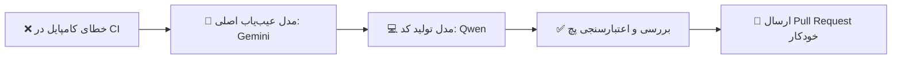

<div align="center">


# 🌌 VoidOne

### لانچر بازی‌های کامپیوتری و مدیریت کتابخانه برنامه‌ها — نسل جدید، سبک و متن‌باز

<p align="center">
  <a href="README.md">🇬🇧 English</a> •
  <b>🇮🇷 پارسی</b>
</p>

<p align="center">
  <a href="https://github.com/VoidOne-App/VoidOne/actions/workflows/c-cpp.yml">
    
  </a>
  <a href="https://github.com/VoidOne-App/VoidOne/actions/workflows/codeql.yml">
    
  </a>
  <a href="https://github.com/VoidOne-App/VoidOne/releases/latest">
    
  </a>
  <a href="https://github.com/VoidOne-App/VoidOne/releases">
    
  </a>
</p>

<p align="center">
  
  
  
  
  
</p>

<br/>

<p align="center">
  <a href="#-درباره-پروژه">درباره پروژه</a> •
  <a href="#-تعهد-voidone--از-طرف-یک-گیمر-به-گیمرها">تعهد پروژه</a> •
  <a href="#-چرا-voidone">چرا VoidOne؟</a> •
  <a href="#-ویژگی‌های-کلیدی">ویژگی‌ها</a> •
  <a href="#-معماری-و-تکنولوژی‌ها">تکنولوژی‌ها</a> •
  <a href="#-دانلود-و-نصب">دانلود</a> •
  <a href="#-کامپایل-از-سورس-کد">کامپایل</a> •
  <a href="#-سیستم-عیب‌یابی-خودکار-با-هوش-مصنوعی">هوش مصنوعی</a> •
  <a href="#-نقشه-راه-توسعه">نقشه راه</a> •
  <a href="#-مشارکت-در-توسعه">مشارکت</a>
</p>

</div>

<br/>

## 👁️ درباره پروژه

**VoidOne** یک لانچر بازی فوق‌العاده سریع، سبک و متن‌باز برای کامپیوتر است که با استفاده از **C++23** و **Qt 6 / QML** توسعه یافته. این نرم‌افزار به عنوان یک اکوسیستم یکپارچه برای گیمرها طراحی شده تا فاصله بین پلتفرم‌های مختلف (Steam, Epic Games, GOG, Xbox) و اجرای محلی بازی‌ها را از بین ببرد — و یک داشبورد مدرن با استایل سایبرپانک و بدون سرویس‌های جاسوسی یا سنگین ارائه دهد.

برنامه در حالت آماده‌به‌کار (Idle) نزدیک به صفر درصد از منابع سیستم را مصرف می‌کند تا بالاترین نرخ فریم (FPS) و سریع‌ترین زمان پاسخ‌دهی را برای بازی‌ها فراهم کند. با جداسازی کامل رابط کاربری از هسته اجرایی، VoidOne اجرای روان روی انواع سخت‌افزارها را بدون نقض حریم خصوصی تضمین می‌کند.

> ⚠️ **وضعیت توسعه:** پروژه VoidOne در مراحل اولیه توسعه فعال قرار دارد. معماری اصلی و APIها به سرعت در حال بهبود هستند — برای مشاهده روند پیشرفت، [نقشه راه توسعه](#-نقشه-راه-توسعه) را بررسی کنید.

<br/>

## 🛡️ تعهد VoidOne — از طرف یک گیمر به گیمرها

پروژه VoidOne در اتاق جلسات شرکت‌های بزرگ ساخته نشده؛ بلکه توسط گیمری ساخته شده که نیازهای واقعی گیمرها را درک می‌کند.

من معتقدم نرم‌افزارهای گیمینگ باید به کاربران خود — حریم خصوصی، سخت‌افزار، داده‌ها و آزادی عمل آن‌ها — احترام بگذارند.

- ♾️ **همیشه رایگان و متن‌باز** — بدون پرداخت‌های مخفی، اشتراک‌های اجباری یا انحصار شرکتی.
- 🔒 **حریم خصوصی و اولویت اجرا به صورت آفلاین** — بدون تبلیغات و بدون جمع‌آوری اطلاعات (Zero Telemetry). دیتابیس شما ۱۰۰٪ روی سیستم خودتان باقی می‌ماند.
- ⚡ **معماری فوق‌العاده سبک** — مصرف رم بسیار پایین (زیر ۵۰ مگابایت)، اجرای آنی و بدون برنامه سنگین در پس‌زمینه.
- 🎮 **مالکیت کامل داده‌ها** — بازی‌ها، تنظیمات، مادها و فایل‌های محلی شما کاملاً متعلق به خودتان است.
- 🧩 **بدون تله‌های اکوسیستمی** — سیستم گیمینگ شما هرگز نباید وابسته به اکانت‌های آنلاین اجباری یا قفل‌های انحصاری باشد.
- 🛠️ **توسعه کاملاً شفاف** — تمام مراحل توسعه به صورت متن‌باز انجام می‌شود تا جامعه گیمرها بتوانند کدها را بررسی، اعتماد و در توسعه آن مشارکت کنند.

> **«من همیشه کنار گیمرها می‌ایستم.»**

<br/>

## ⚡ چرا VoidOne؟

| ویژگی / بنچمارک | VoidOne | لانچرهای رسمی استورها | سایر لانچرهای متن‌باز |
| :--- | :---: | :---: | :---: |
| **زمان اجرای اولیه (Cold Start)** | 🟢 زیر یک ثانیه (~1s) | 🔴 ۵ تا ۱۵+ ثانیه | 🟡 ۲ تا ۵ ثانیه |
| **میزان مصرف رم در حالت Idle** | 🟢 زیر ۵۰ مگابایت | 🔴 ۳۰۰+ مگابایت | 🟡 ۱۰ link تا ۲۰۰ مگابایت |
| **ردیابی و جمع‌آوری داده** | 🟢 صفر | 🔴 اجباری | 🟡 وابسته به پروژه |
| **میانبر زدن لانچر اصلی (Ghost Launch)**| 🟢 داخلی | 🔴 غیرممکن | 🔴 کمیاب |
| **کاملاً متن‌باز (مجوز MIT)** | 🟢 بله | 🔴 خیر | 🟢 بله |
| **رابط کاربری QML با شتاب‌دهنده سخت‌افزاری** | 🟢 بله | 🔴 Electron / WebViews | 🔴 اکثراً ندارد |

<br/>

## ✨ ویژگی‌های کلیدی

### 👻 قابلیت Ghost Launch و میانبر زدن لانچرها (در حال توسعه)
- **اجرای مستقیم فایل‌های باینری:** اجرای مستقیم بازی‌های بدون قفل (DRM-Free) از استیم، اپیک و GOG بدون نیاز به باز شدن لانچرهای سنگین.
- **مدیریت خاموش پس‌زمینه:** اجرای لانچرهای اجباری در حالت کمینه (Minimized)، و بستن خودکار پروسه‌های پس‌زمینه آن‌ها بلافاصله پس از خروج از بازی جهت آزادکنندگی ۱۰۰٪ حافظه رم.

### 🎮 مدیریت و تجمیع‌کننده یکپارچه بازی‌ها
- **موتور اسکن خودکار:** اسکن هوشمند درایوهای ذخیره‌سازی، پوشه‌های دلخواه و فایل‌های مانفیست (Steam VDF, Epic AppData, GOG Galaxy SQLite) برای ثبت خودکار بازی‌ها.
- **دریافت خودکار متادیتا:** دریافت کاورهای باکیفیت، بنرهای عریض، امتیازدادهای Metacritic و اطلاعات سازندگان به صورت اسنکرون و ذخیره در کش.
- **آنالیز جلسات بازی:** ثبت دقیق زمان بازی، تعداد دفعات اجرا و آمارهای شخصی به صورت کاملاً کدگذاری‌شده در دیتابیس محلی.

### 🎨 رابط کاربری سایبرپانک با QML
- **رندرینگ سخت‌افزاری:** رابط کاربری مدرن با QML/QtQuick و رندرینگ مستقیم روی کارت گرافیک با نرخ ۶۰+ فریم بر ثانیه و افکت‌های شیدر و پارتیکل.
- **سفارشی‌سازی کامل:** سیستم مدولار برای تغییر تم، چینش عناصر، سایز فونت‌ها و پشتیبانی کامل از حالت تاریک (Dark Mode).

### 🧩 موتور مدیریت ماد یکپارچه
- **مدیریت پروفایل‌ها:** ساخت پروفایل‌های مجزا برای مادهای هر بازی و فعال/غیرفعال‌سازی آن‌ها با یک کلیک.
- **حل تعارضات و اولویت‌بندی:** بررسی وابستگی مادها، ساختار اولویت بارگذاری و لینک‌دهی مجازی به فایل‌های بازی بدون دستکاری فایل‌های اصلی.

### 🤖 سیستم عیب‌یابی خودکار CI/CD
- **رفع خطای هوشمند:** زیرساخت هوش مصنوعی چندعاملی (مدل اصلی Gemini 2.5 Pro به همراه Qwen2.5-Coder) جهت آنالیز لاگ‌های کامپایل، تشخیص خطاهای C++/CMake، ساخت پچ و ارسال Pull Request خودکار.

<br/>

## ⚙️ معماری و تکنولوژی‌ها

| بخش | تکنولوژی | کاربرد و پیاده‌سازی |
| :--- | :--- | :--- |
| **هسته اصلی** | C++23 | دستورات سطح پایین سیستم‌عامل، مدیریت پروسه‌های ناهمگام و بهینه‌سازی حافظه |
| **فریم‌ورک رابط کاربری** | Qt 6.8 / QML | رابط کاربری گرافیکی رندر شده با کارت گرافیک و کامپوننت‌های پویا |
| **پایگاه داده** | SQLite3 | دیتابیس رابطه‌ای و سبک برای ذخیره اطلاعات بازی‌ها و تنظیمات |
| **سیستم ساخت (Build)** | CMake 3.25+ / Ninja | کامپایل ماژولار و چندپلتفرمی پروژه |
| **یکپارچه‌سازی سیستم‌عامل** | WinAPI / Linux D-Bus | اجرای مستقیم پروسه‌ها، مدیریت دسترسی‌ها و آیکون سینی سیستم (System Tray) |
| **بسته‌بندی** | Inno Setup / Portable ZIP | فایل نصب‌کننده و نسخه پرتابل و بدون نیاز به نصب |
| **اتوماسیون / CI** | GitHub Actions | کامپایل خودکار رو پلتفرم‌های مختلف، آنالیز کد (CodeQL + cppcheck) و انتشار خودکار نسخه‌ها |

<br/>

## 📥 دانلود و نصب

<div align="center">

[](https://github.com/VoidOne-App/VoidOne/releases/latest)

</div>

در هر انتشار، دو نسخه ارائه می‌شود:

| فرمت | مناسب برای |
| :--- | :--- |
| **`VoidOne-Setup-x64.exe`** | نصب کامل همراه با شورت‌کات منوی استارت، دسکتاپ و بخش حذف برنامه (Uninstaller) |
| **`VoidOne-Windows-x64-Portable.zip`** | نسخه پرتابل — قابل اجرا مستقیم از هر پوشه یا فلش مموری |

> 🔐 تمامی فایل‌ها همراه با کد هش `SHA256` منتشر می‌شوند. جهت بررسی سلامت فایل در پاورشل اجرا کنید:
> ```powershell
> Get-FileHash VoidOne-Setup-x64.exe -Algorithm SHA256
> ```

<br/>

## 🔨 کامپایل از سورس کد

### پیش‌نیازهای ابزاری
- **کامپایلر:**
  - ویندوز: MSVC 2022 (v17.8+) با پشتیبانی کامل از استاندارد C++23
  - لینوکس: GCC 13+ یا Clang 17+
- **فریم‌ورک:** Qt 6.8+ (به همراه ماژول‌های QtQuick و QML)
- **ابزارهای ساخت:** CMake 3.25 یا بالاتر، Ninja Build System و Git 2.40+

### مراحل کامپایل خط به خط

```bash
# ۱. کلون کردن مخزن پروژه
git clone [https://github.com/VoidOne-App/VoidOne.git](https://github.com/VoidOne-App/VoidOne.git)
cd VoidOne

# ۲. پیکربندی پروژه با استاندارد C++23 و ژنراتور Ninja
cmake -S . -B build -G Ninja -DCMAKE_BUILD_TYPE=Release -DCMAKE_CXX_STANDARD=23

# ۳. کامپایل بهینه‌شده به صورت موازی
cmake --build build --config Release --parallel
```

<br/>

## 🤖 سیستم عیب‌یابی خودکار با هوش مصنوعی

پروژه VoidOne دارای یک خط لوله خطایابی خودکار در CI/CD است که مشکلات کامپایل را فوراً عیب‌یابی می‌کند:



تمامی کدهای پیشنهادی هوش مصنوعی قبل از ادغام نهایی (Merge)، به صورت دستی بازبینی می‌شوند.

<br/>

## 🗺️ نقشه راه توسعه

- [x] **فاز ۱ — زیرساخت اصلی:** پیکربندی CMake با C++23، ساختار اولیه Qt 6.8/QML و خط لوله کامپایل خودکار در CI/CD
- [ ] **فاز ۲ — پایگاه داده و موتور اسکن:** طراحی ساختار SQLite، اسکنرهای مالتی‌ترید برای دیسک و پارسر فایل‌های مانفیست
- [ ] **فاز ۳ — اتصال به استورها:** پیاده‌سازی اتصالات API و فایل‌های استیم، اپیک گیمز، GOG و برنامه‌های دستی
- [ ] **فاز ۴ — موتور Ghost Launch:** حالت اجرای مستقیم، یکپارچه‌سازی با Steam API stub و بستن خودکار استورهای پس‌زمینه
- [ ] **فاز ۵ — موتور پیشرفته ماد:** بارگذاری پویا، حل نمودار وابستگی مادها و سیستم فایل مجازی
- [ ] **فاز ۶ — توسعه اکوسیستم:** SDK توسعه تم برای QML، همگام‌سازی نورپردازی RGB (OpenRGB) و سینک ابری

<br/>

## 🤝 مشارکت در توسعه

مشارکت کاربران باعث رشد پروژه‌های متن‌باز است. چه رفع باگ، چه بهبود بخش‌هایی از UI یا پیاده‌سازی لاجیک استورها، از تمام مشارکت‌ها استقبال می‌شود.

۱. پروژه را فورک (Fork) کنید.
۲. یک برنچ جدید بسازید: `git checkout -b feature/NewFeature`
۳. تغییرات را کامیت کنید: `'feat: implement new game scanner' git commit -m`
۴. تغییرات را پوش کنید: `git push origin feature/NewFeature`
۵. یک درخواست ادغام (Pull Request) ارسال کنید.

<br/>

## 👨‍💻 پیشینه پروژه

پروژه VoidOne به عنوان یک تلاش جاه‌طلبانه برای ساخت یک جایگزین سریع، مدرن و بدون برنامه‌های اضافی برای لانچرهای بازی کامپیوتر آغاز شد. این پروژه بستری عملی برای بررسی الگوهای مدرن طراحی سیستم‌های سطح پایین در C++23 و طراحی رابط کاربری توصیفی با Qt 6 / QML است. هوش مصنوعی به عنوان یک دستیار برنامه‌نویسی در کنار توسعه‌دهنده استفاده می‌شود و تمام کدها بازبینی، پروفایل و بهینه‌سازی می‌شوند.

<br/>

## 📄 مجوز انتشار (License)

```
+--------------------------------------------------------------+
|                    [ V O I D O N E   E N G I N E ]           |
+--------------------------------------------------------------+
| Copyright (c) 2026 VoidOne-App Core Team                     |
| Repo: [github.com/VoidOne-App/VoidOne](https://github.com/VoidOne-App/VoidOne)                         |
| Tech: Modern C++23 & Qt 6 / QML                               |
+--------------------------------------------------------------+
```

پروژه VoidOne تحت شرایط **مجوز MIT** منتشر شده است. برای مطالعه متن کامل مجوز، فایل [LICENSE](LICENSE) را در ریشه مخزن مشاهده کنید.

<br/>

<div align="center">

**ساخته‌شده توسط یک گیمر. برای گیمرها. به صورت کاملاً متن‌باز.**

<sub>توسعه‌یافته با دقت، ❤️ و C++23 مدرن توسط تیم اصلی VoidOne-App.</sub>

<br/><br/>

⭐ اگر پروژه VoidOne برای شما مفید بود، به آن ستاره بدهید!

</div>
