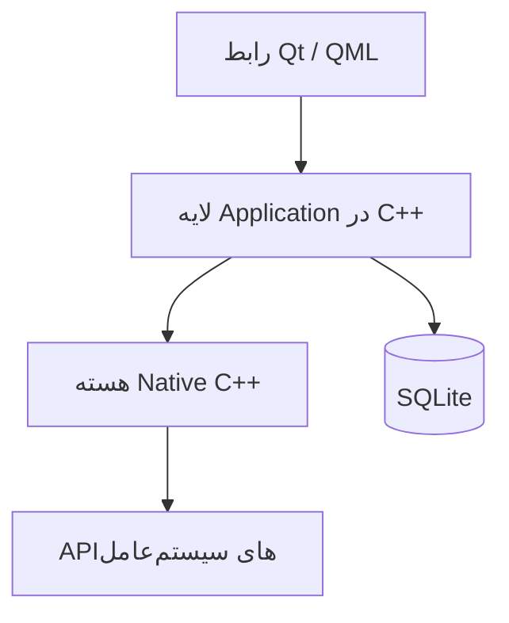
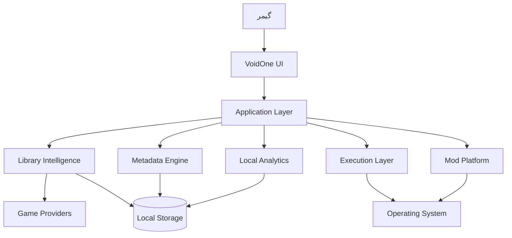

<div align="center">


# 🌌 VoidOne

### پلتفرم متن‌باز و بومی گیمینگ PC؛ ساخته‌شده حول بازی‌های شما، نه فروشگاه‌ها

<p>
  <a href="README.md">🇬🇧 English</a> •
  <b>🇮🇷 پارسی</b>
</p>

<p>
  <a href="https://github.com/VoidOne-App/VoidOne/actions/workflows/c.cpp.yml">
    
  </a>
  <a href="https://github.com/VoidOne-App/VoidOne/releases/latest">
    
  </a>
  <a href="https://github.com/VoidOne-App/VoidOne/stargazers">
    
  </a>
  <a href="https://github.com/VoidOne-App/VoidOne/blob/main/LICENSE">
    
  </a>
</p>

<p>
  
  
  
  
  
  
</p>

<br />

> **یک کتابخانه. بازی‌های شما. سخت‌افزار شما. قوانین شما.**

<br />

<p>
  <a href="#-درباره">درباره</a> •
  <a href="#-چشم‌انداز">چشم‌انداز</a> •
  <a href="#-فلسفه-محصول">فلسفه</a> •
  <a href="#-وضعیت-نسخهها">نسخه‌ها</a> •
  <a href="#-پایه-فعلی">وضعیت فعلی</a> •
  <a href="#-مسیر-آینده-پلتفرم">آینده</a> •
  <a href="#-معماری">معماری</a> •
  <a href="#-زیرساخت-مهندسی">مهندسی</a> •
  <a href="#️-نقشه-راه">نقشه راه</a> •
  <a href="#-ساخت-از-سورس">ساخت</a> •
  <a href="#-مشارکت">مشارکت</a>
</p>

</div>

---

# 👁️ درباره

**VoidOne** یک پلتفرم متن‌باز و بومی برای گیمینگ روی PC است که حول یک ایده ساده ساخته می‌شود:

> **مرکز تجربه گیمینگ شما باید خود بازی‌ها باشند؛ نه فروشگاه‌هایی که آن‌ها را توزیع می‌کنند.**

امروزه گیمینگ روی PC میان فروشگاه‌ها، لانچرها، مسیرهای نصب، Manifestها، سیستم‌های پیکربندی، سرویس‌های متادیتا، پردازش‌های پس‌زمینه و فایل‌های اجرایی مستقل بازی‌ها پراکنده شده است.

VoidOne در حال ساخته‌شدن به‌عنوان یک **لایه بومی میان گیمر، سیستم‌عامل و اکوسیستم گیمینگ** است.

این پروژه بر پایه فناوری‌های مدرن بومی ساخته می‌شود:

- **C++23**
- **Qt 6.8**
- **QML / Qt Quick**
- **SQLite**
- **CMake**
- **Ninja**

VoidOne در حال حاضر در مرحله **توسعه آزمایشی فعال** قرار دارد.

هدف پروژه این است که به‌صورت مرحله‌ای از یک اپلیکیشن بومی مدیریت بازی، به یک پلتفرم گسترده برای مدیریت، اجرای، تحلیل، شخصی‌سازی و توسعه تجربه گیمینگ روی PC تبدیل شود.

---

# 🎯 چشم‌انداز

VoidOne قرار نیست **یک فروشگاه دیگر** باشد.

هدف پروژه این نیست که اکوسیستم‌های فعلی گیمرها را با یک اکوسیستم بسته دیگر جایگزین کند.

هدف این است که یک لایه بومی، متن‌باز و ماژولار میان گیمر و اکوسیستم پراکنده گیمینگ PC ایجاد شود.

```text
                         ┌───────────────────────┐
                         │         گیمر          │
                         └───────────┬───────────┘
                                     │
                                     ▼
                         ┌───────────────────────┐
                         │       VOIDONE         │
                         │   لایه بومی گیمینگ   │
                         └───────────┬───────────┘
                                     │
              ┌──────────────────────┼──────────────────────┐
              │                      │                      │
              ▼                      ▼                      ▼
          کتابخانه‌ها              اجرا                 سرویس‌ها
              │                      │                      │
              └──────────────────────┼──────────────────────┘
                                     │
                                     ▼
                         ┌───────────────────────┐
                         │      سیستم‌عامل       │
                         └───────────────────────┘
```

هدف بلندمدت این است که VoidOne به یک لایه بومی قدرتمند تبدیل شود که گیمر بتواند از طریق آن اکوسیستم گیمینگ موجود خود را مدیریت کند، بدون اینکه کنترل، شفافیت یا مالکیت داده‌هایش را از دست بدهد.

> **نه یک فروشگاه دیگر.  
> نه یک اکوسیستم بسته دیگر.  
> یک پلتفرم بومی که حول گیمر ساخته شده است.**

---

# 🧭 فلسفه محصول

VoidOne بر اساس چند اصل بلندمدت توسعه پیدا می‌کند.

## 🧱 Native First — بومی در اولویت

هرجا فناوری‌های بومی و قابلیت‌های خود سیستم‌عامل مزیت معناداری در عملکرد، یکپارچگی، پایداری یا نگهداری ایجاد کنند، اولویت با آن‌هاست.

## 🔒 Privacy by Design — حریم خصوصی از ابتدا

اطلاعات گیمر نباید بدون دلیل فنی معتبر جمع‌آوری، ارسال یا تجاری‌سازی شود.

## 💾 Local First — محلی در اولویت

هرجا از نظر فنی امکان‌پذیر باشد، اطلاعات مهم گیمر باید تحت کنترل محلی او باقی بماند.

## ⚡ Lightweight by Design — سبک‌وزن از ابتدا

هر وابستگی، پردازش پس‌زمینه، Runtime یا سرویس باید هزینه منابع خودش را توجیه کند.

## 🎮 مالکیت گیمر

گیمر باید کنترل بازی‌ها، تنظیمات، پروفایل‌ها و داده‌های خود را در اختیار داشته باشد.

## 🌐 Open by Design — باز از ابتدا

پروژه باید برای توسعه‌دهندگان و مشارکت‌کنندگان شفاف، قابل بررسی و قابل تغییر باقی بماند.

## 📐 Evidence Over Marketing — مدرک مهم‌تر از تبلیغات

ادعاهای فنی باید با پیاده‌سازی، تست یا Benchmark قابل تکرار پشتیبانی شوند.

## 🧩 توسعه مرحله‌ای

VoidOne عمداً به‌صورت مرحله‌ای توسعه داده می‌شود.

قابلیت‌های بزرگ پلتفرم به‌مرور و هم‌زمان با بالغ‌شدن معماری زیرساختی آن اضافه خواهند شد.

> **قابلیت‌های آینده قرار نیست حذف شوند؛ قرار است مرحله‌به‌مرحله ساخته و اضافه شوند.**

---

# 🛡️ تعهد VoidOne به گیمرها

VoidOne توسط **یک گیمر، برای گیمرها** ساخته می‌شود.

این پروژه برای ساخت نرم‌افزاری ایجاد شده که به کاربرانش احترام می‌گذارد.

## ♾️ رایگان و متن‌باز

VoidOne متعهد است که **رایگان و متن‌باز** باقی بماند.

هسته پروژه تحت **مجوز MIT** منتشر می‌شود.

برای تجربه اصلی پلتفرم، اشتراک اجباری در نظر گرفته نشده است.

قابلیت‌های بنیادی پروژه پشت Paywall قرار نخواهند گرفت.

هدف پروژه ایجاد اکوسیستمی بسته برای قفل‌کردن کاربران نیست.

> **رایگان و متن‌باز بودن، یکی از تعهدات اصلی VoidOne است.**

## 🚫 بدون تبلیغات. بدون Telemetry.

VoidOne بر پایه تبلیغات یا ردیابی رفتاری ساخته نمی‌شود.

اصل پروژه این است:

> **شما از VoidOne برای مدیریت بازی‌هایتان استفاده می‌کنید؛ خودتان محصول نیستید.**

## ⚡ سبک‌وزن از ابتدا

VoidOne یک هدف بلندمدت جاه‌طلبانه برای عملکرد دارد:

> **مصرف RAM در حالت Idle کمتر از 50 MB.**

این مقدار یک **هدف مهندسی** است و مشخصات تضمین‌شده نسخه‌های فعلی نیست.

پروژه تلاش می‌کند موارد غیرضروری مانند موارد زیر را به حداقل برساند:

- سرویس‌های پس‌زمینه
- پردازش‌های دائمی
- Runtimeهای سنگین
- اجزای پرمصرف
- پردازش‌های پنهان

هر جزء باید دلیلی برای وجود داشته باشد.

## 🔒 داده‌های شما. کنترل شما.

VoidOne از رویکرد **Local-First** پیروی می‌کند.

در معماری بلندمدت، اطلاعات مهمی مانند:

- اطلاعات کتابخانه بازی
- پروفایل‌ها
- تنظیمات
- ترجیحات
- آمار محلی
- تنظیمات اختصاصی بازی
- پروفایل‌های Mod

تا جای ممکن تحت کنترل خود گیمر باقی خواهند ماند.

## 🎮 ساخته‌شده برای گیمرها

VoidOne برای احترام به موارد زیر ساخته می‌شود:

- سخت‌افزار شما
- حریم خصوصی شما
- زمان شما
- داده‌های شما
- بازی‌های شما
- آزادی شما

> **هدف کنترل گیمر نیست.  
> هدف، دادن کنترل بیشتر به گیمر است.**

---

# 📦 وضعیت نسخه‌ها

VoidOne در حال حاضر در مرحله **توسعه آزمایشی فعال** قرار دارد.

تمام نسخه‌هایی که تاکنون منتشر شده‌اند، **Experimental** محسوب می‌شوند.

شماره نسخه به‌تنهایی به معنی Stable بودن یک Release نیست.

---

## 🧪 Experimental — آزمایشی

**وضعیت: موجود**

این کانال نسخه فعلی VoidOne است.

نسخه‌های Experimental برای موارد زیر مناسب هستند:

- کاربران اولیه
- مشارکت‌کنندگان
- توسعه‌دهندگان
- تسترها
- دریافت بازخورد
- پیدا کردن Bug
- اعتبارسنجی قابلیت‌ها

نسخه‌های آزمایشی ممکن است شامل قابلیت‌های ناقص، Bug، تغییرات معماری یا بخش‌های ناتمام باشند.

> **تمام Releaseهای فعلی VoidOne آزمایشی هستند.**

---

## 🛠️ Development — توسعه

**وضعیت: فعال**

Development جدیدترین وضعیت پروژه در Repository را دنبال می‌کند.

Buildهای توسعه ممکن است شامل تغییراتی باشند که هنوز در یک Experimental Release منتشر نشده‌اند.

این کانال بیشتر برای موارد زیر در نظر گرفته شده است:

- توسعه‌دهندگان
- مشارکت‌کنندگان
- تسترهای پیشرفته
- اعتبارسنجی CI
- توسعه معماری

---

## 🚀 Stable — پایدار

**وضعیت: به‌زودی**

نسخه Stable **هنوز ساخته و منتشر نشده است**.

Stable زمانی معرفی خواهد شد که پروژه به سطح مناسبی از موارد زیر برسد:

- پایداری
- قابلیت‌های پایه
- پوشش تست
- پایداری Runtime
- نصب پایدار
- به‌روزرسانی قابل اعتماد
- اعتبارسنجی عملکرد
- اعتبارسنجی امنیت
- کیفیت مستندات

اولین Stable Release زمانی منتشر خواهد شد که پروژه واقعاً آماده باشد.

> **Stable یعنی اثبات‌شده؛ نه صرفاً منتشرشده.**

---

### خلاصه کانال‌های انتشار

| کانال | وضعیت | مخاطب |
| :--- | :--- | :--- |
| 🛠️ **Development** | فعال | توسعه‌دهندگان و مشارکت‌کنندگان |
| 🧪 **Experimental** | موجود | تسترها و کاربران اولیه |
| 🚀 **Stable** | به‌زودی | کاربران عمومی |

---

# ✅ پایه فعلی

این بخش **پایه مهندسی فعلی** VoidOne را توضیح می‌دهد.

قابلیت‌های آینده عمداً از وضعیت فعلی جدا شده‌اند.

## 💻 اپلیکیشن بومی

VoidOne با فناوری‌های زیر ساخته می‌شود:

| فناوری | کاربرد |
| :--- | :--- |
| **C++23** | توسعه اپلیکیشن و سیستم‌های بومی |
| **Qt 6.8** | Framework اصلی |
| **QML / Qt Quick** | رابط گرافیکی |
| **SQLite** | ذخیره‌سازی محلی |
| **CMake** | پیکربندی Build |
| **Ninja** | اجرای Build |

## 🎨 رابط کاربری بومی

Qt Quick / QML پایه رابط گرافیکی VoidOne را تشکیل می‌دهد.

لایه UI از لایه Native C++ جدا نگه داشته می‌شود تا معماری برای توسعه‌های آینده قابل نگهداری باقی بماند.

## 💾 ذخیره‌سازی محلی

SQLite برای ذخیره‌سازی محلی داده‌های برنامه استفاده می‌شود.

معماری پروژه بر مالکیت محلی داده‌ها تأکید دارد و هسته برنامه برای عملیات پایه به Backend اجباری آنلاین وابسته نیست.

## 🔄 مهندسی خودکار

Repository شامل Workflowهای GitHub Actions برای بخش‌های مختلف چرخه مهندسی است.

این زیرساخت شامل حوزه‌هایی مانند موارد زیر است:

- اعتبارسنجی Build
- Static Analysis
- تحلیل امنیتی
- Sanitizer
- تست
- Packaging
- تولید Artifact
- Release Automation

Workflow موجود در:

```text
.github/workflows/c.cpp.yml
```

مرجع اصلی برای رفتار دقیق CI است.

---

# 🪟 وضعیت پلتفرم‌ها

## 🪟 Windows

**پلتفرم اصلی**

Windows در حال حاضر محیط اصلی توسعه، Build و Packaging پروژه است.

Pipeline انتشار فعلی برای Windows x64 طراحی شده است.

## 🐧 Linux

**مسیر توسعه Cross-Platform**

Linux بخشی از معماری و مسیر توسعه Cross-Platform VoidOne است.

پشتیبانی Linux با بالغ‌تر شدن پروژه به‌صورت تدریجی گسترش خواهد یافت.

## 🍎 macOS

macOS در حال حاضر بخشی از Pipeline اصلی Build و Packaging پروژه نیست.

---

# 🔭 مسیر آینده پلتفرم

VoidOne به‌عنوان یک پلتفرم توسعه داده می‌شود، نه صرفاً یک Launcher ساده.

موارد زیر **مسیر توسعه بلندمدت پروژه** را تشکیل می‌دهند.

این موارد به‌عنوان قابلیت‌های عمومی نسخه فعلی معرفی نمی‌شوند.

تمام این قابلیت‌ها قرار است **به‌مرور و مرحله‌به‌مرحله** با بالغ‌شدن معماری پروژه اضافه شوند.

### حوزه‌های آینده

- 👻 Ghost Launch
- ⚙️ Intelligent Process Orchestration
- 🧠 مدیریت پیشرفته پردازش‌ها
- ⚡ CPU Priority Profiles
- 📈 Resource Optimization
- 🌐 Multi-Store Aggregation
- 🎮 اتصال به Steam
- 🎮 اتصال به Epic Games
- 🎮 اتصال به GOG
- 🎮 اتصال به EA App
- 🖼️ Rich Metadata Engine
- 🎨 سیستم Artwork / Hero Banner
- 📊 Local Gaming Analytics
- 🧰 Advanced Mod Platform
- 🧩 Mod Profiles
- 🗂️ Virtual File Mapping
- 🔗 Dependency Management
- ⚠️ Conflict Detection
- 🎨 Dynamic Themes
- 🌈 RGB Customization
- 🩺 Performance Diagnostics
- 💾 Backup & Recovery
- 🔌 Extension APIs
- 🎨 Theme SDK
- 🧑‍💻 Developer Ecosystem
- 🌐 Community Extensions

> **این قابلیت‌ها بخشی از مسیر بلندمدت VoidOne هستند و قرار است به‌صورت تدریجی پیاده‌سازی و اضافه شوند.**

---

# 👻 Ghost Launch

**قابلیت برنامه‌ریزی‌شده**

Ghost Launch یک معماری اجرای آینده برای ایجاد کنترل بیشتر روی نحوه اجرای بازی‌ها و مدیریت Runtime آن‌هاست.

قابلیت‌های احتمالی:

- اجرای مستقیم فایل اجرایی در مواردی که از نظر فنی و قانونی امکان‌پذیر باشد
- Launch Argumentهای سفارشی
- پیکربندی Environment
- پروفایل‌های اختصاصی برای هر بازی
- مدیریت چرخه عمر Process
- سیاست‌های پردازش‌های پس‌زمینه
- تشخیص Orphan Process
- اولویت‌بندی Process
- Tracking وضعیت Runtime

به‌صورت مفهومی:

```text
گیمر
  │
  ▼
VoidOne
  │
  ▼
Execution Layer
  │
  ▼
Game Process
```

هدف:

> **ایجاد یک لایه کنترل‌شده بین گیمر و بازی.**

VoidOne قصد دورزدن DRM، مجوزها یا احراز هویت موردنیاز پلتفرم‌ها را ندارد.

اگر یک بازی به‌صورت قانونی به Launcher یا سرویس دیگری نیاز داشته باشد، آن وابستگی همچنان بخشی از محیط اجرای بازی خواهد بود.

---

# ⚙️ Intelligent Process Orchestration

**قابلیت برنامه‌ریزی‌شده**

یک لایه مدیریت Process در آینده می‌تواند به VoidOne اجازه دهد رابطه میان بازی و Processهای وابسته به آن را بهتر درک و مدیریت کند.

قابلیت‌های احتمالی:

- Tracking چرخه عمر Process
- تشخیص Child Process
- سیاست‌های Workload پس‌زمینه
- CPU Priority Profiles
- مدیریت Runtime Process
- تشخیص Orphan Process
- سیاست‌های اجرای اختصاصی هر بازی
- پروفایل‌های آگاه از منابع سیستم

هدف بلندمدت، کنترل بهتر Execution است؛ نه اینکه فقط یک فایل اجرایی اجرا شود و بعد هیچ دیدی نسبت به وضعیت آن وجود نداشته باشد.

---

# 🧩 Multi-Store Aggregation

**قابلیت برنامه‌ریزی‌شده**

VoidOne در آینده می‌تواند یک کتابخانه واحد برای چند اکوسیستم گیمینگ ایجاد کند.

Providerهای احتمالی:

- Steam
- Epic Games
- GOG
- EA App
- نصب‌های Local
- Providerهای بیشتر

قابلیت‌های احتمالی:

- شناسایی نصب‌ها
- Parsing Manifest
- تجمیع کتابخانه
- تشخیص بازی‌های تکراری
- استانداردسازی هویت بازی
- استانداردسازی Metadata
- اجرای وابسته به Provider

هدف:

> **یکپارچه‌سازی دسترسی بدون تبدیل‌شدن VoidOne به یک فروشگاه دیگر.**

---

# 🖼️ Metadata Engine

**قابلیت برنامه‌ریزی‌شده**

یک Metadata Engine آینده می‌تواند موارد زیر را ارائه دهد:

- Cover Artwork
- Hero Banner
- Background
- توضیحات
- ژانر
- اطلاعات انتشار
- اطلاعات توسعه‌دهنده
- اطلاعات ناشر
- امتیازها
- اطلاعات پلتفرم

معماری موردنظر بر موارد زیر تأکید دارد:

- پردازش Asynchronous
- Local Cache
- UI بدون Block شدن
- Network Operation مقاوم در برابر خطا

Metadata باید تجربه را بهتر کند، نه اینکه برای عملیات پایه Local به یک وابستگی اجباری تبدیل شود.

---

# 📊 Local Gaming Analytics

**قابلیت برنامه‌ریزی‌شده**

VoidOne ممکن است در آینده Analytics محلی و Privacy-Oriented ارائه کند.

قابلیت‌های احتمالی:

- Session Tracking
- تاریخچه اجرا
- مدت زمان بازی
- آمار هر بازی
- Crash Recordهای محلی
- Performance History
- روندهای عملکرد محلی

اصل اصلی:

> **Analytics مفید، بدون تبدیل‌کردن گیمر به محصول.**

تا جای ممکن، Analytics به‌صورت Local باقی خواهد ماند.

---

# 🧰 Advanced Mod Platform

**قابلیت برنامه‌ریزی‌شده**

یک معماری پیشرفته برای مدیریت Mod می‌تواند شامل موارد زیر باشد:

- Mod Profile
- Virtual File Mapping
- Non-Destructive Deployment
- Dependency Management
- Conflict Detection
- Load Order Management
- Compatibility Checks

نمونه:

```text
Game
├── Vanilla
├── Competitive
├── Graphics Overhaul
├── Experimental
└── Custom Profile
```

هدف این است که بتوان چند Configuration مختلف برای یک بازی داشت، بدون اینکه لازم باشد نصب اصلی بازی به‌صورت غیرضروری تغییر کند.

---

# 🎨 رابط کاربری نسل بعد

**مسیر بلندمدت**

جهت‌گیری بلندمدت UI شامل موارد زیر است:

- رابط‌های پیشرفته QML
- Dynamic Theme
- کتابخانه‌های مبتنی بر Artwork
- Layoutهای Responsive
- Personalization
- Display Scaling
- Accessibility
- Animationهای اختیاری
- RGB Customization

افکت‌های بصری باید ارزش خود را در برابر هزینه عملکردی‌شان ثابت کنند.

> **رابط کاربری Premium فقط زمانی ارزشمند است که همچنان Responsive باقی بماند.**

---

# 🩺 Performance Diagnostics

**قابلیت برنامه‌ریزی‌شده**

قابلیت‌های آینده Diagnostics ممکن است شامل موارد زیر باشند:

- تحلیل Startup
- Runtime Measurement
- Memory Diagnostics
- Process Analysis
- Library Scan Profiling
- Performance History
- Performance Profile برای هر بازی
- Benchmarking

هدف:

> **عملکرد باید قابل اندازه‌گیری باشد، نه صرفاً قابل احساس.**

---

# 💾 Backup & Recovery

**قابلیت برنامه‌ریزی‌شده**

نسخه‌های آینده ممکن است قابلیت Backup و Recovery محلی ارائه کنند.

موارد احتمالی:

- Configuration
- Library Data
- Game Profiles
- Mod Profiles
- User Preferences

قابلیت‌های احتمالی:

- ساخت Backup
- Export / Import Profile
- Recovery Snapshot
- بازگردانی Configuration

---

# 🔌 Extensibility & Developer Ecosystem

**قابلیت برنامه‌ریزی‌شده**

معماری بلندمدت VoidOne می‌تواند Extension Pointهای کنترل‌شده ارائه کند.

اجزای احتمالی:

- Extension APIs
- Theme SDK
- Provider APIs
- Community Extensions
- Custom Integrations
- Developer Tooling

امنیت، پایداری و نگهداری، پیش‌نیاز هر سیستم Extension خواهند بود.

---

# ⚡ اهداف عملکردی

Performance یکی از اهداف اصلی مهندسی VoidOne است.

مقادیر زیر **اهداف بلندمدت مهندسی** هستند و مشخصات تضمین‌شده نسخه‌های فعلی نیستند.

| معیار | هدف مهندسی | جهت‌گیری |
| :--- | :--- | :--- |
| **RAM در Idle** | `< 50 MB` | معماری سبک |
| **Cold Startup** | `< 1.0s` | Lazy Initialization |
| **Database Operations** | هدف Sub-millisecond | استفاده بهینه از SQLite |
| **UI Rendering** | هدف 60+ FPS | Qt Quick Scene Graph |
| **Library Scanning** | حداقل Block شدن UI | Async / Incremental |

قبل از اینکه این اهداف به مشخصات رسمی تبدیل شوند، Benchmarkهای قابل تکرار باید موارد زیر را ثبت کنند:

- سخت‌افزار
- سیستم‌عامل
- Compiler
- نسخه Qt
- نسخه VoidOne
- Build Configuration
- روش تست
- شرایط اندازه‌گیری

> **هدف این نیست که عملکرد را وعده بدهیم؛ هدف این است که آن را اثبات کنیم.**

---

# 🏗️ معماری

VoidOne بر پایه یک معماری Native و لایه‌ای طراحی شده است.

## معماری فعلی



## معماری بلندمدت پلتفرم



نمودار دوم معماری **بلندمدت پلتفرم** را نشان می‌دهد و به این معنی نیست که تمام اجزای آن در نسخه فعلی وجود دارند.

---

# 🧰 فناوری‌ها

| فناوری | نقش |
| :--- | :--- |
| **C++23** | توسعه Native و Systems |
| **Qt 6.8** | Framework اصلی |
| **QML / Qt Quick** | رابط گرافیکی |
| **SQLite** | ذخیره‌سازی محلی |
| **CMake** | Build Configuration |
| **Ninja** | Build Execution |
| **CTest** | تست خودکار در صورت پیکربندی |
| **GitHub Actions** | CI/CD |
| **CodeQL** | تحلیل امنیتی |
| **Cppcheck** | Static Analysis |
| **AddressSanitizer** | تشخیص خطاهای Runtime و Memory |
| **MSVC** | Toolchain ویندوز |
| **NSIS** | ساخت Installer ویندوز |
| **WiX Toolset** | ساخت MSI |
| **Ollama** | زیرساخت AI محلی |
| **Gemini** | زیرساخت مهندسی مبتنی بر AI |
| **Qwen2.5-Coder** | مدل Coding مورد استفاده در AI Repair |

---

# 🤖 زیرساخت مهندسی

VoidOne از Automation برای کاهش کارهای تکراری و افزایش کیفیت چرخه توسعه استفاده می‌کند.

این سیستم‌ها بخشی از **زیرساخت توسعه** هستند و قابلیت‌های Player-Facing محسوب نمی‌شوند.

## 🔄 CI/CD

Workflow گیت‌هاب پروژه بخش‌های مختلف چرخه مهندسی را خودکار می‌کند.

بسته به Configuration فعلی، این موارد شامل حوزه‌هایی مانند موارد زیر هستند:

- اعتبارسنجی Release Tag
- C++ Static Analysis
- CodeQL
- Cppcheck
- Debug Build
- Sanitizer Validation
- Release Build
- اجرای CTest
- Qt Deployment
- Windows Packaging
- تولید Portable ZIP
- تولید SHA-256
- انتشار Artifact
- Release Notification
- Health Checkهای زمان‌بندی‌شده
- اجرای دستی Workflow

Workflow Repository مرجع اصلی رفتار دقیق CI است.

---

# 🧠 AI Repair

VoidOne دارای یک Workflow مهندسی با نام **AI Repair** است.

AI Repair **قابلیت مخصوص گیمر نیست**.

این سیستم یک لایه Automation برای مهندسی است که به توسعه‌دهندگان در تحلیل خطاهای CI و آماده‌سازی Fixهای پیشنهادی کمک می‌کند.

زیرساخت آن می‌تواند با مواردی مانند موارد زیر کار کند:

- Gemini
- Qwen2.5-Coder
- Ollama
- GitHub Actions
- Build Logs
- ابزارهای C++ / Qt
- Automated Validation

فرآیند مفهومی:

```text
                 خطای CI
                    │
                    ▼
              تحلیل خطا
                    │
                    ▼
             AI-Assisted Repair
                    │
                    ▼
             Candidate Patch
                    │
                    ▼
              Build / Checks
                    │
                    ▼
             Automated Tests
                    │
                    ▼
            Draft Pull Request
                    │
                    ▼
              بررسی انسانی
                    │
                    ▼
                  Merge
```

AI برای سریع‌ترکردن کارهای تکراری مهندسی استفاده می‌شود.

مسئولیت مهندسی و تصمیم نهایی همچنان با انسان است.

> **AI مهندسی را سریع‌تر می‌کند؛ جایگزین مالکیت مهندسی نمی‌شود.**

تغییرات تولیدشده توسط AI همچنان باید از مراحل زیر عبور کنند:

- Build Validation
- Automated Testing
- Security Checks
- Repository Policy
- Human Review

---

# 🛡️ مهندسی امنیت

امنیت از ابتدا به‌عنوان بخشی از فرآیند مهندسی در نظر گرفته می‌شود.

زیرساخت CI فعلی شامل بررسی‌های امنیتی و کیفیتی مانند موارد زیر است:

- GitHub CodeQL
- Cppcheck
- Compiler Hardening
- Sanitizer Validation
- Automated Build Checks
- Artifact Integrity
- SHA-256 Checksums

Build انتشار Windows همچنین از گزینه‌های Hardening زیر استفاده می‌کند:

```text
/NXCOMPAT
/DYNAMICBASE
/GUARD:CF
/HIGHENTROPYVA
```

جهت‌گیری بلندمدت امنیتی شامل موارد زیر است:

- Dependency Auditing
- Artifact Integrity Verification
- Reproducible Builds
- Hardened Update Mechanisms
- Secure Extension Boundaries
- Runtime Integrity Validation

VoidOne ادعای Certification امنیتی یا امنیت مطلق ندارد، مگر اینکه چنین مواردی به‌صورت رسمی مستند شوند.

---

# 📦 انتشارها

## 🚀 آخرین نسخه

<p>
  <a href="https://github.com/VoidOne-App/VoidOne/releases/latest">
    
  </a>
</p>

> 🧪 **کانال فعلی: Experimental**

تمام Releaseهای فعلی VoidOne **آزمایشی** هستند.

کانال Stable هنوز منتشر نشده است.

### 🚀 Stable — به‌زودی

👉 https://github.com/VoidOne-App/VoidOne/releases/latest

---

## 📚 تمام نسخه‌ها

👉 https://github.com/VoidOne-App/VoidOne/releases

بسته به تنظیمات Release Pipeline، فایل‌های زیر ممکن است منتشر شوند:

- Windows Installer
- Windows MSI
- Portable Windows ZIP
- SHA-256 Checksums

---

# 🔐 بررسی صحت Release

هر زمان که فایل SHA-256 همراه Release ارائه شود، می‌توانید صحت فایل دانلودشده را به‌صورت محلی بررسی کنید.

### PowerShell

```powershell
Get-FileHash .\VoidOne-Windows-x64-Portable-<version>.zip -Algorithm SHA256
```

Hash تولیدشده را با Checksum منتشرشده همراه همان Artifact مقایسه کنید.

از نام دقیق فایل ارائه‌شده در Release استفاده کنید.

---

# 🔨 ساخت از سورس

VoidOne در حال حاضر عمدتاً برای Windows توسعه و Package می‌شود.

Linux نیز بخشی از مسیر توسعه Cross-Platform پروژه است.

نیازمندی‌های Build ممکن است با رشد پروژه تغییر کنند.

---

## 🪟 Windows

محیط پیشنهادی:

- Windows 10 یا Windows 11
- Visual Studio 2022 / MSVC
- Qt 6.8
- CMake
- Ninja
- Git

Pipeline انتشار Windows در حال حاضر از موارد زیر استفاده می‌کند:

- Qt 6.8
- MSVC x64
- Ninja
- NSIS
- WiX

---

## 🐧 Linux

محیط احتمالی توسعه:

- توزیع نسبتاً جدید Linux
- GCC یا Clang
- Qt 6
- CMake
- Ninja
- Git
- کتابخانه‌های Development موردنیاز سیستم

پشتیبانی Linux بخشی در حال تکامل از پروژه محسوب می‌شود.

---

## 🍎 macOS

macOS در حال حاضر بخشی از Pipeline اصلی Build و Packaging نیست.

---

# 📥 دریافت سورس

```bash
git clone https://github.com/VoidOne-App/VoidOne.git
cd VoidOne
```

---

# ⚙️ Configure

## Windows

اگر Qt توسط CMake قابل شناسایی باشد:

```powershell
cmake `
  -S . `
  -B build `
  -G Ninja `
  -DCMAKE_BUILD_TYPE=Release `
  -DCMAKE_CXX_STANDARD=23
```

اگر CMake نتواند Qt را پیدا کند:

```powershell
cmake `
  -S . `
  -B build `
  -G Ninja `
  -DCMAKE_BUILD_TYPE=Release `
  -DCMAKE_CXX_STANDARD=23 `
  -DCMAKE_PREFIX_PATH="C:\Qt\6.8.0\msvc2022_64"
```

مسیر Qt را مطابق محیط خود تغییر دهید.

---

## Linux

```bash
cmake \
  -S . \
  -B build \
  -G Ninja \
  -DCMAKE_BUILD_TYPE=Release \
  -DCMAKE_CXX_STANDARD=23
```

اگر Qt خارج از مسیرهای استاندارد نصب شده است:

```bash
cmake \
  -S . \
  -B build \
  -G Ninja \
  -DCMAKE_BUILD_TYPE=Release \
  -DCMAKE_CXX_STANDARD=23 \
  -DCMAKE_PREFIX_PATH="$HOME/Qt/6.x.x/gcc_64"
```

---

# 🔨 Build

```bash
cmake --build build --parallel
```

---

# 🧪 Test

اگر Targetهای CTest در Configuration فعلی موجود باشند:

```bash
ctest \
  --test-dir build \
  --output-on-failure
```

---

# 🔍 Static Analysis

در محیط‌هایی که `clang-tidy` نصب شده است:

```bash
cmake \
  -S . \
  -B build-analysis \
  -G Ninja \
  -DCMAKE_BUILD_TYPE=Debug \
  -DCMAKE_CXX_STANDARD=23 \
  -DCMAKE_CXX_CLANG_TIDY=clang-tidy
```

سپس:

```bash
cmake --build build-analysis --parallel
```

Configuration مربوط به CI مرجع اصلی Static Analysis خودکار پروژه است.

---

# 📦 Windows Packaging

Release Pipeline از **NSIS** و **WiX** برای Packaging ویندوز پشتیبانی می‌کند، در صورتی که Definitionهای مربوطه در Repository پیکربندی شده باشند.

فرآیند Release می‌تواند:

1. برنامه را Build کند.
2. Runtimeهای موردنیاز Qt را Deploy کند.
3. فایل‌های Deployment را اعتبارسنجی کند.
4. Portable ZIP تولید کند.
5. SHA-256 Checksum تولید کند.
6. Installer ایجاد کند، در صورت فعال‌بودن Configuration مربوطه.
7. Artifactهای Release را منتشر کند.

برای Deployment محلی Qt:

```powershell
windeployqt `
  --release `
  --compiler-runtime `
  --no-translations `
  --qmldir ".\src" `
  ".\path\to\VoidOne.exe"
```

مسیر فایل اجرایی به Configuration فعلی Build بستگی دارد.

---

# 🧪 تست و اعتبارسنجی

Testing بخشی از چرخه مهندسی VoidOne است.

بسته به Configuration فعلی Repository، اعتبارسنجی می‌تواند شامل موارد زیر باشد:

- CTest
- Debug Build
- AddressSanitizer
- Static Analysis
- CodeQL
- Cppcheck
- QML Validation
- Release Build Validation
- Packaging Validation

مشارکت‌کنندگان باید تست‌های مرتبط با تغییرات خود را پیش از ایجاد Pull Request اجرا کنند.

---

# 📏 سیاست Performance

VoidOne ادعاهای Performance را به‌عنوان ادعاهای مهندسی در نظر می‌گیرد.

اهداف فعلی:

| معیار | هدف |
| :--- | :--- |
| RAM در Idle | `< 50 MB` |
| Cold Startup | `< 1.0s` |
| Database Operations | هدف Sub-millisecond |
| UI Rendering | هدف 60+ FPS |
| Library Scanning | حداقل Block شدن UI |

پیش از تبدیل این اهداف به مشخصات رسمی اندازه‌گیری‌شده، Benchmarkها باید موارد زیر را ثبت کنند:

- سخت‌افزار
- سیستم‌عامل
- Compiler
- نسخه Qt
- نسخه VoidOne
- Build Configuration
- روش تست
- شرایط اندازه‌گیری

اندازه‌گیری‌های احتمالی:

- Cold Startup
- Warm Startup
- Idle Memory
- Peak Memory
- Library Scan Duration
- Database Performance
- CPU Utilization
- UI Frame-Time
- Background Workload Impact

> **هدف این نیست که عملکرد را وعده بدهیم؛ هدف این است که آن را اثبات کنیم.**

---

# 🗺️ نقشه راه

VoidOne به‌صورت مرحله‌ای توسعه داده می‌شود.

نقشه راه، **جهت توسعه بلندمدت** پلتفرم را نشان می‌دهد.

قابلیت‌ها به‌مرور و با بالغ‌شدن معماری و پیاده‌سازی زیرساختی آن‌ها اضافه خواهند شد.

---

## فاز I — پایه Native

- [x] پایه C++23
- [x] پایه Qt / QML
- [x] سیستم Build مبتنی بر CMake
- [x] معماری Native Application
- [x] زیرساخت GitHub Actions CI/CD
- [x] CodeQL
- [x] Cppcheck
- [x] Sanitizer-Oriented Validation
- [x] Windows Release Packaging Pipeline

---

## فاز II — هوشمندی کتابخانه

- [ ] Game Discovery
- [ ] تشخیص Installation
- [ ] Local Library Persistence
- [ ] Provider Integration
- [ ] Metadata Normalization
- [ ] Game Identity System
- [ ] Library Indexing

---

## فاز III — تجربه گیمینگ

- [ ] رابط پیشرفته Library
- [ ] Filtering و Categorization
- [ ] Artwork و Metadata
- [ ] Search
- [ ] Personalization
- [ ] Dynamic UI
- [ ] QML Experience پیشرفته

---

## فاز IV — Execution

- [ ] Ghost Launch
- [ ] Process Lifecycle Management
- [ ] Launch Profiles
- [ ] Runtime Configuration
- [ ] Process Prioritization
- [ ] Background Process Management
- [ ] Local Playtime Tracking

---

## فاز V — پلتفرم Multi-Store

- [ ] Steam Integration
- [ ] Epic Games Integration
- [ ] GOG Integration
- [ ] EA App Integration
- [ ] Providerهای بیشتر
- [ ] Installation Discovery
- [ ] Provider-Aware Launching
- [ ] Duplicate Detection
- [ ] Cross-Provider Identity Normalization

---

## فاز VI — پلتفرم Mod

- [ ] Mod Profiles
- [ ] Virtual File Mapping
- [ ] Non-Destructive Deployment
- [ ] Dependency Management
- [ ] Conflict Detection
- [ ] Load-Order Management
- [ ] Compatibility Management

---

## فاز VII — هوشمندی و Diagnostics

- [ ] Local Gaming Analytics
- [ ] Performance Diagnostics
- [ ] Startup Analysis
- [ ] Runtime Diagnostics
- [ ] Performance History
- [ ] Advanced Engineering Automation
- [ ] Automated Failure Diagnosis
- [ ] Automated Validation

---

## فاز VIII — شخصی‌سازی

- [ ] Dynamic Themes
- [ ] Advanced Customization
- [ ] Artwork-Driven Interfaces
- [ ] RGB Customization
- [ ] Accessibility Improvements
- [ ] Advanced Display Support

---

## فاز IX — Backup و Recovery

- [ ] Configuration Backup
- [ ] Library Backup
- [ ] Game Profile Backup
- [ ] Mod Profile Backup
- [ ] Import / Export
- [ ] Recovery Snapshots
- [ ] Configuration Restoration

---

## فاز X — اکوسیستم توسعه‌دهندگان

- [ ] Extension APIs
- [ ] Theme SDK
- [ ] Provider APIs
- [ ] Community Extensions
- [ ] Custom Integrations
- [ ] Developer Tooling
- [ ] Extension Security Model

---

# 🏁 مسیر رسیدن به Stable

اولین Stable Release یکی از Milestoneهای اصلی پروژه خواهد بود.

پیش از Stable، VoidOne قصد دارد به سطح مناسبی از موارد زیر برسد:

- [ ] Core Feature Baseline
- [ ] نصب قابل اعتماد
- [ ] به‌روزرسانی قابل اعتماد
- [ ] Runtime Stability
- [ ] پوشش تست خودکار گسترده‌تر
- [ ] Performance Benchmarking
- [ ] Security Validation
- [ ] تکمیل مستندات
- [ ] Release Candidate Cycle
- [ ] تعریف معیارهای Stable
- [ ] اولین Stable Release

> **Stable یک دستاورد مهندسی است؛ نه صرفاً یک برچسب نسخه.**

---

# 🤝 مشارکت

مشارکت در VoidOne خوش‌آمد است.

می‌توانید در زمینه‌های مختلف کمک کنید:

- C++
- Qt / QML
- UI/UX
- Testing
- Documentation
- Bug Reports
- Feature Proposals
- Performance Improvements
- Platform Support
- Build Improvements
- CI/CD Improvements
- Security Improvements

---

## روند مشارکت

یک Branch جدید ایجاد کنید:

```bash
git checkout main
git pull origin main
git checkout -b feature/your-feature
```

تغییرات خود را انجام دهید و آن‌ها را محلی اعتبارسنجی کنید.

سپس:

```bash
git add .
git commit -m "Add your feature"
git push origin feature/your-feature
```

در GitHub یک Pull Request ایجاد کنید.

برای تغییرات مهم، توضیح دهید:

- چه چیزی تغییر کرده است
- چرا تغییر کرده است
- چگونه تست شده است
- چه تأثیری روی Compatibility دارد
- چه تأثیری روی Performance دارد
- در صورت مرتبط‌بودن، چه ملاحظات امنیتی وجود دارد

تغییرات را تا حد ممکن کوچک، قابل بررسی و قابل نگهداری نگه دارید.

---

# 🧭 استانداردهای مهندسی

## Evidence Over Marketing

ادعاهای فنی باید با موارد زیر پشتیبانی شوند:

- Implementation
- Tests
- Benchmarks
- Documentation
- Evidence قابل تکرار

## تغییرات کوچک و قابل بررسی

تغییراتی را ترجیح دهید که متمرکز و قابل درک باشند.

## Native First

هرجا فناوری Native مزیت فنی معناداری ایجاد می‌کند، اولویت با آن است.

## Security by Default

امنیت باید از مرحله معماری و پیاده‌سازی در نظر گرفته شود.

## Human-Controlled Automation

Automation و AI می‌توانند به مهندسی کمک کنند، اما مسئولیت تصمیم نهایی همچنان با انسان است.

## Maintainability بلندمدت

VoidOne برای رشد بلندمدت طراحی می‌شود.

معماری باید موارد زیر را در اولویت قرار دهد:

- مرزبندی واضح
- Modularity
- Testability
- Extensibility
- Maintainability

## احترام به گیمر

هر قابلیت در نهایت باید به یک سؤال پاسخ دهد:

> **آیا این قابلیت ارزش و کنترل بیشتری به گیمر می‌دهد، بدون اینکه چیزی را بدون دلیل از او بگیرد؟**

---

# 🐛 گزارش مشکلات

هنگام گزارش مشکل Build یا Runtime، اطلاعات زیر را در صورت امکان ارائه کنید:

- سیستم‌عامل
- Compiler
- نسخه Compiler
- نسخه Qt
- نسخه CMake
- Build Configuration
- Error Messageهای مرتبط
- مراحل بازتولید مشکل

برای مشکلات Runtime، خروجی Terminal یا Debug را نیز در صورت وجود قرار دهید.

گزارش‌های دقیق باعث می‌شوند مشکلات سریع‌تر بازتولید و رفع شوند.

---

# 📚 مستندات

با رشد VoidOne، مستندات بیشتری برای حوزه‌های زیر اضافه خواهند شد:

- معماری
- توسعه
- Build System
- CI/CD
- Release Engineering
- AI Repair
- Security
- Contribution Guidelines
- Extension APIs
- Theme Development
- Provider Integrations

Repository همچنان مرجع اصلی برای موارد زیر است:

- پیاده‌سازی فعلی
- Build Configuration
- CI Workflowها
- Release Configuration
- ابزارهای پشتیبانی‌شده
- نیازمندی‌های توسعه

موارد موجود در Roadmap نباید به‌عنوان مدرکی برای وجود یک قابلیت در نسخه فعلی در نظر گرفته شوند.

---

# 📜 مجوز

VoidOne تحت **مجوز MIT** منتشر می‌شود.

برای متن کامل مجوز به فایل [`LICENSE`](LICENSE) مراجعه کنید.

Repository:

https://github.com/VoidOne-App/VoidOne

---

<div align="center">

# 🌌 VoidOne

### بازی‌های شما. سخت‌افزار شما. قوانین شما.

**ساخته‌شده توسط یک گیمر. مهندسی‌شده در سطح یک پلتفرم. توسعه‌یافته در فضای باز.**

<br />

### ♾️ رایگان و متن‌باز

### 🚫 بدون تبلیغات. بدون Telemetry.

### 🔒 داده‌های شما. کنترل شما.

### 🎮 ساخته‌شده توسط گیمر، برای گیمرها.

### 🧪 امروز آزمایشی. پایدار وقتی واقعاً آماده باشد.

<br />

<a href="https://github.com/VoidOne-App/VoidOne">
  
</a>

<br />
<br />

**متن‌باز · Native · ماژولار · گیمرمحور**

<br />

<sub>
VoidOne یک پروژه فعال در حال توسعه است.
<br />
قابلیت‌ها به‌صورت تدریجی و هم‌زمان با تکامل پلتفرم اضافه خواهند شد.
</sub>

</div>
