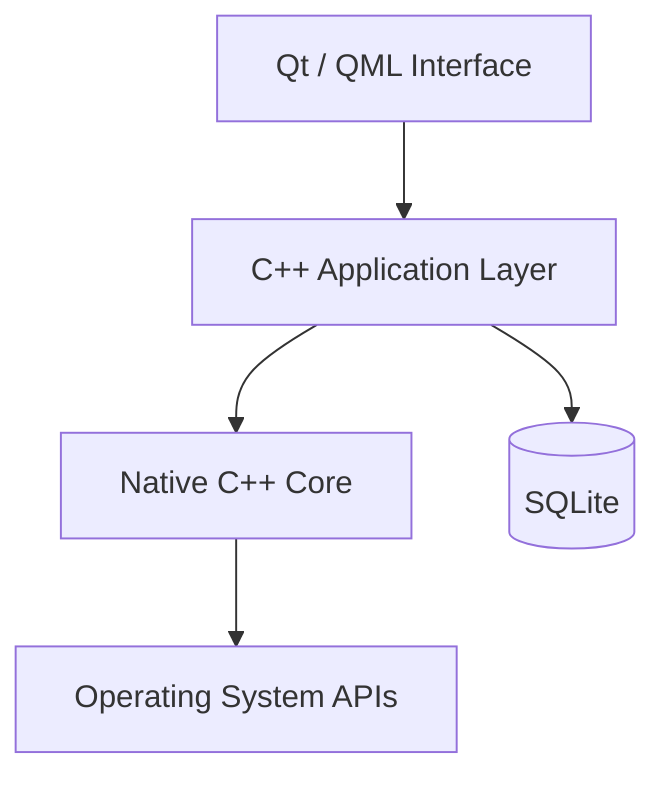
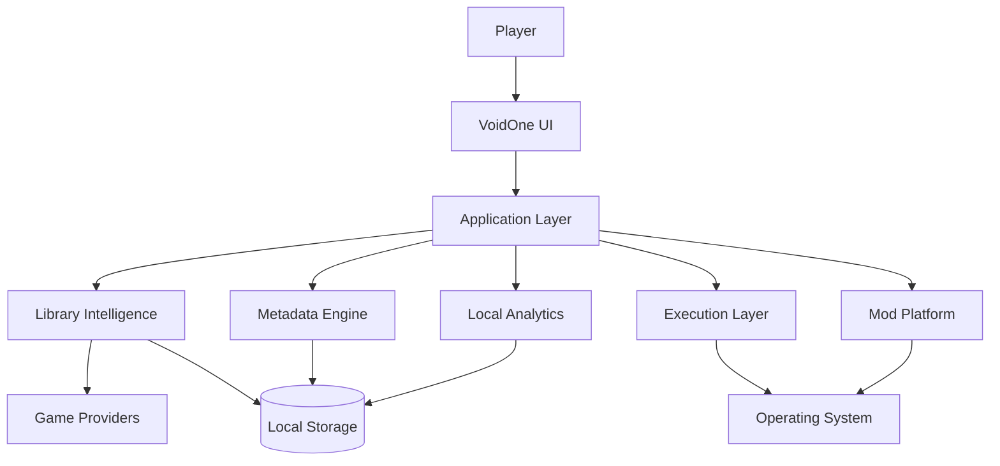

<div align="center">


# 🌌 VoidOne

### پلتفرم متن‌باز بازی‌های کامپیوتری که حول بازی‌های شما ساخته شده — نه حول فروشگاه‌ها

<p>
  <b>🇮🇷 پارسی</b> •
  <a href="README.md">🇬🇧 English</a>
</p>

<p>
  <a href="https://github.com/VoidOne-App/VoidOne/actions/workflows/c.cpp.yml">
    
  </a>
  <a href="https://github.com/VoidOne-App/VoidOne/releases/latest">
    
  </a>
  <a href="https://github.com/VoidOne-App/VoidOne/stargazers">
    
  </a>
  <a href="https://github.com/VoidOne-App/VoidOne/blob/main/LICENSE">
    
  </a>
</p>

<p>
  
  
  
  
  
  
</p>

<br />

**یک کتابخانه. بازی‌های شما. سخت‌افزار شما. قوانین شما.**

<br />

<p>
  <a href="#-درباره-voidone">درباره</a> •
  <a href="#-چشم‌انداز">چشم‌انداز</a> •
  <a href="#-تعهد-به-گیمرها">تعهد</a> •
  <a href="#-وضعیت-نسخه‌ها">نسخه‌ها</a> •
  <a href="#-پایه-فعلی-پروژه">پایه فعلی</a> •
  <a href="#-مسیر-آینده-پلتفرم">آینده</a> •
  <a href="#-معماری">معماری</a> •
  <a href="#-زیرساخت-مهندسی">مهندسی</a> •
  <a href="#-عملکرد">عملکرد</a> •
  <a href="#-نقشه-راه">نقشه راه</a> •
  <a href="#-ساخت-از-سورس">ساخت</a> •
  <a href="#-مشارکت">مشارکت</a>
</p>

</div>

---

# 🌌 درباره VoidOne

**VoidOne** یک پلتفرم متن‌باز و بومی برای بازی‌های کامپیوتری است که با یک ایده ساده اما بلندپروازانه ساخته می‌شود:

> **بازی‌های شما باید مرکز تجربه بازی باشند؛ نه فروشگاه‌هایی که آن‌ها را توزیع می‌کنند.**

دنیای PC Gaming بیش از هر زمان دیگری پراکنده شده است.

بازی‌ها میان فروشگاه‌ها، لانچرها، پوشه‌های نصب، Manifestها، سرویس‌های پس‌زمینه، تنظیمات، سیستم‌های Metadata و فایل‌های اجرایی مختلف تقسیم شده‌اند.

VoidOne با هدف ایجاد یک **لایه بومی، باز و قابل توسعه** میان گیمر و این اکوسیستم پراکنده در حال توسعه است.

این پروژه بر پایه فناوری‌هایی مانند:

- **C++23**
- **Qt 6.8**
- **QML / Qt Quick**
- **SQLite**
- **CMake**
- **Ninja**

ساخته می‌شود.

اما VoidOne قرار نیست صرفاً یک Game Launcher دیگر باشد.

مسیر بلندمدت پروژه، ساخت یک **Gaming Platform Layer** است؛ لایه‌ای که بتواند مدیریت بازی‌ها، اجرای بازی، مدیریت فرایندها، Metadata، Modها، تحلیل محلی، یکپارچه‌سازی Providerها، ابزارهای توسعه و قابلیت‌های پیشرفته دیگر را در یک معماری واحد گرد هم آورد.

---

# 🧪 وضعیت پروژه و نسخه‌ها

## ⚠️ VoidOne در حال توسعه است

تمام نسخه‌های فعلی VoidOne **آزمایشی (Experimental)** هستند.

این موضوع شامل نسخه‌هایی می‌شود که از طریق Releaseهای GitHub منتشر می‌شوند.

نسخه‌های فعلی ممکن است:

- باگ داشته باشند.
- تغییرات معماری داشته باشند.
- بعضی قابلیت‌ها ناقص باشند.
- عملکردشان در نسخه‌های مختلف تغییر کند.
- رابط کاربری آن‌ها تغییر کند.
- برای استفاده روزمره کاملاً آماده نباشند.

این موضوع بخشی طبیعی از توسعه VoidOne است.

> **نسخه‌های فعلی برای آزمایش، توسعه و دریافت بازخورد هستند؛ نه به‌عنوان نسخه نهایی و پایدار محصول.**

---

## 🟢 نسخه پایدار

**نسخه پایدار رسمی VoidOne هنوز ساخته و منتشر نشده است.**

نسخه پایدار زمانی منتشر خواهد شد که پروژه به سطح مناسبی از:

- پایداری
- تست
- عملکرد
- امنیت
- سازگاری
- تجربه کاربری
- کیفیت بسته‌بندی
- مستندسازی

برسد.

تا آن زمان، نسخه‌های منتشرشده همچنان در چرخه توسعه و آزمایش قرار دارند.

> **Stable Version — به‌زودی**

---

## 🔄 قابلیت‌ها قرار نیست حذف شوند

VoidOne یک پروژه مرحله‌ای است.

به همین دلیل بسیاری از قابلیت‌هایی که در این README به‌عنوان آینده پروژه معرفی شده‌اند، هنوز در نسخه فعلی وجود ندارند.

اما این به معنی کنار گذاشته شدن آن‌ها نیست.

قابلیت‌های آینده به‌صورت **مرحله‌به‌مرحله** و با رشد معماری پروژه اضافه خواهند شد.

> **این README همزمان وضعیت فعلی و مسیر توسعه آینده VoidOne را مشخص می‌کند.**

---

# 🎯 چشم‌انداز

VoidOne برای تبدیل شدن به یک Storefront دیگر ساخته نمی‌شود.

هدف این است که VoidOne به لایه‌ای میان:

**گیمر → سیستم‌عامل → اکوسیستم بازی**

تبدیل شود.

```text
                         ┌───────────────────────┐
                         │        GAMER          │
                         │        گیمر           │
                         └───────────┬───────────┘
                                     │
                                     ▼
                         ┌───────────────────────┐
                         │       VOIDONE         │
                         │   Native Game Layer   │
                         └───────────┬───────────┘
                                     │
                 ┌───────────────────┼───────────────────┐
                 │                   │                   │
                 ▼                   ▼                   ▼
             LIBRARIES           EXECUTION          SERVICES
             کتابخانه‌ها           اجرا              سرویس‌ها
                 │                   │                   │
                 └───────────────────┼───────────────────┘
                                     │
                                     ▼
                         ┌───────────────────────┐
                         │   OPERATING SYSTEM    │
                         │       سیستم‌عامل      │
                         └───────────────────────┘
```

هدف VoidOne جایگزین کردن تمام اکوسیستم بازی نیست.

هدف، ساختن یک لایه باز و بومی است که بتواند با اکوسیستمی که گیمر **همین حالا دارد** کار کند.

---

# 🛡️ تعهد به گیمرها

VoidOne از دید یک گیمر ساخته می‌شود.

این پروژه فقط درباره تکنولوژی نیست.

درباره این است که نرم‌افزار بازی باید به کسی که از آن استفاده می‌کند احترام بگذارد.

## ♾️ رایگان و متن‌باز

VoidOne تحت **MIT License** منتشر می‌شود.

هدف پروژه این است که هسته اصلی پلتفرم:

- رایگان باشد.
- متن‌باز باقی بماند.
- قابل بررسی باشد.
- قابل توسعه باشد.
- وابسته به یک اکوسیستم بسته نباشد.

> **VoidOne قرار نیست برای تجربه اصلی خود یک دیوار پرداخت اجباری ایجاد کند.**

---

## 🚫 بدون تبلیغات و Telemetry

VoidOne حول تبلیغات یا ردیابی رفتاری ساخته نمی‌شود.

هدف این است که گیمر برای استفاده از نرم‌افزار مجبور نباشد تبدیل به منبع داده تجاری شود.

> **شما از VoidOne برای مدیریت بازی‌هایتان استفاده می‌کنید؛ نه اینکه خودتان محصول باشید.**

---

## ⚡ سبک و کم‌مصرف

یکی از اهداف مهندسی بلندمدت VoidOne:

> **مصرف RAM در حالت Idle کمتر از 50 MB**

این عدد **هدف مهندسی** است و مشخصات تضمین‌شده نسخه فعلی نیست.

برای رسیدن به این هدف، معماری پروژه تا حد امکان از موارد غیرضروری دوری می‌کند:

- سرویس‌های دائمی
- فرایندهای پس‌زمینه غیرضروری
- Runtimeهای سنگین
- پردازش‌های بی‌دلیل
- مصرف منابع بدون دلیل مشخص

هر بخش از نرم‌افزار باید دلیل مشخصی برای وجود داشته باشد.

---

# 🔒 مالکیت داده

VoidOne با رویکرد **Local-First** طراحی می‌شود.

هدف این است که داده‌هایی مانند:

- کتابخانه بازی‌ها
- تنظیمات
- پروفایل‌ها
- Configuration
- آمار محلی
- تاریخچه اجرای بازی‌ها
- تنظیمات Mod

تا حد امکان تحت کنترل خود کاربر باقی بمانند.

---

# 🎮 Built by a Gamer. For Gamers.

VoidOne برای گیمرهایی ساخته می‌شود که می‌خواهند:

- سخت‌افزارشان تحت کنترل خودشان باشد.
- داده‌هایشان تحت کنترل خودشان باشد.
- بازی‌هایشان در یک محیط یکپارچه مدیریت شوند.
- مجبور نباشند برای هر قابلیت به یک سرویس جداگانه وابسته باشند.
- نرم‌افزاری داشته باشند که قابل بررسی و توسعه باشد.

> ### **Free & Open Source — Forever**
>
> ### **No Ads. No Telemetry.**
>
> ### **Your Data. Your Control.**
>
> ### **Built by a Gamer. For Gamers.**

---

# 🧭 اصول طراحی VoidOne

## 🧱 Native First

هرجا فناوری‌های بومی بتوانند مزیت واقعی در عملکرد، یکپارچگی با سیستم‌عامل یا نگهداری ایجاد کنند، اولویت با آن‌ها است.

## 🔒 Privacy by Design

حریم خصوصی نباید یک قابلیت جانبی باشد؛ باید بخشی از معماری باشد.

## 💾 Local First

هرجا امکان‌پذیر باشد، پردازش و ذخیره‌سازی اصلی باید محلی انجام شود.

## ⚡ Lightweight by Design

هر Dependency، Runtime، Service یا Background Process باید هزینه منابع خود را توجیه کند.

## 🎮 User Ownership

کاربر باید کنترل بازی‌ها، داده‌ها، Configuration و تجربه خود را در اختیار داشته باشد.

## 🌐 Open by Design

کد، معماری و توسعه پروژه باید تا حد امکان شفاف، قابل بررسی و قابل مشارکت باشد.

## 📐 Evidence Over Marketing

ادعاهای فنی باید با:

- کد
- تست
- Benchmark
- Measurement
- یا شواهد قابل تکرار

پشتیبانی شوند.

---

# 🏗️ پایه فعلی پروژه

این بخش وضعیت **پایه مهندسی فعلی** VoidOne را توضیح می‌دهد.

## 💻 فناوری‌های اصلی

VoidOne بر پایه این فناوری‌ها ساخته می‌شود:

| فناوری | کاربرد |
| :--- | :--- |
| **C++23** | توسعه Native و Systems |
| **Qt 6.8** | Framework اصلی |
| **QML / Qt Quick** | رابط کاربری |
| **SQLite** | ذخیره‌سازی محلی |
| **CMake** | سیستم Build |
| **Ninja** | اجرای Build |
| **CTest** | تست خودکار در Configurationهای مربوط |
| **GitHub Actions** | CI/CD |
| **CodeQL** | تحلیل امنیتی |
| **Cppcheck** | Static Analysis |
| **AddressSanitizer** | تشخیص خطاهای حافظه |

---

# 🎨 رابط کاربری بومی

رابط کاربری VoidOne بر پایه **Qt Quick / QML** ساخته می‌شود.

معماری پروژه میان لایه رابط کاربری و منطق Native C++ جداسازی ایجاد می‌کند.

هدف این معماری:

- توسعه سریع‌تر UI
- نگهداری بهتر
- کاهش وابستگی‌های غیرضروری
- امکان توسعه رابط‌های پیچیده‌تر
- دسترسی مستقیم به قابلیت‌های Native

است.

---

# 💾 ذخیره‌سازی محلی

VoidOne از **SQLite** برای Local Persistence استفاده می‌کند.

این معماری امکان ذخیره داده‌هایی مانند:

- کتابخانه
- تنظیمات
- پروفایل‌ها
- Metadata محلی
- اطلاعات بازی
- آمار محلی

را بدون نیاز اجباری به یک Backend مرکزی فراهم می‌کند.

---

# 🔄 زیرساخت CI/CD

Repository شامل Workflow خودکار GitHub Actions است.

Workflow فعلی پروژه در:

```text
.github/workflows/c.cpp.yml
```

قرار دارد.

بسته به وضعیت فعلی Repository، این زیرساخت می‌تواند بخش‌هایی مانند:

- Build
- Static Analysis
- CodeQL
- Cppcheck
- Sanitizer Validation
- Testing
- Packaging
- Artifact Generation
- Checksum Generation
- Release Automation

را اجرا کند.

> **Workflow موجود در Repository منبع اصلی حقیقت برای رفتار دقیق CI است.**

---

# 🪟 وضعیت پلتفرم‌ها

## Windows

Windows در حال حاضر محیط اصلی Build و Packaging پروژه است.

## Linux

Linux بخشی از مسیر Cross-Platform پروژه است و با رشد معماری VoidOne توسعه بیشتری خواهد یافت.

## macOS

macOS در حال حاضر بخشی از Pipeline اصلی Build و Packaging پروژه نیست.

---

# 🔭 مسیر آینده پلتفرم

قابلیت‌های این بخش **قابلیت‌های فعلی نسخه آزمایشی محسوب نمی‌شوند**؛ بلکه بخشی از مسیر توسعه VoidOne هستند.

این قابلیت‌ها حذف نشده‌اند و قرار است به‌صورت مرحله‌ای به پروژه اضافه شوند.

---

# 👻 Ghost Launch

**Ghost Launch** یکی از قابلیت‌های مهم مسیر آینده VoidOne است.

هدف آن ایجاد یک Execution Layer کنترل‌شده میان VoidOne و بازی است.

معماری مفهومی:

```text
Player
   │
   ▼
VoidOne
   │
   ▼
Execution Layer
   │
   ▼
Game Process
```

قابلیت‌های احتمالی:

- اجرای مستقیم Executable در موارد ممکن
- Launch Arguments
- Environment Configuration
- Per-Game Profiles
- Process Lifecycle Management
- Background Process Policies
- Orphan Process Detection
- Process Prioritization
- Runtime State Tracking

Ghost Launch قرار نیست DRM یا Licensing را دور بزند.

اگر بازی به‌صورت قانونی به یک Store یا Service دیگر نیاز داشته باشد، آن Dependency همچنان بخشی از محیط اجرای بازی خواهد بود.

---

# ⚙️ Intelligent Process Orchestration

VoidOne در مسیر توسعه خود یک لایه پیشرفته برای مدیریت Processها خواهد داشت.

این سیستم می‌تواند ارتباط میان بازی و Processهای جانبی آن را بهتر مدیریت کند.

قابلیت‌های هدف:

- Process Lifecycle Tracking
- Child Process Awareness
- Background Workload Policies
- CPU Priority Profiles
- Runtime Process Management
- Orphan Process Detection
- Per-Game Execution Policies
- Resource-Aware Launch Profiles

هدف:

> **اجرای کنترل‌شده بازی، نه فقط اجرای یک فایل و فراموش کردن آن.**

---

# 🧩 Multi-Store Aggregation

یکی از اهداف اصلی VoidOne ایجاد یک Library یکپارچه از منابع مختلف است.

Providerهای هدف شامل مواردی مانند:

- Steam
- Epic Games
- GOG
- EA App
- Local Installations
- Providerهای آینده

خواهند بود.

قابلیت‌های هدف:

- Installation Discovery
- Manifest Parsing
- Library Aggregation
- Duplicate Detection
- Game Identity Normalization
- Metadata Normalization
- Provider-Aware Launching

هدف این نیست که VoidOne تبدیل به یک Store دیگر شود.

هدف:

> **یکپارچه کردن تجربه بازی بدون ساختن یک اکوسیستم بسته جدید.**

---

# 🖼️ Rich Metadata Engine

VoidOne در آینده یک سیستم Metadata پیشرفته خواهد داشت.

قابلیت‌های هدف:

- Cover Artwork
- Hero Banner
- Background
- Description
- Genre
- Release Information
- Developer
- Publisher
- Rating
- Platform Information

معماری موردنظر شامل:

- پردازش Asynchronous
- Local Cache
- UI غیرمسدودکننده
- مدیریت خطاهای شبکه
- کاهش وابستگی به Network برای عملیات اصلی

خواهد بود.

Metadata باید تجربه را بهتر کند، نه اینکه برای اجرای عملیات پایه اجباری باشد.

---

# 📊 Local Gaming Analytics

VoidOne در آینده می‌تواند سیستم Analytics کاملاً محلی ارائه کند.

قابلیت‌های هدف:

- Session Tracking
- Launch History
- Play Duration
- Per-Game Statistics
- Local Crash Records
- Performance History
- Local Performance Trends

اصل اصلی:

> **تحلیل مفید بدون تبدیل کردن گیمر به محصول.**

تا حد امکان داده‌های Analytics محلی باقی خواهند ماند.

---

# 🧰 Advanced Mod Platform

یکی از مسیرهای توسعه مهم VoidOne ساخت یک Mod Platform کامل است.

قابلیت‌های هدف:

- Mod Profiles
- Virtual File Mapping
- Non-Destructive Deployment
- Dependency Management
- Conflict Detection
- Load Order Management
- Compatibility Checks

نمونه ساختار:

```text
Game
├── Vanilla
├── Competitive
├── Graphics Overhaul
├── Experimental
└── Custom Profile
```

هدف این است که گیمر بتواند Configurationهای مختلفی از یک بازی داشته باشد، بدون اینکه مجبور باشد Installation اصلی را دائماً تغییر دهد.

---

# 🎨 رابط کاربری نسل بعد

رابط کاربری VoidOne در طول توسعه پروژه می‌تواند به قابلیت‌های پیشرفته‌تری مجهز شود.

مسیر طراحی شامل مواردی مانند:

- Advanced QML Interface
- Dynamic Themes
- Artwork-Driven Library
- Responsive Layouts
- Personalization
- Display Scaling
- Accessibility
- Optional Animations
- RGB Customization

است.

اما یک اصل مهم وجود دارد:

> **زیبایی نباید به قیمت عملکرد تمام شود.**

هر Visual Effect باید هزینه عملکردی خود را توجیه کند.

---

# 🩺 Performance Diagnostics

VoidOne در آینده می‌تواند ابزارهای Diagnostics داخلی ارائه دهد.

قابلیت‌های هدف:

- Startup Analysis
- Runtime Measurements
- Memory Diagnostics
- Process Analysis
- Library Scan Profiling
- Performance History
- Per-Game Performance Profiles
- Benchmarking

هدف:

> **عملکرد باید قابل اندازه‌گیری باشد، نه صرفاً قابل احساس.**

---

# 💾 Backup & Recovery

سیستم Backup و Recovery یکی دیگر از بخش‌های مسیر توسعه VoidOne است.

داده‌های احتمالی:

- Application Configuration
- Library Data
- Game Profiles
- Mod Profiles
- User Preferences

قابلیت‌های هدف:

- Backup Creation
- Profile Export / Import
- Recovery Snapshots
- Configuration Restoration

---

# 🔌 Extension APIs

VoidOne در مسیر بلندمدت خود یک معماری Extensible خواهد داشت.

قابلیت‌های احتمالی:

- Extension APIs
- Provider APIs
- Theme SDK
- Community Extensions
- Custom Integrations
- Developer Tooling

سیستم Extension باید با درنظر گرفتن:

- امنیت
- پایداری
- Isolation
- Compatibility
- Maintainability

طراحی شود.

---

# 🌐 Developer Ecosystem

هدف نهایی تنها ساخت یک Application نیست.

VoidOne می‌تواند در آینده به بستری برای توسعه‌دهندگان و Community تبدیل شود.

مسیر توسعه شامل:

- Extension Ecosystem
- Theme Ecosystem
- Provider Integrations
- Developer APIs
- Community Tools
- Custom Experiences

خواهد بود.

---

# ⚡ اهداف عملکردی

عملکرد یکی از اهداف اصلی مهندسی VoidOne است.

این اعداد **هدف مهندسی** هستند، نه مشخصات تضمین‌شده نسخه‌های فعلی.

| معیار | هدف مهندسی |
| :--- | :--- |
| **Idle Memory** | کمتر از `50 MB` |
| **Cold Startup** | کمتر از `1.0s` |
| **Database Operations** | هدف Sub-millisecond |
| **UI Rendering** | هدف 60+ FPS |
| **Library Scanning** | حداقل Blocking رابط کاربری |

برای تبدیل شدن این اعداد به Specification رسمی، باید Benchmarkهای قابل تکرار منتشر شوند.

Benchmark باید شامل موارد زیر باشد:

- سخت‌افزار
- سیستم‌عامل
- Compiler
- Qt Version
- Application Version
- Build Configuration
- Test Methodology
- Measurement Conditions

> **هدف ما وعده دادن عملکرد نیست؛ هدف ما اثبات عملکرد است.**

---

# 🏗️ معماری

VoidOne بر پایه یک معماری لایه‌ای Native توسعه پیدا می‌کند.

## معماری فعلی



## معماری بلندمدت



نمودار دوم، معماری هدف بلندمدت پروژه را نمایش می‌دهد و به معنی وجود داشتن تمام این اجزا در نسخه فعلی نیست.

---

# 🤖 زیرساخت مهندسی و AI

VoidOne از Automation و AI برای کمک به فرآیند توسعه استفاده می‌کند.

این زیرساخت با تجربه کاربر نهایی متفاوت است.

---

## 🔄 Automated CI/CD

زیرساخت CI/CD پروژه می‌تواند مراحل مختلف چرخه مهندسی را خودکار کند:

- بررسی Release Tag
- Static Analysis
- CodeQL
- Cppcheck
- Debug Build
- Sanitizer Validation
- Release Build
- CTest
- Qt Deployment
- Windows Packaging
- Portable ZIP
- SHA-256 Checksums
- Release Artifacts
- Release Notifications

همچنین Workflow می‌تواند برای اجراهای:

- Pull Request
- Scheduled Runs
- Manual Runs
- Release Runs

پیکربندی شود.

---

# 🧠 AI Repair

VoidOne دارای زیرساخت **AI Repair** برای کمک به فرآیند مهندسی است.

AI Repair یک قابلیت کاربرمحور نیست.

هدف آن کمک به توسعه‌دهنده برای:

- تحلیل خطاهای CI
- بررسی Build Failure
- پیشنهاد اصلاح
- تولید Candidate Patch
- اجرای Validation
- آماده‌سازی تغییر برای Review

است.

فناوری‌های مورد استفاده یا هدف شامل مواردی مانند:

- **Gemini**
- **Qwen2.5-Coder**
- **Ollama**
- **GitHub Actions**
- C++ Tooling
- Build Logs

هستند.

چرخه مفهومی:

```text
                 CI Failure
                     │
                     ▼
             Failure Analysis
                     │
                     ▼
             AI-Assisted Repair
                     │
                     ▼
              Candidate Patch
                     │
                     ▼
               Build / Checks
                     │
                     ▼
              Automated Tests
                     │
                     ▼
             Draft Pull Request
                     │
                     ▼
                Human Review
                     │
                     ▼
                   Merge
```

اصل مهم:

> **AI سرعت مهندسی را افزایش می‌دهد؛ اما مسئولیت مهندسی را جایگزین نمی‌کند.**

هیچ تغییر تولیدشده توسط AI نباید بدون Validation و Review مناسب به‌عنوان تغییر نهایی تلقی شود.

---

# 🛡️ مهندسی امنیت

امنیت از مراحل ابتدایی توسعه در نظر گرفته می‌شود.

زیرساخت CI می‌تواند شامل:

- **GitHub CodeQL**
- **Cppcheck**
- Compiler Hardening
- Sanitizer Validation
- Automated Build Checks
- Artifact Integrity Checks
- SHA-256 Checksums

باشد.

در Windows Release Build نیز گزینه‌های Hardening مانند:

```text
/NXCOMPAT
/DYNAMICBASE
/GUARD:CF
/HIGHENTROPYVA
```

در نظر گرفته شده‌اند.

مسیر بلندمدت امنیت شامل:

- Dependency Auditing
- Artifact Integrity Verification
- Reproducible Builds
- Hardened Update Mechanisms
- Secure Extension Boundaries
- Runtime Integrity Validation

است.

VoidOne ادعای Security Certification یا امنیت مطلق ندارد، مگر اینکه چنین موضوعی به‌صورت رسمی مستند شود.

---

# 📦 انتشار نسخه‌ها

VoidOne از GitHub Releases برای انتشار Buildهای پروژه استفاده می‌کند.

### آخرین نسخه

<p>
  <a href="https://github.com/VoidOne-App/VoidOne/releases/latest">
    
  </a>
</p>

**آخرین Release:**

https://github.com/VoidOne-App/VoidOne/releases/latest

> ⚠️ تا زمان انتشار نسخه پایدار رسمی، Releaseهای منتشرشده آزمایشی هستند.

### تمام نسخه‌ها

https://github.com/VoidOne-App/VoidOne/releases

بسته به نسخه و وضعیت Pipeline، Release ممکن است شامل:

- Windows Installer
- Windows MSI
- Portable ZIP
- SHA-256 Checksum

باشد.

---

# 🔐 بررسی صحت فایل‌های منتشرشده

اگر یک SHA-256 Checksum همراه Release منتشر شده باشد، می‌توانید فایل دانلودشده را بررسی کنید.

### PowerShell

```powershell
Get-FileHash .\VoidOne-Windows-x64-Portable-<version>.zip -Algorithm SHA256
```

Hash به‌دست‌آمده را با Checksum منتشرشده برای همان فایل مقایسه کنید.

---

# 🔨 ساخت VoidOne از Source

VoidOne در حال حاضر عمدتاً برای Windows توسعه و بسته‌بندی می‌شود.

Linux نیز بخشی از مسیر Cross-Platform پروژه است.

نیازمندی‌ها ممکن است در طول توسعه تغییر کنند.

---

## Windows

محیط پیشنهادی:

- Windows 10 یا Windows 11
- Visual Studio 2022 / MSVC
- Qt 6.8
- CMake
- Ninja
- Git

Pipeline فعلی Windows از محیط‌هایی مانند:

- Qt 6.8
- MSVC x64
- Ninja
- NSIS
- WiX

استفاده می‌کند.

---

## Linux

محیط احتمالی:

- توزیع Linux جدید
- GCC یا Clang
- Qt 6
- CMake
- Ninja
- Git
- System Development Libraries موردنیاز

پشتیبانی Linux به‌صورت تدریجی توسعه خواهد یافت.

---

## macOS

macOS در حال حاضر بخشی از Pipeline اصلی Build و Packaging نیست.

---

# 📥 دریافت Source

```bash
git clone https://github.com/VoidOne-App/VoidOne.git
cd VoidOne
```

---

# ⚙️ Configure

## Windows

اگر Qt توسط CMake قابل شناسایی باشد:

```powershell
cmake `
  -S . `
  -B build `
  -G Ninja `
  -DCMAKE_BUILD_TYPE=Release `
  -DCMAKE_CXX_STANDARD=23
```

اگر CMake نتواند Qt را پیدا کند:

```powershell
cmake `
  -S . `
  -B build `
  -G Ninja `
  -DCMAKE_BUILD_TYPE=Release `
  -DCMAKE_CXX_STANDARD=23 `
  -DCMAKE_PREFIX_PATH="C:\Qt\6.8.0\msvc2022_64"
```

مسیر Qt را مطابق محیط خود تغییر دهید.

---

## Linux

```bash
cmake \
  -S . \
  -B build \
  -G Ninja \
  -DCMAKE_BUILD_TYPE=Release \
  -DCMAKE_CXX_STANDARD=23
```

اگر Qt خارج از مسیرهای استاندارد نصب شده باشد:

```bash
cmake \
  -S . \
  -B build \
  -G Ninja \
  -DCMAKE_BUILD_TYPE=Release \
  -DCMAKE_CXX_STANDARD=23 \
  -DCMAKE_PREFIX_PATH="$HOME/Qt/6.x.x/gcc_64"
```

---

# 🔨 Build

```bash
cmake --build build --parallel
```

---

# 🧪 Test

اگر Configuration فعلی Targetهای CTest را فراهم کند:

```bash
ctest \
  --test-dir build \
  --output-on-failure
```

---

# 🔍 Static Analysis

در محیط‌هایی که `clang-tidy` نصب شده است:

```bash
cmake \
  -S . \
  -B build-analysis \
  -G Ninja \
  -DCMAKE_BUILD_TYPE=Debug \
  -DCMAKE_CXX_STANDARD=23 \
  -DCMAKE_CXX_CLANG_TIDY=clang-tidy
```

سپس:

```bash
cmake --build build-analysis --parallel
```

Configuration دقیق CI همچنان منبع اصلی برای Static Analysis خودکار Repository است.

---

# 📦 Windows Packaging

Pipeline انتشار Windows از Packaging با ابزارهایی مانند:

- **NSIS**
- **WiX Toolset**

پشتیبانی می‌کند، در صورتی که Configuration مربوطه در Repository فعال باشد.

فرآیند انتشار می‌تواند شامل:

```text
Build
  │
  ▼
Qt Deployment
  │
  ▼
Deployment Validation
  │
  ▼
Portable ZIP
  │
  ▼
SHA-256
  │
  ├──► Installer
  │
  └──► MSI
         │
         ▼
       Release
```

باشد.

برای Deployment محلی Qt می‌توان از `windeployqt` استفاده کرد:

```powershell
windeployqt `
  --release `
  --compiler-runtime `
  --no-translations `
  --qmldir ".\src" `
  ".\path\to\VoidOne.exe"
```

مسیر Executable را مطابق Build خود تغییر دهید.

---

# 🧪 Testing & Validation

تست بخشی از چرخه توسعه VoidOne است.

بسته به Configuration فعلی Repository، Validation می‌تواند شامل موارد زیر باشد:

- CTest
- Debug Builds
- AddressSanitizer
- Static Analysis
- CodeQL
- Cppcheck
- QML Validation
- Release Build Validation
- Packaging Validation

Contributorها بهتر است پیش از ایجاد Pull Request، تست‌های مرتبط با تغییر خود را اجرا کنند.

---

# 📏 سیاست Performance

ادعاهای عملکردی باید قابل تکرار باشند.

اهداف فعلی:

| معیار | هدف |
| :--- | :--- |
| Idle Memory | `< 50 MB` |
| Cold Startup | `< 1.0s` |
| Database Operations | Sub-millisecond Target |
| UI Rendering | 60+ FPS Target |
| Library Scanning | Minimal UI Blocking |

پیش از اینکه هرکدام از این موارد به Specification رسمی تبدیل شوند، Benchmark باید شامل اطلاعات زیر باشد:

- Hardware
- Operating System
- Compiler
- Qt Version
- Application Version
- Build Configuration
- Test Methodology
- Measurement Conditions

موارد قابل اندازه‌گیری:

- Cold Startup
- Warm Startup
- Idle Memory
- Peak Memory
- Library Scan Duration
- Database Performance
- CPU Utilization
- UI Frame Time
- Background Workload Impact

> **هدف، وعده دادن نیست؛ هدف، اندازه‌گیری و اثبات است.**

---

# 🗺️ نقشه راه

VoidOne به‌صورت مرحله‌ای توسعه پیدا می‌کند.

موارد این Roadmap جهت توسعه پروژه هستند و تاریخ تحویل تضمین‌شده محسوب نمی‌شوند.

---

## مرحله I — Native Foundation

- [x] پایه C++23
- [x] Qt / QML Application Foundation
- [x] CMake Build System
- [x] Native Application Architecture
- [x] GitHub Actions CI/CD
- [x] CodeQL
- [x] Cppcheck
- [x] Sanitizer-Oriented Validation
- [x] Windows Release Packaging Pipeline

---

## مرحله II — Library Intelligence

- [ ] Game Discovery
- [ ] Installation Detection
- [ ] Local Library Persistence
- [ ] Provider Integration
- [ ] Metadata Normalization

---

## مرحله III — Gaming Experience

- [ ] Advanced Library Interface
- [ ] Filtering & Categorization
- [ ] Artwork & Metadata
- [ ] Personalization
- [ ] UI Refinement

---

## مرحله IV — Execution

- [ ] Ghost Launch
- [ ] Process Lifecycle Management
- [ ] Launch Profiles
- [ ] Runtime Configuration
- [ ] Local Playtime Tracking

---

## مرحله V — Mod Platform

- [ ] Mod Profiles
- [ ] Virtual File Mapping
- [ ] Dependency Management
- [ ] Conflict Detection
- [ ] Compatibility Management

---

## مرحله VI — Intelligence

- [ ] Local Gaming Analytics
- [ ] Performance Diagnostics
- [ ] Advanced Engineering Automation
- [ ] Automated Failure Diagnosis
- [ ] Automated Validation

---

## مرحله VII — Ecosystem

- [ ] Extension APIs
- [ ] Theme SDK
- [ ] Community Extensions
- [ ] Additional Providers
- [ ] Developer Ecosystem

---

## مرحله VIII — Platform Expansion

- [ ] Advanced Process Orchestration
- [ ] CPU Priority Profiles
- [ ] Resource Optimization
- [ ] Rich Metadata Engine
- [ ] Advanced Backup & Recovery
- [ ] Dynamic Themes
- [ ] RGB Customization
- [ ] Developer Tooling
- [ ] Provider Expansion
- [ ] Cross-Platform Maturity

> **تمام این قابلیت‌ها بخشی از مسیر توسعه VoidOne هستند و قرار است به‌صورت تدریجی اضافه شوند.**

---

# 🤝 مشارکت

مشارکت در VoidOne آزاد است.

زمینه‌های مختلفی برای مشارکت وجود دارد:

- C++
- Qt / QML
- UI / UX
- Testing
- Documentation
- Bug Reports
- Feature Proposals
- Performance
- Platform Support
- Build Systems
- CI/CD
- Security
- Developer Tooling

---

# 🔧 روند مشارکت

ابتدا Repository را دریافت کنید:

```bash
git clone https://github.com/VoidOne-App/VoidOne.git
cd VoidOne
```

Branch جدید بسازید:

```bash
git checkout main
git pull origin main
git checkout -b feature/your-feature
```

پس از اعمال تغییرات، آن‌ها را تست کنید.

سپس:

```bash
git add .
git commit -m "Add your feature"
git push origin feature/your-feature
```

و Pull Request خود را ایجاد کنید.

برای تغییرات بزرگ، توضیح دهید:

- چه چیزی تغییر کرده است.
- چرا این تغییر لازم بوده است.
- چگونه تست شده است.
- آیا Compatibility تحت تأثیر قرار گرفته است یا خیر.

تغییرات کوچک، متمرکز و قابل بررسی را ترجیح دهید.

---

# 🧭 استانداردهای مهندسی

## Evidence Over Marketing

ادعاهای فنی باید پشتوانه داشته باشند.

## Small Reviewable Changes

تغییرات کوچک‌تر، بررسی و نگهداری آسان‌تری دارند.

## Native First

در موارد مناسب، فناوری Native اولویت دارد.

## Security by Default

امنیت باید از مرحله طراحی در نظر گرفته شود.

## Human-Controlled Automation

AI و Automation باید به مهندسی کمک کنند، نه اینکه مسئولیت مهندسی را حذف کنند.

## Long-Term Maintainability

کد باید برای رشد بلندمدت پروژه قابل نگهداری باشد.

## Respect the Player

هر قابلیت در نهایت باید به یک سؤال پاسخ دهد:

> **آیا این قابلیت ارزش و کنترل بیشتری به گیمر می‌دهد، بدون اینکه آزادی یا منابع او را بدون دلیل از بین ببرد؟**

---

# 🐛 گزارش مشکلات

برای گزارش Build یا Runtime Problem، تا حد امکان موارد زیر را ارائه کنید:

- Operating System
- Compiler
- Compiler Version
- Qt Version
- CMake Version
- Build Configuration
- Error Message
- Steps to Reproduce
- Debug Output

گزارش دقیق باعث می‌شود مشکل سریع‌تر قابل بازتولید و حل باشد.

---

# 📚 مستندات

با رشد پروژه، مستندات بیشتری به Repository اضافه خواهد شد.

Repository منبع اصلی حقیقت برای موارد زیر است:

- Current Implementation
- Build Configuration
- CI Workflows
- Release Configuration
- Supported Tooling
- Development Requirements

موارد موجود در Roadmap نباید به‌عنوان قابلیت فعلی پروژه در نظر گرفته شوند.

---

# 📜 مجوز

VoidOne تحت **MIT License** منتشر می‌شود.

متن کامل مجوز در فایل زیر قرار دارد:

```text
LICENSE
```

Repository رسمی:

https://github.com/VoidOne-App/VoidOne

---

# 🌌 چرا VoidOne؟

چون PC Gaming نباید مجبور باشد حول فروشگاه‌ها ساخته شود.

بازی‌های شما باید مرکز باشند.

نه Store.

نه Launcher.

نه سرویس.

نه تبلیغات.

**بازی‌های شما.**

و VoidOne قرار است لایه‌ای باشد که مدیریت آن‌ها را ساده‌تر، بازتر و قابل کنترل‌تر کند.

---

<div align="center">

# 🌌 VoidOne

### بازی‌های شما. سخت‌افزار شما. قوانین شما.

**ساخته‌شده توسط یک گیمر. مهندسی‌شده به‌عنوان یک پلتفرم. توسعه‌یافته در فضای باز.**

<br />

### ♾️ Free & Open Source — Forever

### 🚫 No Ads. No Telemetry.

### 🔒 Your Data. Your Control.

### 🎮 Built by a Gamer. For Gamers.

<br />

<a href="https://github.com/VoidOne-App/VoidOne">
  
</a>

<br />
<br />

**Open Source · Native · Modular · Player-Focused**

<br />

### 🧪 تمامی نسخه‌های فعلی آزمایشی هستند

### 🟢 نسخه پایدار رسمی — به‌زودی

<br />

**VoidOne is not another store.**

**It is the layer between you and your games.**

</div>