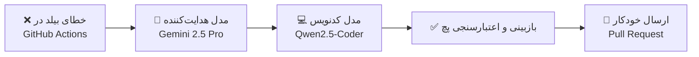

<div align="center" dir="rtl">


# 🌌 VoidOne

### سامانه نسل نو، متن‌باز و سبک برای مدیریت و اجرای بازی‌های پی‌سی

<p align="center">
  <a href="README.en.md">🇬🇧 English</a> •
  <b>🇮🇷 پارسی</b>
</p>

<p align="center">
  <a href="https://github.com/VoidOne-App/VoidOne/actions/workflows/c-cpp.yml">
    
  </a>
  <a href="https://github.com/VoidOne-App/VoidOne/actions/workflows/codeql.yml">
    
  </a>
  <a href="https://github.com/VoidOne-App/VoidOne/releases/latest">
    
  </a>
  <a href="https://github.com/VoidOne-App/VoidOne/releases">
    
  </a>
</p>

<p align="center">
  
  
  
  
  
</p>

<br/>

<p align="center">
  <a href="#-درباره-پروژه">درباره</a> •
  <a href="#-چرا-voidone">چرا VoidOne؟</a> •
  <a href="#-ویژگی‌های-کلیدی">ویژگی‌ها</a> •
  <a href="#-زیرساخت-فنی">زیرساخت فنی</a> •
  <a href="#-دریافت-و-نصب">دریافت و نصب</a> •
  <a href="#-ساخت-از-سورس">ساخت از سورس</a> •
  <a href="#-هوش-مصنوعی-در-cicd">هوش مصنوعی</a> •
  <a href="#-نقشه-راه">نقشه راه</a> •
  <a href="#-مشارکت">مشارکت</a>
</p>

</div>

<br/>

<div dir="rtl">

## 👁️ درباره پروژه

**VoidOne** یک لانچر سریع، سبک و متن‌باز برای بازی‌های پی‌سی است؛ ساخته‌شده روی **C++23** و **Qt 6 / QML**. هدف پروژه، یکپارچه‌سازی کتابخانه‌ی بازی از استورهای مختلف (Steam، Epic Games، GOG، Xbox) در یک محیط واحد با تم سایبرپانک است — بدون تله‌متری، بدون فرآیندهای پس‌زمینه‌ی سنگین، و بدون هیچ داده‌ای که از دستگاه شما خارج شود.

در حالت آماده‌به‌کار (Idle)، VoidOne عملاً منابع سیستم را اشغال نمی‌کند. با جداسازی کامل لایه‌ی رابط کاربری از منطق اجرایی، برنامه روی سخت‌افزارهای متنوع — از سیستم‌های قدیمی تا هندهلدهای گیمینگ — روان اجرا می‌شود.

> ⚠️ **وضعیت پروژه:** VoidOne در فاز اولیه‌ی توسعه‌ی فعال قرار دارد. معماری هسته با سرعت بالا در حال شکل‌گیری است — پیگیری [نقشه راه](#-نقشه-راه) برای دیدن وضعیت لحظه‌ای پیشنهاد می‌شود.

<br/>

## ⚡ چرا VoidOne؟

| | VoidOne | لانچرهای رسمی استورها | سایر لانچرهای متن‌باز |
| :--- | :---: | :---: | :---: |
| مصرف RAM در حالت Idle | 🟢 زیر ۵۰ مگابایت | 🔴 ۲۰۰+ مگابایت | 🟡 متغیر |
| تله‌متری و ردیابی | 🟢 صفر | 🔴 دارد | 🟡 بسته به پروژه |
| کتابخانه‌ی یکپارچه‌ی چند-استور | 🟢 دارد | 🔴 ندارد | 🟡 محدود |
| متن‌باز بودن کامل (MIT) | 🟢 دارد | 🔴 ندارد | 🟢 دارد |
| رابط کاربری QML شتاب‌دهی‌شده با GPU | 🟢 دارد | 🟡 متغیر | 🔴 اغلب ندارد |
| سیستم مادینگ یکپارچه | 🟢 در توسعه | 🔴 ندارد | 🟡 محدود |

<br/>

## ✨ ویژگی‌های کلیدی

### 🎮 کتابخانه یکپارچه بازی‌ها
- **موتور اسکن خودکار:** اسکن دقیق حافظه، پوشه‌های سفارشی و فایل‌های پیکربندی استورها (Steam VDF، Epic AppData، GOG Galaxy SQLite) برای ساخت لیست مرجع بازی‌ها.
- **دریافت هوشمند متادیتا:** دریافت ناهمگام (Asynchronous) کاورها، پس‌زمینه‌ها، امتیازات و اطلاعات سازندگان از طریق حافظه‌پنهان محلی.
- **آمار بازی و حریم خصوصی:** ثبت کاملاً محلی زمان بازی و روند استفاده — بدون ارسال حتی یک بایت داده به سرورهای خارجی.

### 🎨 رابط کاربری سایبرپانک با QML
- **رندر سخت‌افزاری:** اجرای روان با +۶۰ فریم بر ثانیه از طریق رندر مستقیم GPU با QtQuick.
- **شخصی‌سازی گسترده:** معماری ماژولار UI، پشتیبانی از پوسته‌ی تاریک، چیدمان قابل‌تغییر و تم‌سازی سفارشی.

### 🧩 موتور مدیریت ماد (Mod Engine)
- **پروفایل‌بندی مادها:** ساخت پروفایل مجزا برای هر بازی با فعال/غیرفعال‌سازی تک‌کلیکه.
- **ترتیب بارگذاری هوشمند:** بررسی وابستگی‌ها، اولویت‌بندی اجرا و لینک مجازی فایل‌های ماد بدون دست‌کاری فایل‌های اصلی بازی.

### 🤖 خط لوله CI/CD خودترمیم
- **تشخیص و رفع خودکار خطای بیلد:** تحلیل خطاهای CMake/C++ توسط زنجیره‌ی مدل‌های هوش مصنوعی و ارسال خودکار Pull Request.

<br/>

## ⚙️ زیرساخت فنی

| بخش | تکنولوژی | کاربرد |
| :--- | :--- | :--- |
| **هسته اصلی** | C++23 | پردازش کم‌مصرف، مدیریت ناهمگام پروسه‌ها، بهینه‌سازی حافظه |
| **رابط کاربری** | Qt 6.8 / QML | طراحی مدرن، رندر GPU، مدیریت چرخه‌ی حیات کامپوننت‌ها |
| **دیتابیس** | SQLite3 | ذخیره‌سازی محلی و Thread-safe متادیتای بازی‌ها |
| **سیستم بیلد** | CMake 3.25+ / Ninja | کامپایل سریع، چندسکویی و ماژولار |
| **اتصال سیستمی** | WinAPI / Linux D-Bus | اجرای مستقیم پروسه‌ها، مدیریت دسترسی و آیکون سیستم‌تری |
| **بسته‌بندی** | Inno Setup / Portable ZIP | نصب‌کننده‌ی رسمی ویندوز و نسخه‌ی پرتابل بدون نصب |
| **اتوماسیون / CI** | GitHub Actions | بیلد، آنالیز استاتیک (CodeQL + cppcheck)، بررسی امنیتی، انتشار خودکار |

<br/>

## 📥 دریافت و نصب

<div align="center">

[](https://github.com/VoidOne-App/VoidOne/releases/latest)

</div>

دو روش نصب موجود است:

| روش | مناسب برای |
| :--- | :--- |
| **`VoidOne-Setup-x64.exe`** | نصب کامل با میانبر منوی استارت و (اختیاری) میانبر دسکتاپ، Uninstaller رسمی |
| **`VoidOne-Windows-x64-Portable.zip`** | اجرای بدون نصب — کپی و اجرا از هر پوشه یا USB |

> 🔐 هر دو فایل به‌همراه چک‌سام `SHA256` منتشر می‌شوند. پیش از اجرا، صحت فایل را با فرمان زیر بررسی کنید:
> ```powershell
> Get-FileHash VoidOne-Setup-x64.exe -Algorithm SHA256
> ```

<br/>

## 🔨 ساخت از سورس

### پیش‌نیازها

- **کامپایلر:**
  - ویندوز: MSVC 2022 (نسخه v17.8 به بالا) با پشتیبانی کامل C++23
  - لینوکس: GCC 13+ یا Clang 17+
- **فریم‌ورک:** Qt 6.8+ (به همراه ماژول‌های QtQuick و QML)
- **ابزارها:** CMake 3.25+، Ninja Build System، Git 2.40+

### مراحل کامپایل

```bash
# ۱. دریافت کدها از گیت‌هاب
git clone https://github.com/VoidOne-App/VoidOne.git
cd VoidOne

# ۲. پیکربندی سیستم بیلد با استاندارد C++23
cmake -S . -B build -G Ninja -DCMAKE_BUILD_TYPE=Release -DCMAKE_CXX_STANDARD=23

# ۳. کامپایل هم‌زمان پروژه
cmake --build build --config Release --parallel
```

<br/>

## 🤖 هوش مصنوعی در CI/CD

VoidOne از یک خط لوله‌ی هوشمند برای تشخیص و رفع سریع خطاهای بیلد استفاده می‌کند:



تمام پچ‌های تولیدشده پیش از merge توسط تیم اصلی به‌صورت دستی بازبینی می‌شوند — هوش مصنوعی دستیار سرعت است، نه تصمیم‌گیرنده‌ی نهایی.

<br/>

## 🗺️ نقشه راه

- [x] **فاز ۱ — زیرساخت اصلی:** تنظیم CMake برای C++23، اتصال Qt 6.8/QML، کانفیگ CI/CD ویندوز و لینوکس
- [ ] **فاز ۲ — دیتابیس و اسکنر:** طراحی دیتابیس SQLite، اسکنر چندنخی فایل‌ها، الگوریتم‌های پارس اطلاعات
- [ ] **فاز ۳ — اتصال استورها:** اتصال به API و فایل‌های Steam، Epic Games، GOG و بازی‌های دستی
- [ ] **فاز ۴ — سیستم مادینگ:** لودر داینامیک پلاگین، حل تداخل مادها، سیستم فایل مجازی
- [ ] **فاز ۵ — توسعه اکوسیستم:** ابزار ساخت تم QML، سینک نورپردازی RGB (OpenRGB)، همگام‌سازی ابری

<br/>

## 🤝 مشارکت

مشارکت شما به رشد این پروژه‌ی متن‌باز کمک می‌کند — چه با گزارش باگ، چه بهینه‌سازی UI، چه توسعه‌ی اتصال به استورها.

1. پروژه را Fork کنید.
2. یک برنچ جدید بسازید: `git checkout -b feature/NewFeature`
3. تغییرات را ثبت کنید: `git commit -m 'feat: add new feature'`
4. برنچ را Push کنید: `git push origin feature/NewFeature`
5. یک Pull Request ارسال کنید.

<br/>

## 👨‍💻 پیش‌زمینه پروژه

VoidOne با هدف ساخت جایگزینی مدرن، سریع و بدون افکت‌های اضافه برای لانچرهای متداول بازی آغاز شد. این پروژه بستری عملی برای پیاده‌سازی الگوهای پیشرفته‌ی برنامه‌نویسی سطح‌پایین در C++23 و طراحی رابط کاربری با Qt 6 / QML است. هوش مصنوعی به‌عنوان ابزار دستیار در طراحی معماری و تست خودکار استفاده می‌شود؛ تمام کدها پیش از merge به‌صورت دستی بازبینی و بهینه می‌شوند.

<br/>

## 📄 پروانه (License)

```
+--------------------------------------------------------------+
|                    [ V O I D O N E   E N G I N E ]           |
+--------------------------------------------------------------+
| Copyright (c) 2026 VoidOne-App Core Team                     |
| Repo: github.com/VoidOne-App/VoidOne                         |
| Tech: Modern C++23 & Qt 6 / QML                               |
+--------------------------------------------------------------+
```

این پروژه تحت پروانه‌ی **MIT** منتشر شده است. برای جزئیات بیشتر، پرونده‌ی [LICENSE](LICENSE) را مطالعه کنید.

<br/>

<div align="center">

<sub>توسعه‌یافته با دقت، ❤️ و C++23 توسط تیم اصلی VoidOne-App</sub>

<br/><br/>

⭐ اگر VoidOne را دوست دارید، فراموش نکنید ستاره بدهید!

</div>

</div>
