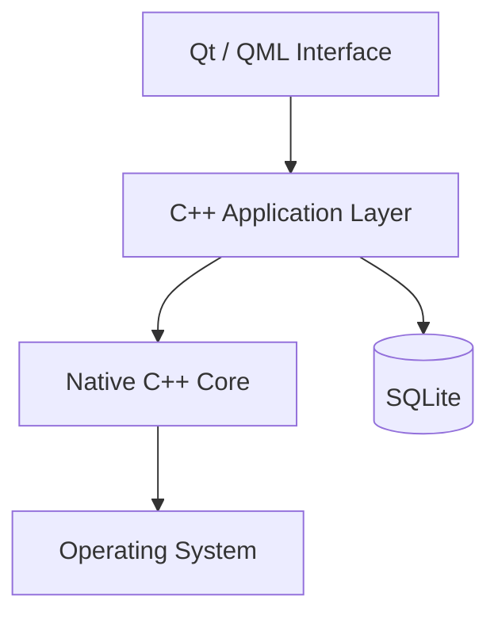
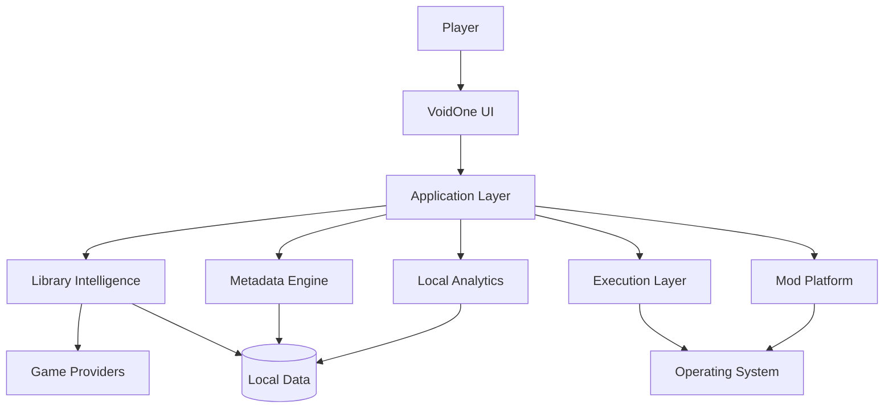

<div align="center">


# 🌌 VoidOne

### A Native Open-Source PC Gaming Platform Built Around Your Games

<p align="center">
  <b>🇬🇧 English</b> •
  <a href="README.fa.md">🇮🇷 پارسی</a>
</p>

<p align="center">
  <a href="https://github.com/VoidOne-App/VoidOne/actions/workflows/c.cpp.yml">
    
  </a>
  <a href="https://github.com/VoidOne-App/VoidOne/actions/workflows/ai-repair.yml">
    
  </a>
  <a href="https://github.com/VoidOne-App/VoidOne/releases/latest">
    
  </a>
  <a href="https://github.com/VoidOne-App/VoidOne/stargazers">
    
  </a>
  <a href="https://img.shields.io/github/license/VoidOne-App/VoidOne">
    
  </a>
</p>

<p align="center">
  
  
  
  
  
</p>

<br />

**One Library. Your Games. Your Hardware. Your Rules.**

<br />

<p align="center">
  <a href="#-about">About</a> •
  <a href="#-vision">Vision</a> •
  <a href="#-philosophy">Philosophy</a> •
  <a href="#-current-capabilities">Current</a> •
  <a href="#-future-direction">Future</a> •
  <a href="#-performance-goals">Performance</a> •
  <a href="#-architecture">Architecture</a> •
  <a href="#-technology-stack">Technology</a> •
  <a href="#-roadmap">Roadmap</a> •
  <a href="#-build-from-source">Build</a> •
  <a href="#-contributing">Contributing</a>
</p>

</div>

---

## 👁️ About

**VoidOne** is an open-source, native PC gaming platform engineered around the player's local game library.

Built with **C++23, Qt 6.8, QML, SQLite, and CMake**, VoidOne is designed to provide a lightweight foundation for discovering, organizing, launching, and eventually managing games across the fragmented PC gaming ecosystem.

Modern PC gaming can involve:

- Multiple storefronts
- Multiple launchers
- Different installation locations
- Platform-specific manifests
- Independent executables
- Separate configuration systems
- Background services
- Different metadata providers
- Mod-management tools

VoidOne is being built to reduce that fragmentation through a native application architecture.

> **Your games should be the focal point of your system — not the stores distributing them.**

VoidOne is currently an evolving engineering project. Its present capabilities and future platform vision are intentionally separated throughout this document.

---

# 🎯 Vision

VoidOne is not being built simply to become another storefront.

The long-term goal is to build a **unified native layer between the player, the operating system, and the gaming ecosystem**.

```text
                         ┌───────────────────────┐
                         │        PLAYER         │
                         └───────────┬───────────┘
                                     │
                                     ▼
                         ┌───────────────────────┐
                         │       VOIDONE         │
                         │ Native Gaming Platform│
                         └───────────┬───────────┘
                                     │
             ┌───────────────────────┼───────────────────────┐
             │                       │                       │
             ▼                       ▼                       ▼
        GAME LIBRARY           EXECUTION LAYER        GAME SERVICES
             │                       │                       │
             └───────────────────────┼───────────────────────┘
                                     │
                                     ▼
                         ┌───────────────────────┐
                         │    OPERATING SYSTEM   │
                         └───────────────────────┘
```

The objective is not to replace existing gaming platforms overnight.

Instead, VoidOne aims to provide an independent layer capable of progressively integrating with the ecosystem while keeping the player's local environment at the center.

---

# 🛡️ Philosophy

VoidOne follows a set of principles that guide both product development and engineering decisions.

## ♾️ Open by Design

VoidOne is open-source and distributed under the MIT License.

The project is intended to remain inspectable, modifiable, and accessible to contributors.

## 🔒 Local-First

Whenever functionality can reasonably be performed locally, VoidOne should prefer local processing and local persistence.

The long-term architecture prioritizes local ownership of:

- Library information
- Application configuration
- User preferences
- Local statistics
- Game profiles

## 📴 Offline-Oriented

Core local functionality should not unnecessarily depend on an internet connection.

Online services may enhance features such as metadata and artwork, but the fundamental local experience should remain useful without unnecessary network dependencies.

## ⚙️ Native First

VoidOne is built around native desktop technologies:

- C++23
- Qt 6.8
- QML / Qt Quick
- SQLite
- CMake

The application is not designed around an Electron-style browser runtime.

## 👤 User Ownership

VoidOne is designed around the idea that the player owns the experience.

The platform should help organize and control the games already available on the user's machine rather than turning the launcher itself into another mandatory ecosystem.

## 🤖 Human-Controlled Automation

AI and automation can accelerate engineering work.

They should not replace testing, review, accountability, or human engineering ownership.

> **AI accelerates engineering. It does not replace engineering ownership.**

---

# ✅ Current Capabilities

This section describes the **current engineering foundation** of VoidOne.

Future capabilities are intentionally excluded from this section.

### Native Application Foundation

VoidOne is built around:

- **C++23**
- **Qt 6.8**
- **QML / Qt Quick**
- **SQLite**
- **CMake**
- **Ninja**

### Engineering Infrastructure

The repository includes GitHub-based engineering automation, including:

- Automated build workflows
- Static analysis where configured
- Security analysis where configured
- Repository automation
- AI-assisted engineering infrastructure

### Local Persistence

SQLite provides the foundation for local application data and persistence.

The architecture is designed so that local application state can be managed without requiring a remote database.

### Native UI Foundation

Qt Quick / QML provides the foundation for the application's graphical interface.

The separation between QML presentation and C++ application logic is intended to keep the interface flexible while retaining a native systems-oriented core.

---

# 🧪 Engineering Automation

VoidOne includes an engineering automation layer designed to assist development and repository maintenance.

The project can use AI-assisted workflows to help diagnose and repair engineering problems.

The intended workflow is:

```text
                 CI / Build
                     │
                     ▼
                Failure / Issue
                     │
                     ▼
              AI-Assisted Analysis
                     │
                     ▼
               Candidate Repair
                     │
                     ▼
                 Validation
                     │
              ┌──────┴──────┐
              ▼             ▼
            Build          Tests
              │             │
              └──────┬──────┘
                     ▼
               Human Review
                     │
                     ▼
                  Merge
```

AI-generated changes remain subject to normal engineering review and validation.

---

# 🚀 Future Direction

The following capabilities represent **planned and long-term engineering directions**.

They are **not current capabilities unless separately implemented and documented by the repository**.

VoidOne's ambition is to progressively evolve from a native launcher foundation into a broader PC gaming platform.

---

# 👻 Ghost Launch

**Ghost Launch** is a planned execution architecture intended to provide greater control over game startup and runtime behavior.

Potential capabilities include:

- Direct executable execution
- Launch profiles
- Custom launch arguments
- Environment variables
- Process lifecycle monitoring
- Background-process policies
- Orphan-process detection
- Process prioritization
- Runtime state management

The conceptual direction is:

```text
Player
  │
  ▼
VoidOne
  │
  ▼
Execution Layer
  │
  ▼
Game Process
```

The purpose is to create a controlled execution layer between the player and the game.

VoidOne will not attempt to bypass DRM, licensing systems, or platform authentication requirements.

If a game legitimately requires another service, that dependency remains part of the execution environment.

---

# ⚡ Performance Goals

Performance is a **core engineering objective** of VoidOne.

The figures below are **long-term engineering targets**, not guaranteed specifications of the current release.

| Metric | Target | Engineering Direction |
| :--- | :--- | :--- |
| **Idle Memory** | `< 50 MB` | Native C++ architecture and avoidance of heavyweight browser runtimes |
| **Cold Startup** | `< 1.0s` | Lazy initialization and asynchronous startup |
| **Database Operations** | Sub-millisecond target | Efficient SQLite queries and indexing |
| **UI Rendering** | 60+ FPS target | Qt Quick scene graph and hardware acceleration |
| **Library Scanning** | Minimize blocking time | Asynchronous and incremental processing |

### 🎯 The Goal

The goal is to build a launcher that remains:

- Fast to start
- Lightweight while idle
- Responsive during library operations
- Efficient with large libraries
- Predictable under normal workloads
- Native to the operating system

These targets are **not marketing specifications**.

Before any target is presented as an official performance claim, it should be validated through reproducible benchmarks.

Benchmark reports should document:

- Hardware
- Operating system
- Compiler
- Qt version
- Build configuration
- Application version
- Test methodology
- Measurement conditions

> **These are engineering targets — not current guarantees.**

---

# 🧩 Multi-Store Aggregation

A unified multi-store library is part of the long-term VoidOne direction.

Potential providers include:

- Steam
- Epic Games
- GOG
- EA App
- Local installations
- Additional providers

Potential capabilities include:

- Installation discovery
- Manifest parsing
- Unified library aggregation
- Duplicate detection
- Game identity normalization
- Metadata normalization
- Provider-aware launching

The goal is to make the player's games accessible through one consistent interface without turning VoidOne into another storefront.

---

# 🖼️ Metadata Engine

A future metadata engine may provide:

- Cover artwork
- Hero banners
- Background images
- Descriptions
- Genres
- Release information
- Developer information
- Publisher information
- Ratings
- Platform information

The planned architecture favors:

- Asynchronous processing
- Local caching
- Non-blocking UI
- Failure-tolerant network operations

Metadata should enhance the local library rather than become a hard dependency for basic local functionality.

---

# 📊 Local Gaming Analytics

Future versions may provide privacy-oriented local analytics.

Potential capabilities include:

- Session tracking
- Launch history
- Play duration
- Per-game statistics
- Local crash information
- Performance history

The guiding principle is:

> **Useful analytics without turning the player into the product.**

The long-term direction is to keep analytics local wherever technically practical.

---

# 🧰 Advanced Mod Platform

A future mod platform may introduce:

- Mod profiles
- Virtual file mapping
- Non-destructive deployment
- Dependency management
- Conflict detection
- Load-order management
- Compatibility validation

A possible profile model:

```text
Game
├── Vanilla
├── Competitive
├── Graphics Overhaul
├── Experimental
└── Custom Profile
```

The objective is to let players maintain multiple game configurations without destructively modifying the original installation.

---

# 🎨 Next-Generation UI

The long-term interface direction may include:

- Advanced QML interfaces
- Dynamic themes
- Artwork-driven libraries
- Responsive layouts
- Personalization
- Display scaling
- Accessibility improvements
- Optional visual effects
- RGB customization

Visual effects should always justify their performance cost.

A premium interface is only useful if it remains responsive.

---

# 🩺 Performance Diagnostics

Future diagnostics capabilities may include:

- Startup analysis
- Runtime measurements
- Memory diagnostics
- Process analysis
- Library scan profiling
- Performance history
- Per-game performance profiles
- Benchmarking tools

The objective is to make performance measurable rather than relying on subjective claims.

---

# 💾 Backup & Recovery

Future versions may introduce local backup and recovery capabilities.

Potential areas include:

- Application configuration
- Library data
- Game profiles
- Mod profiles
- User preferences

Potential capabilities:

- Backup creation
- Profile export/import
- Recovery snapshots
- Configuration restoration

---

# 🔌 Extensibility & Developer Ecosystem

The long-term platform may expose controlled extension points.

Potential future components include:

- Extension APIs
- Theme SDK
- Developer APIs
- Community extensions
- Custom integrations
- Additional provider adapters

Security and stability should remain fundamental requirements for any extension architecture.

---

# 🏗️ Architecture

VoidOne follows a layered architecture designed to separate presentation, application logic, persistence, platform discovery, and operating-system integration.

## Current Architectural Direction



The separation allows the UI to evolve without forcing major changes into the native core.

## Long-Term Platform Architecture



This architecture is a **strategic direction**, not a claim that every component already exists.

---

# 🛡️ Security

Security is treated as an engineering requirement.

Current repository tooling may include security and static-analysis workflows where configured.

Long-term security work may include:

- Dependency auditing
- Artifact integrity verification
- Release validation
- Reproducible builds
- Hardened update mechanisms
- Secure extension boundaries
- Runtime integrity checks

VoidOne does not claim security certifications or absolute security guarantees unless explicitly documented.

---

# 🧰 Technology Stack

| Technology | Role |
| :--- | :--- |
| **C++23** | Native application and systems development |
| **Qt 6.8** | Native application framework |
| **QML / Qt Quick** | Declarative graphical interface |
| **SQLite** | Local persistence |
| **CMake** | Build configuration |
| **Ninja** | Build execution |
| **CTest** | Testing infrastructure where configured |
| **GitHub Actions** | CI/CD and automation |
| **CodeQL** | Security analysis where configured |
| **Cppcheck** | Static analysis where configured |
| **WiX Toolset** | Windows installer tooling where configured |
| **NSIS** | Windows packaging tooling where configured |
| **Ollama** | Local AI infrastructure where configured |
| **Gemini** | AI-assisted engineering where configured |
| **Qwen2.5-Coder** | Code-oriented AI assistance where configured |

---

# 🔄 CI/CD

GitHub Actions forms part of the project's engineering infrastructure.

The repository contains workflow automation for development and engineering tasks.

Depending on the workflow, responsibilities may include:

- Source validation
- Compilation
- Static analysis
- Security analysis
- Testing
- Packaging
- Artifact generation
- Engineering automation

The repository's actual workflow definitions are the source of truth for current CI behavior.

---

# 📦 Download

Official releases are distributed through GitHub Releases.

### Latest Release

https://github.com/VoidOne-App/VoidOne/releases/latest

### All Releases

https://github.com/VoidOne-App/VoidOne/releases

Release artifacts depend on the specific release.

They may include:

- Windows installers
- Portable archives
- SHA-256 checksums

Always use the artifacts published with the release you are downloading.

---

# 🔐 Hash Verification

When SHA-256 checksums are provided with a release, verify downloaded files locally.

### PowerShell

```powershell
Get-FileHash .\VoidOne-Windows-x64-Portable.zip -Algorithm SHA256
```

Compare the resulting hash with the checksum published alongside the corresponding release artifact.

Use the exact filename supplied by the release.

---

# 🔨 Build From Source

## Windows Prerequisites

Recommended development environment:

- Windows 10 or later
- Visual Studio 2022
- MSVC
- Qt 6.8+
- CMake
- Ninja
- Git

For installer development, additional tooling such as WiX Toolset or NSIS may be required depending on the packaging configuration.

## Linux Prerequisites

Linux support depends on the current repository implementation and CI configuration.

Where supported, development may require:

- GCC or Clang
- C++23 support
- Qt 6.8+
- CMake
- Ninja
- Git

---

## Clone

```bash
git clone https://github.com/VoidOne-App/VoidOne.git
cd VoidOne
```

## Configure

```bash
cmake -S . -B build -G Ninja \
  -DCMAKE_BUILD_TYPE=Release \
  -DCMAKE_CXX_STANDARD=23
```

If CMake cannot locate Qt automatically:

```bash
cmake -S . -B build -G Ninja \
  -DCMAKE_BUILD_TYPE=Release \
  -DCMAKE_CXX_STANDARD=23 \
  -DCMAKE_PREFIX_PATH="C:/Qt/6.8.0/msvc2022_64"
```

Replace the Qt path with the installation path on your system.

## Build

```bash
cmake --build build --config Release --parallel
```

## Test

If tests are configured for the current build:

```bash
ctest --test-dir build --output-on-failure
```

---

# 🧪 Testing

Testing is part of the intended engineering lifecycle.

Contributors should run the tests and validation relevant to their changes.

For projects exposing CTest tests:

```bash
ctest --test-dir build --output-on-failure
```

Not every planned subsystem necessarily has automated coverage yet.

Test coverage should grow alongside the platform.

---

# 📦 Packaging

Windows distribution is designed to support conventional desktop packaging workflows.

Depending on the current repository configuration, packaging infrastructure may include:

- WiX Toolset
- NSIS
- Portable archives
- Installer artifacts

Packaging commands and artifact names should always follow the current repository configuration rather than relying on hardcoded filenames.

---

# 🗺️ Roadmap

VoidOne is being developed progressively.

Roadmap status intentionally distinguishes completed foundation work from future platform capabilities.

## Phase I — Native Foundation

- [x] C++23 project foundation
- [x] Qt / QML integration
- [x] CMake build system
- [x] Native application architecture
- [x] GitHub engineering infrastructure

## Phase II — Library Intelligence

- [ ] Game discovery
- [ ] Installation detection
- [ ] Library persistence
- [ ] Provider integration
- [ ] Metadata normalization

## Phase III — Experience

- [ ] Advanced library interface
- [ ] Filtering and categorization
- [ ] Artwork and metadata
- [ ] Personalization
- [ ] UI refinement

## Phase IV — Execution

- [ ] Ghost Launch
- [ ] Process lifecycle management
- [ ] Launch profiles
- [ ] Runtime configuration
- [ ] Local playtime tracking

## Phase V — Mod Platform

- [ ] Mod profiles
- [ ] Virtual file mapping
- [ ] Dependency management
- [ ] Conflict detection
- [ ] Compatibility management

## Phase VI — Intelligence

- [ ] Local gaming analytics
- [ ] Performance diagnostics
- [ ] Advanced AI engineering
- [ ] Automated failure diagnosis
- [ ] Automated validation

## Phase VII — Ecosystem

- [ ] Extension APIs
- [ ] Theme SDK
- [ ] Community extensions
- [ ] Additional providers
- [ ] Developer ecosystem

> Roadmap items represent engineering direction, not guaranteed delivery dates.

---

# 📏 Benchmarking Policy

VoidOne aims to make performance measurable.

Any future official benchmark should document:

```text
Application Version
        │
        ▼
Hardware
        │
        ▼
Operating System
        │
        ▼
Compiler / Toolchain
        │
        ▼
Qt Version
        │
        ▼
Build Configuration
        │
        ▼
Benchmark Methodology
        │
        ▼
Measured Result
```

Potential measurements include:

- Cold startup
- Warm startup
- Idle memory
- Peak memory
- Library scan time
- Database performance
- UI frame-time
- CPU utilization
- Background workload impact

> **No performance number becomes an official specification until it can be reproduced.**

---

# 🤝 Contributing

Contributions are welcome.

Areas of contribution include:

- C++ development
- Qt/QML
- UI/UX
- Build systems
- CI/CD
- Testing
- Game discovery
- Performance
- Security
- Documentation
- Developer tooling

## Contribution Workflow

1. Fork the repository.
2. Create a focused branch.
3. Implement a reviewable change.
4. Build the project.
5. Run relevant tests.
6. Update documentation where necessary.
7. Open a pull request.

Example:

```bash
git checkout -b feature/your-feature
```

Keep commits focused and descriptive.

For substantial changes, explain:

- What changed
- Why it changed
- How it was tested
- Any relevant compatibility considerations

---

# 🧭 Engineering Standards

### Evidence Over Marketing

Technical claims should be supported by implementation, testing, benchmarks, or documented evidence.

### Small Reviewable Changes

Prefer focused changes that are easy to understand, validate, and review.

### Native First

Prefer native solutions where they provide meaningful advantages in performance, integration, maintainability, or system control.

### Security by Default

Security should be considered during architecture and implementation rather than treated exclusively as a post-release concern.

### Human-Controlled Automation

AI and automation should assist engineers while preserving human responsibility for the final result.

### Long-Term Maintainability

Architecture should remain understandable and extensible as VoidOne grows.

---

# 📜 License

VoidOne is distributed under the **MIT License**.

See [`LICENSE`](LICENSE) for the complete license text.

Repository:

https://github.com/VoidOne-App/VoidOne

---

<div align="center">

# 🌌 VoidOne

### Your Games. Your Hardware. Your Rules.

**Built by a gamer. Engineered like a platform. Built in the open.**

<br />

<a href="https://github.com/VoidOne-App/VoidOne">
  
</a>

<br />
<br />

**Open Source · Native · Modular · Player-Focused**

</div>