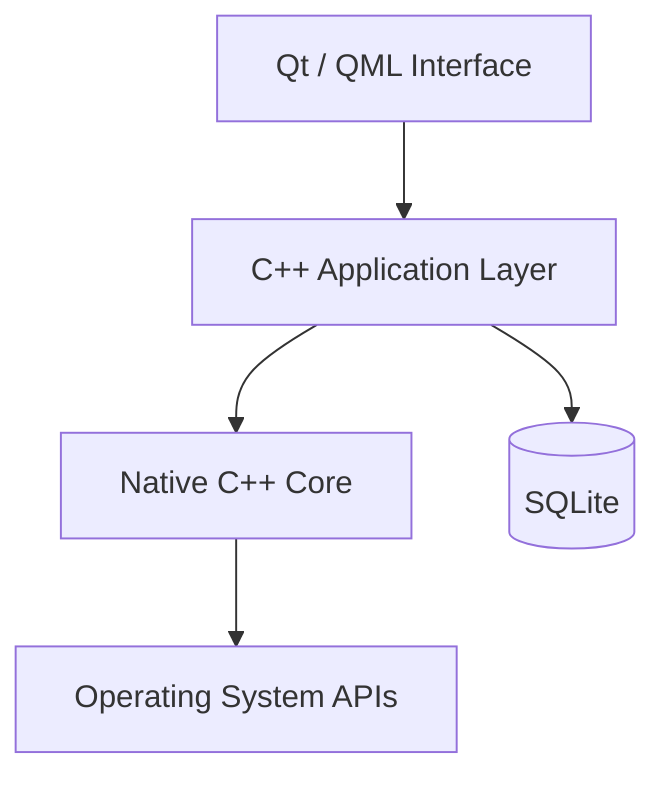
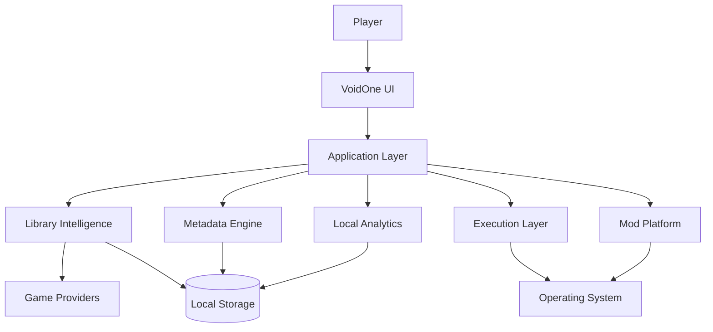

<div align="center">


# 🌌 VoidOne

### The Open-Source PC Gaming Platform Built Around Your Games — Not Around a Store

<p>
  <b>🇬🇧 English</b> •
  <a href="README.fa.md">🇮🇷 پارسی</a>
</p>

<p>
  <a href="https://github.com/VoidOne-App/VoidOne/actions/workflows/c.cpp.yml">
    
  </a>
  <a href="https://github.com/VoidOne-App/VoidOne/releases/latest">
    
  </a>
  <a href="https://github.com/VoidOne-App/VoidOne/stargazers">
    
  </a>
  <a href="https://github.com/VoidOne-App/VoidOne/blob/main/LICENSE">
    
  </a>
</p>

<p>
  
  
  
  
  
</p>

<br />

**One Library. Your Games. Your Hardware. Your Rules.**

<br />

<p>
  <a href="#-about">About</a> •
  <a href="#-vision">Vision</a> •
  <a href="#-gamer-to-gamer-commitment">Commitment</a> •
  <a href="#-current-foundation">Current</a> •
  <a href="#-future-platform-direction">Future</a> •
  <a href="#-performance-goals">Performance</a> •
  <a href="#-architecture">Architecture</a> •
  <a href="#-engineering-infrastructure">Engineering</a> •
  <a href="#-roadmap">Roadmap</a> •
  <a href="#-build-from-source">Build</a> •
  <a href="#-contributing">Contributing</a>
</p>

</div>

---

## 👁️ About

**VoidOne** is an open-source, native PC gaming platform being engineered around a simple principle:

> **Your games should be the center of your gaming experience — not the stores distributing them.**

PC gaming is fragmented across storefronts, launchers, installation directories, platform manifests, configuration systems, metadata providers, and independent game executables.

VoidOne aims to provide a native layer between the player and that fragmented ecosystem.

Built around modern technologies including:

- **C++23**
- **Qt 6**
- **QML / Qt Quick**
- **SQLite**
- **CMake**
- **Ninja**

VoidOne is currently an actively developed project. Its long-term direction extends beyond a traditional launcher toward a unified platform for game discovery, library management, execution, optimization, mod management, local intelligence, and extensibility.

The distinction between **current implementation** and **future direction** is intentional throughout this README.

---

# 🎯 Vision

VoidOne is not being built to become another storefront.

It is being built to become the layer between:

**The Player → The Operating System → The Gaming Ecosystem**

```text
                         ┌───────────────────────┐
                         │        PLAYER         │
                         └───────────┬───────────┘
                                     │
                                     ▼
                         ┌───────────────────────┐
                         │       VOIDONE         │
                         │   Native Game Layer   │
                         └───────────┬───────────┘
                                     │
                 ┌───────────────────┼───────────────────┐
                 │                   │                   │
                 ▼                   ▼                   ▼
             LIBRARIES           EXECUTION          SERVICES
                 │                   │                   │
                 └───────────────────┼───────────────────┘
                                     │
                                     ▼
                         ┌───────────────────────┐
                         │    OPERATING SYSTEM   │
                         └───────────────────────┘
```

The goal is not to replace the gaming ecosystem with another closed ecosystem.

The goal is to give the player a native, open, and extensible layer that works with the ecosystem they already use.

> **VoidOne is not being built to become another storefront. It is being built to become the layer between the player, the operating system, and the gaming ecosystem.**

---

# 🛡️ Gamer-to-Gamer Commitment

VoidOne is built **by a gamer, for gamers**.

This is not simply a marketing statement.

It is the project's commitment to the people who use it.

## ♾️ Free & Open-Source — Forever

VoidOne is committed to remaining **free and open-source**.

No mandatory subscription for the core platform.

No paywall around the fundamental experience.

No closed ecosystem designed to lock players in.

## 🚫 No Ads. No Telemetry.

**No Ads. No Telemetry.**

VoidOne is not being built around advertising, behavioral tracking, or turning players into a monetized data source.

> **You use VoidOne to manage your games — you don't become the product.**

## ⚡ Lightweight by Design

VoidOne is being engineered around an ambitious performance goal:

> **Target idle memory usage: under 50 MB.**

This is an **engineering target**, not a guaranteed specification of the current release.

The goal is to avoid unnecessary:

- Background services
- Heavy runtimes
- Persistent processes
- Resource-hungry components
- Hidden workloads

Every component should have a reason to exist.

## 🔒 100% Control Over Your Data

Your data belongs to **you**.

VoidOne is designed around local-first data ownership.

The long-term objective is to keep your:

- Game library
- Settings
- Configuration
- Profiles
- Local statistics
- Gaming data

under your control whenever technically practical.

## 🎮 I Stand With Gamers

VoidOne exists because gamers deserve software that respects:

- Their hardware
- Their privacy
- Their time
- Their data
- Their freedom
- Their games

We are not building another ecosystem to control the player.

We are building a tool to give players **more control over the ecosystem they already have**.

> ### **Free and open-source — forever.**
>
> ### **No Ads. No Telemetry.**
>
> ### **Your data. Your control.**
>
> ### **Built by a gamer. For gamers.**
>
> **I stand with gamers — always.**

---

# 🧭 Product Principles

### 🧱 Native First

Prefer native technologies and operating-system capabilities where they provide meaningful advantages in performance, integration, and maintainability.

### 🔒 Privacy by Design

Avoid unnecessary collection, tracking, or transmission of player data.

### 💾 Local First

Prefer local processing and local persistence whenever practical.

### ⚡ Lightweight by Design

Dependencies, services, runtimes, and background processes should justify their resource cost.

### 🎮 User Ownership

The player should remain in control of their games, data, configuration, and experience.

### 🌐 Open by Design

The project should remain transparent, inspectable, modifiable, and accessible to contributors.

### 📐 Evidence Over Marketing

Technical claims should be backed by implementation, testing, or reproducible benchmarks.

---

# ✅ Current Foundation

This section describes the project's **current engineering foundation**.

Future capabilities are intentionally excluded from current-feature claims.

## 💻 Native Application

VoidOne is built around:

- **C++23**
- **Qt 6**
- **QML / Qt Quick**
- **SQLite**
- **CMake**
- **Ninja**

## 🎨 Native UI Foundation

Qt Quick / QML provides the graphical interface foundation.

The project separates the visual layer from the native C++ application layer to support maintainability and future expansion.

## 💾 Local Persistence

SQLite provides local persistence for application data.

The architecture is designed around local ownership rather than requiring a mandatory remote backend for the core application.

## 🔄 Cross-Platform Engineering

VoidOne is primarily developed and tested on **Windows**, with Linux builds also exercised through the project's CI infrastructure.

macOS is not currently part of the primary build/test configuration.

---

# 🔭 Future Platform Direction

The following capabilities represent **planned, future, or long-term engineering directions**.

> **These are roadmap capabilities and must not be interpreted as generally available functionality in the current release unless the repository explicitly implements them.**

Long-term platform direction includes:

- Ghost Launch
- Intelligent Process Orchestration
- Advanced Process Management
- CPU Priority Profiles
- Resource Optimization
- Multi-Store Aggregation
- Epic Games integration
- GOG integration
- EA App integration
- Rich Metadata Engine
- Artwork / Hero Banner System
- Local Gaming Analytics
- Advanced Mod Engine
- Mod Profiles
- Virtual File Mapping
- Dependency Management
- Conflict Detection
- Advanced QML Interface
- Dynamic Themes
- RGB Customization
- Performance Diagnostics
- Backup & Recovery
- Extension APIs
- Theme SDK
- Developer Ecosystem
- Community Extensions

These represent the **direction of the platform**, not claims about its current state.

---

# 👻 Ghost Launch

**Ghost Launch** is a planned execution architecture intended to provide greater control over how games are started and managed.

Potential capabilities include:

- Direct executable execution where technically and legally possible
- Custom launch arguments
- Environment configuration
- Per-game launch profiles
- Process lifecycle management
- Background-process policies
- Orphan-process detection
- Process prioritization
- Runtime state tracking

Conceptually:

```text
Player
  │
  ▼
VoidOne
  │
  ▼
Execution Layer
  │
  ▼
Game Process
```

The objective:

> **A controlled execution layer between the player and the game.**

VoidOne does not intend to bypass DRM, licensing, or required platform authentication.

If a game legitimately requires another platform or service, that dependency remains part of the execution environment.

---

# ⚙️ Intelligent Process Orchestration

A future process-management layer may allow VoidOne to understand and manage the relationship between a game and its supporting processes.

Potential capabilities include:

- Process lifecycle tracking
- Child-process awareness
- Background workload policies
- CPU priority profiles
- Runtime process management
- Orphan-process detection
- Per-game execution policies
- Resource-aware launch profiles

The long-term objective is controlled execution rather than simply starting an executable and forgetting about it.

---

# 🧩 Multi-Store Aggregation

A unified multi-store library is part of the long-term platform direction.

Potential providers include:

- Steam
- Epic Games
- GOG
- EA App
- Local installations
- Additional providers

Potential capabilities include:

- Installation discovery
- Manifest parsing
- Library aggregation
- Duplicate detection
- Game identity normalization
- Metadata normalization
- Provider-aware launching

The objective is to unify access without turning VoidOne into another storefront.

---

# 🖼️ Metadata Engine

A future metadata engine may provide:

- Cover artwork
- Hero banners
- Backgrounds
- Descriptions
- Genres
- Release information
- Developer information
- Publisher information
- Ratings
- Platform information

The planned architecture favors:

- Asynchronous processing
- Local caching
- Non-blocking UI
- Failure-tolerant network operations

Metadata should enhance the experience without becoming a mandatory dependency for basic local operations.

---

# 📊 Local Gaming Analytics

Future versions may provide privacy-oriented local analytics.

Potential capabilities include:

- Session tracking
- Launch history
- Play duration
- Per-game statistics
- Local crash records
- Performance history
- Local performance trends

Guiding principle:

> **Useful analytics without turning the player into the product.**

Analytics should remain local wherever technically practical.

---

# 🧰 Advanced Mod Platform

A future mod-management architecture may include:

- Mod profiles
- Virtual file mapping
- Non-destructive deployment
- Dependency management
- Conflict detection
- Load-order management
- Compatibility checks

Example:

```text
Game
├── Vanilla
├── Competitive
├── Graphics Overhaul
├── Experimental
└── Custom Profile
```

The objective is to allow multiple configurations without unnecessarily modifying the original installation.

---

# 🎨 Next-Generation Interface

The long-term UI direction may include:

- Advanced QML interfaces
- Dynamic themes
- Artwork-driven libraries
- Responsive layouts
- Personalization
- Display scaling
- Accessibility improvements
- Optional animations
- RGB customization

Visual effects should justify their performance cost.

> **A premium interface is only useful when it remains responsive.**

---

# 🩺 Performance Diagnostics

Future diagnostic capabilities may include:

- Startup analysis
- Runtime measurements
- Memory diagnostics
- Process analysis
- Library scan profiling
- Performance history
- Per-game performance profiles
- Benchmarking

The objective is to make performance measurable rather than subjective.

---

# 💾 Backup & Recovery

Future versions may introduce local backup and recovery functionality.

Potential areas include:

- Application configuration
- Library data
- Game profiles
- Mod profiles
- User preferences

Potential capabilities include:

- Backup creation
- Profile export/import
- Recovery snapshots
- Configuration restoration

---

# 🔌 Extensibility & Developer Ecosystem

VoidOne's long-term architecture may provide controlled extension points.

Potential future components include:

- Extension APIs
- Theme SDK
- Provider APIs
- Community extensions
- Custom integrations
- Developer tooling

Security, stability, and maintainability should remain requirements for any extension system.

---

# ⚡ Performance Goals

Performance is a core engineering objective.

The following values are **long-term targets**, not guaranteed specifications of the current release.

| Metric | Engineering Target | Direction |
| :--- | :--- | :--- |
| **Idle Memory** | `< 50 MB` | Native C++ architecture and lightweight runtime |
| **Cold Startup** | `< 1.0s` | Lazy initialization and asynchronous startup |
| **Database Operations** | Sub-millisecond target | Efficient SQLite queries and indexing |
| **UI Rendering** | 60+ FPS target | Qt Quick scene graph and hardware acceleration |
| **Library Scanning** | Minimal UI blocking | Asynchronous and incremental processing |

These targets require reproducible benchmarks before being presented as official specifications.

Benchmark reports should document:

- Hardware
- Operating system
- Compiler
- Qt version
- Application version
- Build configuration
- Test methodology
- Measurement conditions

> **The goal is not to promise performance. The goal is to prove it.**

---

# 🏗️ Architecture

VoidOne is designed around a layered native architecture.

## Current Architectural Direction



## Long-Term Platform Architecture



The second diagram represents the **long-term platform architecture**, not a claim that every component currently exists.

---

# 🧰 Technology Stack

| Technology | Role |
| :--- | :--- |
| **C++23** | Native application and systems development |
| **Qt 6** | Application framework |
| **QML / Qt Quick** | Graphical interface |
| **SQLite** | Local persistence |
| **CMake** | Build configuration |
| **Ninja** | Build execution |
| **CTest** | Test execution where configured |
| **GitHub Actions** | CI/CD automation |
| **Clang / clang-tidy** | Static analysis where configured |
| **AddressSanitizer** | Memory diagnostics where configured |
| **UndefinedBehaviorSanitizer** | Undefined-behavior diagnostics where configured |

---

# 🤖 Engineering Infrastructure

VoidOne uses automation to improve the development lifecycle.

This infrastructure is separate from the player's product experience.

## 🔄 Automated CI/CD

The repository uses GitHub Actions for automated engineering workflows.

Depending on the active workflow configuration, automation can cover areas such as:

- Windows builds
- Linux builds
- Debug builds
- Release builds
- Unit tests
- Sanitizer builds
- Static analysis
- QML validation
- Packaging
- Artifact generation
- SHA-256 checksum generation

The repository's workflow definitions are the source of truth for the exact current CI configuration.

## 🧠 AI Repair

VoidOne also contains an **AI Repair** engineering workflow.

AI Repair exists to assist with software-engineering failures such as diagnosis, candidate fixes, and validation.

It is **not** presented as an autonomous authority.

The intended engineering flow is:

```text
CI Failure
    │
    ▼
AI-Assisted Diagnosis
    │
    ▼
Candidate Patch
    │
    ▼
Validation
    │
    ├───────────────┐
    ▼               ▼
  Build           Tests
    │               │
    └───────┬───────┘
            ▼
      Human Review
            │
            ▼
          Merge
```

Potential uses include:

- Failure diagnosis
- Code analysis
- Candidate patch generation
- Build validation
- Test validation
- Regression investigation
- Engineering feedback

> **AI accelerates engineering. It does not replace engineering ownership.**

AI-generated changes remain subject to validation, review, and repository policy.

---

# 🛡️ Security

Security is treated as an engineering concern throughout development.

Current security-related validation depends on the active repository configuration.

Long-term security direction includes:

- Dependency auditing
- Artifact integrity verification
- Release validation
- Reproducible builds
- Hardened update mechanisms
- Secure extension boundaries
- Runtime integrity validation

VoidOne does not claim security certifications or absolute security guarantees unless explicitly documented.

---

# 📥 Download

## 🚀 Latest Release

Use the official GitHub **Latest Release** endpoint:

**https://github.com/VoidOne-App/VoidOne/releases/latest**

This automatically points to the latest published release without requiring the README to hardcode a version number.

## 📦 All Releases

**https://github.com/VoidOne-App/VoidOne/releases**

Release assets depend on the individual release and may include:

- Windows installers
- Portable archives
- Linux archives
- SHA-256 checksums

Always use the assets published with the corresponding release.

---

# 🔐 Verify Release Integrity

When SHA-256 checksums are provided, verify downloaded artifacts locally.

### PowerShell

```powershell
Get-FileHash .\VoidOne-Windows-x64-Portable.zip -Algorithm SHA256
```

Compare the generated hash with the checksum published alongside the corresponding release.

Use the exact filename supplied by the release.

---

# 🔨 Build From Source

VoidOne is primarily developed and tested on Windows, with Linux builds also exercised through CI.

Build requirements may evolve as the project develops.

## Windows

Recommended environment:

- Windows 10 or Windows 11
- Visual Studio 2022 or Visual Studio Build Tools 2022
- MSVC x64
- Qt 6
- CMake
- Ninja
- Git

## Linux

Recommended environment:

- Recent Linux distribution
- GCC or Clang
- Qt 6
- CMake
- Ninja
- Git
- Required system development libraries

## macOS

macOS is not currently part of the primary build/test configuration.

Future platform support may be considered as the project matures.

---

## 📥 Clone

```bash
git clone https://github.com/VoidOne-App/VoidOne.git
cd VoidOne
```

## ⚙️ Configure

### Windows

If Qt is already discoverable by CMake:

```powershell
cmake `
  -S . `
  -B build `
  -G Ninja `
  -DCMAKE_BUILD_TYPE=Release `
  -DCMAKE_CXX_STANDARD=23
```

If CMake cannot locate Qt automatically:

```powershell
cmake `
  -S . `
  -B build `
  -G Ninja `
  -DCMAKE_BUILD_TYPE=Release `
  -DCMAKE_CXX_STANDARD=23 `
  -DCMAKE_PREFIX_PATH="C:\Qt\6.x.x\msvc2022_64"
```

Replace the Qt path with the actual installation path.

### Linux

```bash
cmake \
  -S . \
  -B build \
  -G Ninja \
  -DCMAKE_BUILD_TYPE=Release \
  -DCMAKE_CXX_STANDARD=23
```

If Qt is installed outside the standard environment:

```bash
cmake \
  -S . \
  -B build \
  -G Ninja \
  -DCMAKE_BUILD_TYPE=Release \
  -DCMAKE_CXX_STANDARD=23 \
  -DCMAKE_PREFIX_PATH="$HOME/Qt/6.x.x/gcc_64"
```

## 🔨 Build

```bash
cmake --build build --parallel
```

## 🧪 Test

If tests are configured for the selected build:

```bash
ctest \
  --test-dir build \
  --output-on-failure \
  --parallel 2
```

---

# 🔍 Static Analysis

Where supported by the active build configuration, Clang and `clang-tidy` can be used for additional analysis.

```bash
cmake \
  -S . \
  -B build-analysis \
  -G Ninja \
  -DCMAKE_BUILD_TYPE=Debug \
  -DCMAKE_CXX_STANDARD=23 \
  -DCMAKE_CXX_COMPILER=clang++ \
  -DCMAKE_CXX_CLANG_TIDY=clang-tidy
```

Then:

```bash
cmake --build build-analysis --parallel
```

---

# 📦 Packaging

## Windows

Qt's `windeployqt` can be used to deploy required Qt runtime components alongside a Windows build.

Example:

```powershell
windeployqt `
  --release `
  --qmldir ".\src\ui\qml" `
  ".\build\path\to\VoidOneLauncher.exe"
```

The exact executable path depends on the current CMake configuration.

The repository's automated workflows handle configured packaging and artifact generation.

## Linux

Configured CI workflows can package Linux release builds and generate SHA-256 checksums.

---

# 🧪 Testing & Validation

Testing is part of the engineering lifecycle.

Depending on the active configuration, validation may include:

- Unit tests
- Build validation
- AddressSanitizer
- UndefinedBehaviorSanitizer
- Static analysis
- QML validation
- Cross-platform build verification

Contributors should run the relevant validation before opening a pull request.

---

# 🗺️ Roadmap

VoidOne is being developed incrementally.

Roadmap items represent engineering direction and do not constitute guaranteed delivery dates.

## Phase I — Native Foundation

- [x] C++23 project foundation
- [x] Qt / QML application foundation
- [x] CMake build system
- [x] Native application architecture
- [x] GitHub Actions infrastructure
- [x] Cross-platform CI foundation

## Phase II — Library Intelligence

- [ ] Game discovery
- [ ] Installation detection
- [ ] Local library persistence
- [ ] Provider integration
- [ ] Metadata normalization

## Phase III — Experience

- [ ] Advanced library interface
- [ ] Filtering and categorization
- [ ] Artwork and metadata
- [ ] Personalization
- [ ] UI refinement

## Phase IV — Execution

- [ ] Ghost Launch
- [ ] Process lifecycle management
- [ ] Launch profiles
- [ ] Runtime configuration
- [ ] Local playtime tracking

## Phase V — Mod Platform

- [ ] Mod profiles
- [ ] Virtual file mapping
- [ ] Dependency management
- [ ] Conflict detection
- [ ] Compatibility management

## Phase VI — Intelligence

- [ ] Local gaming analytics
- [ ] Performance diagnostics
- [ ] Advanced engineering automation
- [ ] Automated failure diagnosis
- [ ] Automated validation

## Phase VII — Ecosystem

- [ ] Extension APIs
- [ ] Theme SDK
- [ ] Community extensions
- [ ] Additional providers
- [ ] Developer ecosystem

> **The roadmap describes direction, not promises.**

---

# 🤝 Contributing

Contributions are welcome.

You can contribute through:

- C++
- Qt / QML
- UI/UX
- Testing
- Documentation
- Bug reports
- Feature proposals
- Performance improvements
- Platform support
- Build and CI improvements

## Contribution Workflow

Create a focused feature branch:

```bash
git checkout main
git pull origin main
git checkout -b feature/your-feature
```

Make your changes and test them locally.

Then:

```bash
git add .
git commit -m "Add your feature"
git push origin feature/your-feature
```

Open a Pull Request on GitHub.

For substantial changes, explain:

- What changed
- Why it changed
- How it was tested
- Any relevant compatibility considerations

Keep changes focused, reviewable, and maintainable.

---

# 🧭 Engineering Standards

### Evidence Over Marketing

Technical claims should be supported by implementation, testing, benchmarks, or documented evidence.

### Small Reviewable Changes

Prefer focused changes that are easy to understand, validate, and review.

### Native First

Prefer native technologies when they provide meaningful advantages in performance, integration, maintainability, or system control.

### Security by Default

Consider security during architecture and implementation rather than treating it exclusively as a post-release concern.

### Human-Controlled Automation

Automation and AI should assist engineering while preserving human responsibility for decisions and final changes.

### Long-Term Maintainability

Architecture should remain understandable and extensible as VoidOne grows.

### Respect the Player

Every feature should ultimately answer one question:

> **Does this give the player more value and control without unnecessarily taking something away?**

---

# 🐛 Reporting Issues

When reporting a build or runtime problem, include:

- Operating system
- Compiler
- Compiler version
- Qt version
- CMake version
- Build configuration
- Relevant error messages
- Steps to reproduce the problem

For runtime failures, include available terminal or debug output.

Clear reports make issues easier to reproduce and resolve.

---

# 📚 Documentation

Additional project documentation may include:

- `BUILD.md` — Build and development guidance
- `CONTRIBUTING.md` — Contribution guidance
- `TROUBLESHOOTING.md` — Troubleshooting information

The repository remains the source of truth for current implementation details.

---

# 📜 License

VoidOne is distributed under the **MIT License**.

See [`LICENSE`](LICENSE) for the complete license text.

Repository:

https://github.com/VoidOne-App/VoidOne

---

<div align="center">

# 🌌 VoidOne

### Your Games. Your Hardware. Your Rules.

**Built by a gamer. Engineered like a platform. Built in the open.**

<br />

**♾️ Free & Open Source — Forever**

**🚫 No Ads. No Telemetry.**

**🔒 Your Data. Your Control.**

<br />

<a href="https://github.com/VoidOne-App/VoidOne">
  
</a>

<br />
<br />

**Open Source · Native · Modular · Player-Focused**

</div>