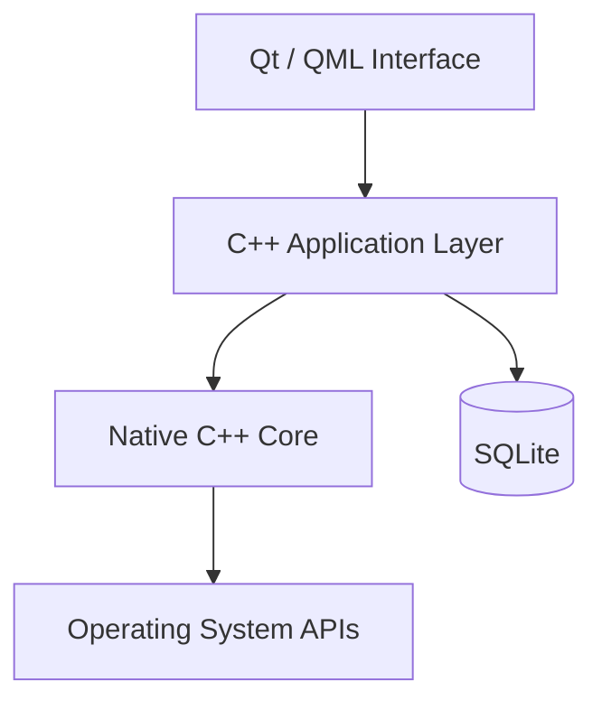
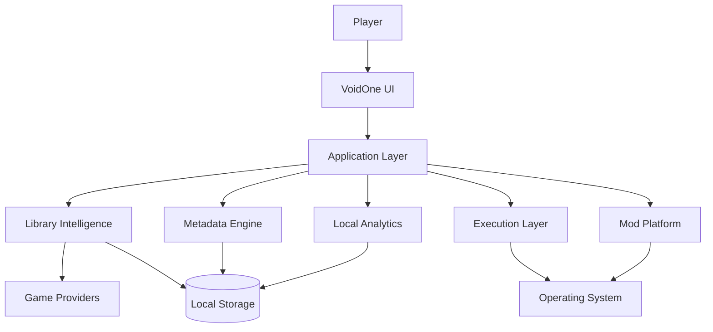

<div align="center">


# 🌌 VoidOne

### The Open-Source Native PC Gaming Platform Built Around Your Games — Not Around a Store

<p>
  <b>🇬🇧 English</b> •
  <a href="README.fa.md">🇮🇷 پارسی</a>
</p>

<p>
  <a href="https://github.com/VoidOne-App/VoidOne/actions/workflows/c.cpp.yml">
    
  </a>
  <a href="https://github.com/VoidOne-App/VoidOne/releases/latest">
    
  </a>
  <a href="https://github.com/VoidOne-App/VoidOne/stargazers">
    
  </a>
  <a href="https://github.com/VoidOne-App/VoidOne/blob/main/LICENSE">
    
  </a>
</p>

<p>
  
  
  
  
  
  
</p>

<br />

> **One Library. Your Games. Your Hardware. Your Rules.**

<br />

<p>
  <a href="#-about">About</a> •
  <a href="#-vision">Vision</a> •
  <a href="#-philosophy">Philosophy</a> •
  <a href="#-release-channels">Releases</a> •
  <a href="#-current-foundation">Current</a> •
  <a href="#-platform-direction">Future</a> •
  <a href="#-architecture">Architecture</a> •
  <a href="#-engineering">Engineering</a> •
  <a href="#-roadmap">Roadmap</a> •
  <a href="#-build-from-source">Build</a> •
  <a href="#-contributing">Contributing</a>
</p>

</div>

---

# 👁️ About

**VoidOne** is an open-source, native PC gaming platform being engineered around one simple principle:

> **Your games should be the center of your gaming experience — not the stores distributing them.**

Modern PC gaming is fragmented across storefronts, launchers, installation directories, manifests, configuration systems, metadata providers, background services, and independent game executables.

VoidOne is being built as a **native layer between the player, the operating system, and the gaming ecosystem**.

The project is built around modern native technologies:

- **C++23**
- **Qt 6.8**
- **QML / Qt Quick**
- **SQLite**
- **CMake**
- **Ninja**

VoidOne is currently in active experimental development.

The platform is being developed incrementally, with its architecture designed to grow from a native gaming application into a broader ecosystem for managing, launching, analyzing, customizing, and extending PC games.

---

# 🎯 Vision

VoidOne is **not another storefront**.

It is not designed to replace the ecosystems players already use with another closed ecosystem.

Instead, VoidOne aims to provide an open, native, modular layer that sits between the player and the fragmented PC gaming environment.

```text
                         ┌───────────────────────┐
                         │        PLAYER         │
                         └───────────┬───────────┘
                                     │
                                     ▼
                         ┌───────────────────────┐
                         │       VOIDONE         │
                         │   Native Game Layer   │
                         └───────────┬───────────┘
                                     │
              ┌──────────────────────┼──────────────────────┐
              │                      │                      │
              ▼                      ▼                      ▼
         LIBRARIES              EXECUTION              SERVICES
              │                      │                      │
              └──────────────────────┼──────────────────────┘
                                     │
                                     ▼
                         ┌───────────────────────┐
                         │   OPERATING SYSTEM   │
                         └───────────────────────┘
```

The long-term objective is to make VoidOne a powerful native layer through which players can manage their existing gaming ecosystem without giving up ownership, transparency, or control.

> **Not another store.  
> Not another closed ecosystem.  
> A native platform built around the player.**

---

# 🧭 Product Philosophy

VoidOne is being developed around several long-term principles.

## 🧱 Native First

Prefer native technologies and operating-system capabilities when they provide meaningful advantages in performance, integration, reliability, and maintainability.

## 🔒 Privacy by Design

Player data should not be collected, transmitted, or monetized without a legitimate technical reason.

## 💾 Local First

Whenever technically practical, important player data should remain locally controlled.

## ⚡ Lightweight by Design

Every dependency, background process, runtime component, and service should justify its resource cost.

## 🎮 Player Ownership

Players should remain in control of their games, configurations, profiles, and data.

## 🌐 Open by Design

The project should remain inspectable, modifiable, and accessible to developers and contributors.

## 📐 Evidence Over Marketing

Technical claims should be supported by implementation, testing, or reproducible benchmarks.

## 🧩 Incremental Engineering

VoidOne is intentionally being developed in stages.

Large platform capabilities are introduced progressively as the underlying architecture matures.

---

# 🛡️ Gamer-to-Gamer Commitment

VoidOne is built **by a gamer, for gamers**.

The project exists to build software that respects the people using it.

## ♾️ Free & Open Source

VoidOne is committed to remaining **free and open source**.

The core project is distributed under the **MIT License**.

There is no mandatory subscription for the core platform.

There is no paywall around the fundamental application.

There is no intention to create a closed ecosystem designed to lock players in.

> **Free and open source is a core commitment of VoidOne.**

## 🚫 No Ads. No Telemetry.

VoidOne is not being built around advertising or behavioral tracking.

The project is designed around the principle that:

> **You use VoidOne to manage your games — you don't become the product.**

## ⚡ Lightweight by Design

VoidOne has an ambitious long-term performance target:

> **Idle memory usage below 50 MB.**

This is an **engineering target**, not a guaranteed specification of current releases.

The project aims to minimize unnecessary:

- Background services
- Persistent processes
- Heavy runtimes
- Resource-intensive components
- Hidden workloads

Every component should have a reason to exist.

## 🔒 Your Data. Your Control.

VoidOne follows a local-first approach.

The long-term platform is designed to keep important information such as:

- Game library data
- Profiles
- Configuration
- Preferences
- Local statistics
- Game-specific settings
- Mod profiles

under player control whenever technically practical.

## 🎮 Built for Gamers

VoidOne exists to respect:

- Your hardware
- Your privacy
- Your time
- Your data
- Your games
- Your freedom

> **The goal is not to control the player.  
> The goal is to give the player more control.**

---

# 📦 Release Channels

VoidOne is currently in **active experimental development**.

All currently published versions are considered **experimental builds**.

A version number does not automatically make a release stable.

---

## 🧪 Experimental

**Status: Available**

This is the current VoidOne release channel.

Experimental releases are intended for:

- Early adopters
- Contributors
- Developers
- Testers
- Feedback
- Bug discovery
- Feature validation

Experimental builds may contain incomplete functionality, bugs, architectural changes, or unfinished platform components.

> **All currently published VoidOne releases are experimental.**

---

## 🛠️ Development

**Status: Active**

Development represents the latest state of the repository.

Development builds may contain work that has not yet been packaged into an experimental release.

This channel is primarily intended for:

- Contributors
- Developers
- Advanced testers
- CI validation
- Architecture development

---

## 🚀 Stable

**Status: Coming Soon**

The Stable channel **has not been released yet**.

Stable will be introduced after the project reaches an appropriate level of:

- Reliability
- Core functionality
- Testing coverage
- Runtime stability
- Installation stability
- Upgrade reliability
- Performance validation
- Security validation
- Documentation quality

The first Stable release will be introduced when the project is ready.

> **Stable means proven — not merely released.**

---

### Release Channel Overview

| Channel | Status | Intended Audience |
| :--- | :--- | :--- |
| 🛠️ **Development** | Active | Developers & contributors |
| 🧪 **Experimental** | Available | Testers & early adopters |
| 🚀 **Stable** | Coming Soon | General users |

---

# ✅ Current Foundation

This section describes the **current engineering foundation** of VoidOne.

Future platform capabilities are intentionally separated from currently implemented functionality.

## 💻 Native Application

VoidOne is built using:

| Technology | Purpose |
| :--- | :--- |
| **C++23** | Native application and systems development |
| **Qt 6.8** | Application framework |
| **QML / Qt Quick** | Graphical interface |
| **SQLite** | Local persistence |
| **CMake** | Build configuration |
| **Ninja** | Build execution |

## 🎨 Native UI

Qt Quick / QML provides the graphical interface foundation.

The UI layer is separated from the native C++ application layer to provide a maintainable foundation for future expansion.

## 💾 Local Persistence

SQLite provides local persistence for application data.

The architecture favors local ownership and does not require a mandatory remote backend for the core application.

## 🔄 Automated Engineering

The repository contains an automated GitHub Actions workflow covering multiple stages of the engineering lifecycle.

Current automation includes areas such as:

- Build validation
- Static analysis
- Security analysis
- Sanitizer validation
- Testing
- Packaging
- Artifact generation
- Release automation

The workflow located at:

```text
.github/workflows/c.cpp.yml
```

remains the authoritative source for the exact CI configuration.

---

# 🪟 Platform Status

## Windows

**Primary platform**

Windows is currently the primary development, build, and packaging environment.

The release pipeline currently targets Windows x64.

## Linux

**Cross-platform direction**

Linux is part of VoidOne's broader cross-platform architecture and development direction.

Linux support is expected to expand progressively as the platform matures.

## macOS

macOS is currently **not part of the primary build and packaging pipeline**.

---

# 🔭 Platform Direction

VoidOne is being developed as a platform rather than a single-purpose launcher.

The following capabilities represent the project's **long-term development direction**.

They are not presented as generally available features of the current experimental releases.

Capabilities are expected to be introduced **incrementally over time** as their underlying architecture and implementation mature.

Planned areas include:

- 👻 Ghost Launch
- ⚙️ Intelligent Process Orchestration
- 🧠 Advanced Process Management
- ⚡ CPU Priority Profiles
- 📈 Resource Optimization
- 🌐 Multi-Store Aggregation
- 🎮 Steam Integration
- 🎮 Epic Games Integration
- 🎮 GOG Integration
- 🎮 EA App Integration
- 🖼️ Rich Metadata Engine
- 🎨 Artwork / Hero Banner System
- 📊 Local Gaming Analytics
- 🧰 Advanced Mod Platform
- 🧩 Mod Profiles
- 🗂️ Virtual File Mapping
- 🔗 Dependency Management
- ⚠️ Conflict Detection
- 🎨 Dynamic Themes
- 🌈 RGB Customization
- 🩺 Performance Diagnostics
- 💾 Backup & Recovery
- 🔌 Extension APIs
- 🎨 Theme SDK
- 🧑‍💻 Developer Ecosystem
- 🌐 Community Extensions

> **These capabilities form the long-term direction of VoidOne and are intended to be introduced progressively rather than all at once.**

---

# 👻 Ghost Launch

**Planned Platform Capability**

Ghost Launch is a planned execution architecture designed to give VoidOne greater control over how games are started and managed.

Potential capabilities include:

- Direct executable execution where technically and legally possible
- Custom launch arguments
- Environment configuration
- Per-game launch profiles
- Process lifecycle management
- Background-process policies
- Orphan-process detection
- Process prioritization
- Runtime state tracking

Conceptually:

```text
Player
   │
   ▼
VoidOne
   │
   ▼
Execution Layer
   │
   ▼
Game Process
```

The objective is:

> **A controlled execution layer between the player and the game.**

VoidOne does not intend to bypass DRM, licensing requirements, or required platform authentication.

If a game legitimately requires another platform or service, that dependency remains part of its execution environment.

---

# ⚙️ Intelligent Process Orchestration

**Planned Platform Capability**

A future process-management layer may allow VoidOne to understand the relationship between a game and its supporting processes.

Potential capabilities include:

- Process lifecycle tracking
- Child-process awareness
- Background workload policies
- CPU priority profiles
- Runtime process management
- Orphan-process detection
- Per-game execution policies
- Resource-aware launch profiles

The long-term objective is controlled execution rather than simply launching an executable and losing visibility into its runtime environment.

---

# 🧩 Multi-Store Aggregation

**Planned Platform Capability**

VoidOne is intended to eventually provide a unified library across multiple gaming ecosystems.

Potential providers include:

- Steam
- Epic Games
- GOG
- EA App
- Local installations
- Additional providers

Potential capabilities include:

- Installation discovery
- Manifest parsing
- Library aggregation
- Duplicate detection
- Game identity normalization
- Metadata normalization
- Provider-aware launching

The objective is to unify access without turning VoidOne into another storefront.

---

# 🖼️ Metadata Engine

**Planned Platform Capability**

A future metadata engine may provide:

- Cover artwork
- Hero banners
- Backgrounds
- Descriptions
- Genres
- Release information
- Developer information
- Publisher information
- Ratings
- Platform information

The planned architecture favors:

- Asynchronous processing
- Local caching
- Non-blocking UI
- Failure-tolerant network operations

Metadata should enhance the experience without becoming a mandatory dependency for basic local operations.

---

# 📊 Local Gaming Analytics

**Planned Platform Capability**

VoidOne may eventually provide privacy-oriented local analytics.

Potential capabilities include:

- Session tracking
- Launch history
- Play duration
- Per-game statistics
- Local crash records
- Performance history
- Local performance trends

The guiding principle:

> **Useful analytics without turning the player into the product.**

Analytics should remain local wherever technically practical.

---

# 🧰 Advanced Mod Platform

**Planned Platform Capability**

A future mod-management architecture may include:

- Mod profiles
- Virtual file mapping
- Non-destructive deployment
- Dependency management
- Conflict detection
- Load-order management
- Compatibility checks

Example:

```text
Game
├── Vanilla
├── Competitive
├── Graphics Overhaul
├── Experimental
└── Custom Profile
```

The objective is to support multiple game configurations without unnecessarily modifying the original installation.

---

# 🎨 Next-Generation Interface

**Planned Platform Capability**

The long-term interface direction includes:

- Advanced QML interfaces
- Dynamic themes
- Artwork-driven libraries
- Responsive layouts
- Personalization
- Display scaling
- Accessibility improvements
- Optional animations
- RGB customization

Visual effects should justify their performance cost.

> **A premium interface is only useful when it remains responsive.**

---

# 🩺 Performance Diagnostics

**Planned Platform Capability**

Future diagnostic capabilities may include:

- Startup analysis
- Runtime measurements
- Memory diagnostics
- Process analysis
- Library scan profiling
- Performance history
- Per-game performance profiles
- Benchmarking

The objective is to make performance measurable rather than subjective.

---

# 💾 Backup & Recovery

**Planned Platform Capability**

Future versions may introduce local backup and recovery functionality.

Potential areas include:

- Application configuration
- Library data
- Game profiles
- Mod profiles
- User preferences

Potential capabilities include:

- Backup creation
- Profile export/import
- Recovery snapshots
- Configuration restoration

---

# 🔌 Extensibility & Developer Ecosystem

**Planned Platform Capability**

VoidOne's long-term architecture may provide controlled extension points.

Potential future components include:

- Extension APIs
- Theme SDK
- Provider APIs
- Community extensions
- Custom integrations
- Developer tooling

Security, stability, and maintainability will remain requirements for extension systems.

---

# ⚡ Performance Goals

Performance is a core engineering objective.

The following are **long-term engineering targets**, not guaranteed specifications of current releases.

| Metric | Engineering Target | Direction |
| :--- | :--- | :--- |
| **Idle Memory** | `< 50 MB` | Lightweight architecture |
| **Cold Startup** | `< 1.0s` | Lazy initialization |
| **Database Operations** | Sub-millisecond target | Efficient SQLite usage |
| **UI Rendering** | 60+ FPS target | Qt Quick scene graph |
| **Library Scanning** | Minimal UI blocking | Async / incremental processing |

These values must be validated through reproducible benchmarks before being presented as official measured specifications.

Benchmark reports should document:

- Hardware
- Operating system
- Compiler
- Qt version
- Application version
- Build configuration
- Test methodology
- Measurement conditions

> **The goal is not to promise performance. The goal is to prove it.**

---

# 🏗️ Architecture

VoidOne is designed around a layered native architecture.

## Current Architectural Foundation



## Long-Term Platform Architecture



The second diagram represents the **long-term platform architecture**.

It does not imply that every component currently exists.

---

# 🧰 Technology Stack

| Technology | Role |
| :--- | :--- |
| **C++23** | Native application and systems development |
| **Qt 6.8** | Application framework |
| **QML / Qt Quick** | Graphical interface |
| **SQLite** | Local persistence |
| **CMake** | Build configuration |
| **Ninja** | Build execution |
| **CTest** | Automated testing where configured |
| **GitHub Actions** | CI/CD automation |
| **CodeQL** | Security analysis |
| **Cppcheck** | Static analysis |
| **AddressSanitizer** | Runtime memory diagnostics |
| **MSVC** | Windows C++ toolchain |
| **NSIS** | Windows installer generation |
| **WiX Toolset** | Windows MSI packaging |
| **Ollama** | Local AI infrastructure |
| **Gemini** | AI-assisted engineering infrastructure |
| **Qwen2.5-Coder** | Coding model used by AI Repair infrastructure |

---

# 🤖 Engineering Automation

VoidOne uses automation to reduce repetitive engineering work and improve development reliability.

These systems are part of the **development infrastructure**, not the player-facing product.

## 🔄 CI/CD

The repository's GitHub Actions workflow automates multiple stages of the engineering lifecycle.

Depending on workflow configuration, this includes:

- Release-tag validation
- C++ static analysis
- CodeQL analysis
- Cppcheck
- Debug builds
- Sanitizer validation
- Release builds
- CTest execution
- Qt deployment
- Windows packaging
- Portable ZIP generation
- SHA-256 checksum generation
- Release artifact publishing
- Automated release notifications
- Scheduled health checks
- Manual workflow execution

The repository workflow remains the authoritative source for exact CI behavior.

---

# 🧠 AI Repair

VoidOne includes an **AI Repair** engineering workflow.

AI Repair is **not a player-facing feature**.

It is an engineering automation layer designed to assist developers in investigating CI failures and preparing candidate fixes.

The infrastructure can integrate components such as:

- Gemini
- Qwen2.5-Coder
- Ollama
- GitHub Actions
- Build logs
- C++ / Qt tooling
- Automated validation

Conceptually:

```text
                 CI Failure
                     │
                     ▼
             Failure Analysis
                     │
                     ▼
             AI-Assisted Repair
                     │
                     ▼
              Candidate Patch
                     │
                     ▼
               Build / Checks
                     │
                     ▼
              Automated Tests
                     │
                     ▼
             Draft Pull Request
                     │
                     ▼
                Human Review
                     │
                     ▼
                   Merge
```

AI is used to accelerate repetitive engineering work.

It does not replace human engineering ownership.

> **AI accelerates engineering. It does not replace engineering ownership.**

AI-generated changes remain subject to:

- Build validation
- Automated testing
- Security checks
- Repository policy
- Human review

---

# 🛡️ Security Engineering

Security is treated as an engineering concern throughout development.

Current CI infrastructure includes security-oriented validation such as:

- GitHub CodeQL
- Cppcheck
- Compiler hardening
- Sanitizer-enabled validation
- Automated build checks
- Artifact integrity checks
- SHA-256 checksum generation

The Windows release build also uses hardening options including:

```text
/NXCOMPAT
/DYNAMICBASE
/GUARD:CF
/HIGHENTROPYVA
```

Long-term security direction includes:

- Dependency auditing
- Artifact integrity verification
- Reproducible builds
- Hardened update mechanisms
- Secure extension boundaries
- Runtime integrity validation

VoidOne does not claim security certifications or absolute security guarantees unless explicitly documented.

---

# 📦 Releases

## 🚀 Latest Release

<p>
  <a href="https://github.com/VoidOne-App/VoidOne/releases/latest">
    
  </a>
</p>

> 🧪 **Current Channel: Experimental**

All currently published VoidOne releases are **experimental builds**.

The Stable channel has not been released yet.

**Stable — Coming Soon**

👉 https://github.com/VoidOne-App/VoidOne/releases/latest

---

## 📚 All Releases

👉 https://github.com/VoidOne-App/VoidOne/releases

Release assets are generated according to the repository's release workflow.

Depending on the release configuration, assets may include:

- Windows installer
- Windows MSI package
- Portable Windows ZIP
- SHA-256 checksum files

---

# 🔐 Release Integrity

When a SHA-256 checksum is provided with a release artifact, verify the downloaded file locally.

### PowerShell

```powershell
Get-FileHash .\VoidOne-Windows-x64-Portable-<version>.zip -Algorithm SHA256
```

Compare the resulting hash with the checksum published alongside the same release artifact.

Use the exact filename supplied by the release.

---

# 🔨 Build From Source

VoidOne is primarily developed and packaged for Windows.

Linux remains part of the broader cross-platform engineering direction.

Build requirements may evolve as the project develops.

---

## 🪟 Windows

Recommended environment:

- Windows 10 or Windows 11
- Visual Studio 2022 / MSVC
- Qt 6.8
- CMake
- Ninja
- Git

The Windows release pipeline currently uses:

- Qt 6.8
- MSVC x64
- Ninja
- NSIS
- WiX

---

## 🐧 Linux

Potential development environment:

- Recent Linux distribution
- GCC or Clang
- Qt 6
- CMake
- Ninja
- Git
- Required system development libraries

Linux support should be considered an evolving part of the project.

---

## 🍎 macOS

macOS is not currently part of the primary build and packaging pipeline.

---

# 📥 Clone

```bash
git clone https://github.com/VoidOne-App/VoidOne.git
cd VoidOne
```

---

# ⚙️ Configure

## Windows

If Qt is discoverable by CMake:

```powershell
cmake `
  -S . `
  -B build `
  -G Ninja `
  -DCMAKE_BUILD_TYPE=Release `
  -DCMAKE_CXX_STANDARD=23
```

If CMake cannot locate Qt automatically:

```powershell
cmake `
  -S . `
  -B build `
  -G Ninja `
  -DCMAKE_BUILD_TYPE=Release `
  -DCMAKE_CXX_STANDARD=23 `
  -DCMAKE_PREFIX_PATH="C:\Qt\6.8.0\msvc2022_64"
```

Adjust the Qt path to match your installation.

---

## Linux

```bash
cmake \
  -S . \
  -B build \
  -G Ninja \
  -DCMAKE_BUILD_TYPE=Release \
  -DCMAKE_CXX_STANDARD=23
```

If Qt is installed outside standard search paths:

```bash
cmake \
  -S . \
  -B build \
  -G Ninja \
  -DCMAKE_BUILD_TYPE=Release \
  -DCMAKE_CXX_STANDARD=23 \
  -DCMAKE_PREFIX_PATH="$HOME/Qt/6.x.x/gcc_64"
```

---

# 🔨 Build

```bash
cmake --build build --parallel
```

---

# 🧪 Test

If CTest targets are available:

```bash
ctest \
  --test-dir build \
  --output-on-failure
```

---

# 🔍 Static Analysis

For environments where `clang-tidy` is available:

```bash
cmake \
  -S . \
  -B build-analysis \
  -G Ninja \
  -DCMAKE_BUILD_TYPE=Debug \
  -DCMAKE_CXX_STANDARD=23 \
  -DCMAKE_CXX_CLANG_TIDY=clang-tidy
```

Then:

```bash
cmake --build build-analysis --parallel
```

The CI configuration remains the authoritative source for automated analysis.

---

# 📦 Windows Packaging

The release pipeline supports Windows packaging through **NSIS** and **WiX** where their corresponding definitions are configured.

The release process can:

1. Build the application.
2. Deploy the required Qt runtime.
3. Validate deployment files.
4. Generate a portable ZIP.
5. Generate SHA-256 checksums.
6. Build installer artifacts where configured.
7. Publish release artifacts.

For local Qt deployment:

```powershell
windeployqt `
  --release `
  --compiler-runtime `
  --no-translations `
  --qmldir ".\src" `
  ".\path\to\VoidOne.exe"
```

The executable path depends on the current build configuration.

---

# 🧪 Testing & Validation

Testing is part of the engineering lifecycle.

Depending on the current repository configuration, validation may include:

- CTest
- Debug builds
- AddressSanitizer
- Static analysis
- CodeQL
- Cppcheck
- QML validation
- Release build validation
- Packaging validation

Contributors should run the validation relevant to their changes before opening a pull request.

---

# 📏 Performance Policy

VoidOne treats performance claims as engineering claims.

The following remain **targets**, not guaranteed specifications:

| Metric | Target |
| :--- | :--- |
| Idle memory | `< 50 MB` |
| Cold startup | `< 1.0s` |
| Database operations | Sub-millisecond target |
| UI rendering | 60+ FPS target |
| Library scanning | Minimal UI blocking |

Before a target becomes an official measured specification, benchmarks should document:

- Hardware
- Operating system
- Compiler
- Qt version
- Application version
- Build configuration
- Test methodology
- Measurement conditions

Potential measurements include:

- Cold startup
- Warm startup
- Idle memory
- Peak memory
- Library scan duration
- Database performance
- CPU utilization
- UI frame-time
- Background workload impact

> **The goal is not to promise performance. The goal is to prove it.**

---

# 🗺️ Roadmap

VoidOne is being developed incrementally.

The roadmap describes the **long-term development direction** of the platform.

Features are expected to be introduced progressively as their underlying architecture and implementation mature.

---

## Phase I — Native Foundation

- [x] C++23 project foundation
- [x] Qt / QML application foundation
- [x] CMake build system
- [x] Native application architecture
- [x] GitHub Actions CI/CD infrastructure
- [x] CodeQL integration
- [x] Cppcheck integration
- [x] Sanitizer-oriented validation
- [x] Windows release packaging pipeline

---

## Phase II — Library Intelligence

- [ ] Game discovery
- [ ] Installation detection
- [ ] Local library persistence
- [ ] Provider integration
- [ ] Metadata normalization
- [ ] Game identity system
- [ ] Library indexing

---

## Phase III — Gaming Experience

- [ ] Advanced library interface
- [ ] Filtering and categorization
- [ ] Artwork and metadata
- [ ] Search
- [ ] Personalization
- [ ] Dynamic UI
- [ ] Improved QML experience

---

## Phase IV — Execution

- [ ] Ghost Launch
- [ ] Process lifecycle management
- [ ] Launch profiles
- [ ] Runtime configuration
- [ ] Process prioritization
- [ ] Background-process management
- [ ] Local playtime tracking

---

## Phase V — Multi-Store Platform

- [ ] Steam integration
- [ ] Epic Games integration
- [ ] GOG integration
- [ ] EA App integration
- [ ] Additional providers
- [ ] Installation discovery
- [ ] Provider-aware launching
- [ ] Duplicate detection
- [ ] Cross-provider identity normalization

---

## Phase VI — Mod Platform

- [ ] Mod profiles
- [ ] Virtual file mapping
- [ ] Non-destructive deployment
- [ ] Dependency management
- [ ] Conflict detection
- [ ] Load-order management
- [ ] Compatibility management

---

## Phase VII — Intelligence & Diagnostics

- [ ] Local gaming analytics
- [ ] Performance diagnostics
- [ ] Startup analysis
- [ ] Runtime diagnostics
- [ ] Performance history
- [ ] Advanced engineering automation
- [ ] Automated failure diagnosis
- [ ] Automated validation

---

## Phase VIII — Personalization

- [ ] Dynamic themes
- [ ] Advanced customization
- [ ] Artwork-driven interfaces
- [ ] RGB customization
- [ ] Accessibility improvements
- [ ] Advanced display support

---

## Phase IX — Backup & Recovery

- [ ] Configuration backup
- [ ] Library backup
- [ ] Game profile backup
- [ ] Mod profile backup
- [ ] Import / export
- [ ] Recovery snapshots
- [ ] Configuration restoration

---

## Phase X — Developer Ecosystem

- [ ] Extension APIs
- [ ] Theme SDK
- [ ] Provider APIs
- [ ] Community extensions
- [ ] Custom integrations
- [ ] Developer tooling
- [ ] Extension security model

---

# 🏁 Stable Release

The first Stable release is a dedicated project milestone.

Before Stable, VoidOne aims to establish:

- [ ] Core feature baseline
- [ ] Reliable installation
- [ ] Reliable upgrades
- [ ] Runtime stability
- [ ] Expanded automated testing
- [ ] Performance benchmarking
- [ ] Security validation
- [ ] Documentation completion
- [ ] Release candidate cycle
- [ ] Stable release criteria
- [ ] First Stable release

> **Stable is a milestone earned through engineering — not a version label assigned by schedule.**

---

# 🤝 Contributing

Contributions are welcome.

You can contribute through:

- C++
- Qt / QML
- UI/UX
- Testing
- Documentation
- Bug reports
- Feature proposals
- Performance improvements
- Platform support
- Build improvements
- CI/CD improvements
- Security improvements

---

## Contribution Workflow

Create a feature branch:

```bash
git checkout main
git pull origin main
git checkout -b feature/your-feature
```

Make your changes and validate them locally.

Then:

```bash
git add .
git commit -m "Add your feature"
git push origin feature/your-feature
```

Open a Pull Request on GitHub.

For substantial changes, explain:

- What changed
- Why it changed
- How it was tested
- Compatibility considerations
- Performance implications
- Security considerations where relevant

Keep changes focused, reviewable, and maintainable.

---

# 🧭 Engineering Standards

## Evidence Over Marketing

Technical claims should be backed by:

- Implementation
- Tests
- Benchmarks
- Documentation
- Reproducible evidence

## Small, Reviewable Changes

Prefer changes that are focused and easy to understand.

## Native First

Prefer native technologies when they provide meaningful technical advantages.

## Security by Default

Security should be considered during architecture and implementation.

## Human-Controlled Automation

Automation and AI may assist engineering, but humans remain responsible for final decisions.

## Long-Term Maintainability

VoidOne is intended to grow for years.

Architecture should therefore prioritize:

- Clear boundaries
- Modularity
- Testability
- Extensibility
- Maintainability

## Respect the Player

Every feature should ultimately answer:

> **Does this give the player more value and control without unnecessarily taking something away?**

---

# 🐛 Reporting Problems

When reporting a build or runtime problem, include:

- Operating system
- Compiler
- Compiler version
- Qt version
- CMake version
- Build configuration
- Relevant error messages
- Steps to reproduce

For runtime problems, include available terminal or debug output.

Clear reports make problems easier to reproduce and resolve.

---

# 📚 Documentation

As VoidOne grows, additional documentation may cover:

- Architecture
- Development
- Build systems
- CI/CD
- Release engineering
- AI Repair
- Security
- Contribution guidelines
- Extension APIs
- Theme development
- Provider integrations

The repository remains the primary source of truth for:

- Current implementation
- Build configuration
- CI workflows
- Release configuration
- Supported tooling
- Development requirements

Roadmap entries should not be interpreted as evidence that a feature is already implemented.

---

# 📜 License

VoidOne is distributed under the **MIT License**.

See [`LICENSE`](LICENSE) for the complete license text.

Repository:

https://github.com/VoidOne-App/VoidOne

---

<div align="center">

# 🌌 VoidOne

### Your Games. Your Hardware. Your Rules.

**Built by a gamer. Engineered like a platform. Built in the open.**

<br />

### ♾️ Free & Open Source

### 🚫 No Ads. No Telemetry.

### 🔒 Your Data. Your Control.

### 🎮 Built by a Gamer. For Gamers.

### 🧪 Experimental Today. Stable When It's Ready.

<br />

<a href="https://github.com/VoidOne-App/VoidOne">
  
</a>

<br />
<br />

**Open Source · Native · Modular · Player-Focused**

<br />

<sub>
VoidOne is an actively developed project.  
Features are introduced progressively as the platform evolves.
</sub>

</div>
