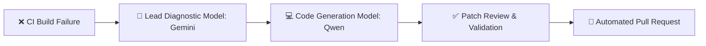

<div align="center">


# 🌌 VoidOne

### Next-Generation, Open-Source PC Game Launcher & Library Manager

<p align="center">
  <b>🇬🇧 English</b> •
  <a href="README.fa.md">🇮🇷 پارسی</a>
</p>

<p align="center">
  <a href="https://github.com/VoidOne-App/VoidOne/actions/workflows/c-cpp.yml">
    
  </a>
  <a href="https://github.com/VoidOne-App/VoidOne/actions/workflows/codeql.yml">
    
  </a>
  <a href="https://github.com/VoidOne-App/VoidOne/releases/latest">
    
  </a>
  <a href="https://github.com/VoidOne-App/VoidOne/releases">
    
  </a>
</p>

<p align="center">
  
  
  
  
  
</p>

<br/>

<p align="center">
  <a href="#-about">About</a> •
  <a href="#-voidones-promise--gamer-to-gamer">Manifesto</a> •
  <a href="#-why-voidone">Why VoidOne?</a> •
  <a href="#-key-features">Features</a> •
  <a href="#-tech-stack--architecture">Tech Stack</a> •
  <a href="#-download--install">Download</a> •
  <a href="#-building-from-source">Building</a> •
  <a href="#-autonomous-ai-repair-system">AI Engine</a> •
  <a href="#-engineering-roadmap">Roadmap</a> •
  <a href="#-contributing">Contributing</a>
</p>

</div>

<br/>

## 👁️ About

**VoidOne** is a blazing-fast, lightweight, open-source PC game launcher engineered with modern **C++23** and **Qt 6 / QML**. Built as a unified ecosystem for PC gamers, VoidOne bridges the gap between fragmented game distribution platforms (Steam, Epic Games, GOG, Xbox) and local execution — delivering a cyberpunk-inspired, highly customizable dashboard without the telemetry bloat.

The application operates with near-zero idle resource utilization, prioritizing high frame rates and instant responsiveness over bloated background services. By decoupling the presentation layer from low-level execution logic, VoidOne guarantees seamless scaling across diverse hardware configurations while maintaining a completely privacy-respecting footprint.

> ⚠️ **Development Status:** VoidOne is under active early-stage development. Core architecture and APIs are evolving rapidly — check the [roadmap](#-engineering-roadmap) for current progress.

<br/>

## 🛡️ VoidOne's Promise — Gamer to Gamer

VoidOne isn't built from a boardroom. It's built by a gamer who understands what gamers actually need. 

I believe gaming software should respect the people who use it — their privacy, their hardware, their data, and their freedom.

- ♾️ **Always Free & Open Source** — No hidden paywalls, forced subscriptions, or enterprise lock-ins.
- 🔒 **Privacy & Offline First** — Zero ads and zero telemetry. Your database stays 100% local on your machine.
- ⚡ **Lightweight Architecture** — Ultra-low memory usage (under 50 MB RAM) with sub-second cold starts and zero background bloat.
- 🎮 **Full Data Ownership** — Your games, configurations, mods, and local files belong entirely to you.
- 🧩 **No Ecosystem Traps** — Your gaming setup should never depend on proprietary lock-ins or mandatory online accounts.
- 🛠️ **Transparent Development** — Built entirely in the open so the community can inspect, trust, and contribute.

> **"I stand with gamers, forever."**

<br/>

## ⚡ Why VoidOne?

| Feature / Metric | VoidOne | Official Store Launchers | Other Open-Source Launchers |
| :--- | :---: | :---: | :---: |
| **Cold Start Time** | 🟢 Sub-second (~1s) | 🔴 5 to 15+ seconds | 🟡 2 to 5 seconds |
| **Idle RAM Footprint** | 🟢 Under 50 MB | 🔴 300+ MB | 🟡 100 - 200 MB |
| **Telemetry & Tracking** | 🟢 Zero | 🔴 Mandatory | 🟡 Project-dependent |
| **Launcher Bypass (Ghost Launch)**| 🟢 Built-in | 🔴 Impossible | 🔴 Rare |
| **Fully Open-Source (MIT)** | 🟢 Yes | 🔴 No | 🟢 Yes |
| **GPU-Accelerated QML UI** | 🟢 Yes | 🔴 Electron / WebViews | 🔴 Often absent |

<br/>

## ✨ Key Features

### 👻 Ghost Launch & Launcher Bypass (In Development)
- **Direct Binary Execution:** Launch DRM-Free Steam, Epic, and GOG titles directly via local executables and launch arguments, bypassing heavy store bloatware.
- **Silent Background Orchestration:** Run mandatory third-party clients in headless or minimized mode, and automatically terminate their background processes upon game exit to release 100% system RAM back to your game.

### 🎮 Unified Game Aggregator
- **Auto-Discovery Engine:** Systematically scans local storage drives, custom directory trees, and external platform manifests (Steam VDF, Epic AppData, GOG Galaxy SQLite) to automatically populate a master game registry.
- **Rich Metadata Enrichment:** Asynchronously fetches high-resolution cover artwork, panoramic hero images, metacritic ratings, release timelines, and publisher details via cached API connections.
- **Session Analytics & Local Metrics:** Localized tracking of per-game execution sessions, playtime accumulation, launch frequency, and personal usage trends stored entirely within an encrypted local database.

### 🎨 Cyberpunk QML Interface
- **Hardware-Accelerated Visuals:** High-performance QML/QtQuick presentation layer backed by direct GPU rendering, supporting fluid 60+ FPS animations, hardware shaders, and customizable particle effects.
- **Granular Customization:** Modular UI ecosystem featuring dynamic theme switching, layout restructuring, custom font scaling, and native dark mode integration.

### 🧩 Integrated Mod Engine
- **Profile Management:** Create isolated, per-game mod configurations with atomic, single-click toggle states.
- **Load Order Resolution:** Advanced dependency verification, load hierarchy prioritization, and non-destructive virtual filesystem linkage for active mod files.

### 🤖 Self-Healing CI/CD Pipeline
- **Automated AI Remediation:** Multi-agent LLM infrastructure (Gemini 2.5 Pro lead engine coupled with local Qwen2.5-Coder instances) that parses build logs, pinpoints C++/CMake compilation failures, generates code patches, and submits automated Pull Requests.

<br/>

## ⚙️ Tech Stack & Architecture

| Component | Technology | Purpose & Implementation |
| :--- | :--- | :--- |
| **Core Engine** | C++23 | Low-overhead system calls, asynchronous process management, memory optimization |
| **GUI Framework** | Qt 6.8 / QML | Hardware-rendered, declarative user interface with dynamic component lifecycle |
| **Database Layer** | SQLite3 | Thread-safe, embedded relational database for game manifests and application state |
| **Build System** | CMake 3.25+ / Ninja | Modular, multi-config cross-platform compilation pipeline |
| **OS Integration** | WinAPI / Linux D-Bus | Direct process spawning, privilege elevation handling, system tray integration |
| **Packaging** | Inno Setup / Portable ZIP | Official Windows installer plus a zero-install portable build |
| **Automation / CI** | GitHub Actions | Cross-platform builds, static analysis (CodeQL + cppcheck), security auditing, automated releases |

<br/>

## 📥 Download & Install

<div align="center">

[](https://github.com/VoidOne-App/VoidOne/releases/latest)

</div>

Two distribution formats are provided with every release:

| Format | Best for |
| :--- | :--- |
| **`VoidOne-Setup-x64.exe`** | Full installation with Start Menu shortcut, optional desktop shortcut, and a proper Uninstaller |
| **`VoidOne-Windows-x64-Portable.zip`** | No-install usage — copy and run from any folder or a USB drive |

> 🔐 Both files ship with a `SHA256` checksum. Verify integrity before running:
> ```powershell
> Get-FileHash VoidOne-Setup-x64.exe -Algorithm SHA256
> ```

<br/>

## 🔨 Building from Source

### Toolchain Prerequisites
- **Compiler:**
  - Windows: MSVC 2022 (v17.8+) with full C++23 standard library support
  - Linux: GCC 13+ or Clang 17+
- **Framework:** Qt 6.8+ (Desktop Development Setup, QtQuick, and QML modules)
- **Build Suite:** CMake 3.25 or higher, Ninja Build System, Git 2.40+

### Step-by-Step Compilation

```bash
# 1. Clone the repository
git clone [https://github.com/VoidOne-App/VoidOne.git](https://github.com/VoidOne-App/VoidOne.git)
cd VoidOne

# 2. Configure the project with the C++23 standard and Ninja generator
cmake -S . -B build -G Ninja -DCMAKE_BUILD_TYPE=Release -DCMAKE_CXX_STANDARD=23

# 3. Build optimized binaries in parallel
cmake --build build --config Release --parallel
```

<br/>

## 🤖 Autonomous AI Repair System

VoidOne features an automated self-healing CI pipeline designed to diagnose build regressions instantly:



Every AI-generated patch is manually reviewed before merge — AI accelerates diagnosis, it doesn't make the final call.

<br/>

## 🗺️ Engineering Roadmap

- [x] **Phase 1 — Core Foundation:** CMake C++23 build harness, Qt 6.8/QML scaffolding, automated cross-compilation CI pipelines
- [ ] **Phase 2 — Database & Scanning Engine:** Thread-safe SQLite database schema, multi-threaded disk scanners, manifest parsing algorithms
- [ ] **Phase 3 — Storefront Connectors:** Native API and filesystem hooks for Steam, Epic Games Launcher, GOG Galaxy, and manual executables
- [ ] **Phase 4 — Ghost Launch Engine:** Direct execution mode, Steam API stub integration, and auto-killing background store processes
- [ ] **Phase 5 — Advanced Mod Engine:** Dynamic plugin loader, mod dependency graph resolution, virtual filesystem overlay mechanics
- [ ] **Phase 6 — Ecosystem Expansion:** Customizable QML theme development SDK, RGB hardware synchronization (OpenRGB), cloud configuration sync

<br/>

## 🤝 Contributing

Contributions are fundamental to the growth of open-source software. Whether fixing bugs, refining UI components, or implementing store integration logic, your efforts are welcome.

1. Fork the project repository.
2. Create your feature branch: `git checkout -b feature/NewFeature`
3. Commit your changes: `git commit -m 'feat: implement new game scanner'`
4. Push to your branch: `git push origin feature/NewFeature`
5. Submit a detailed Pull Request.

<br/>

## 👨‍💻 Project Background

VoidOne originated as an ambitious initiative to build a modern, high-performance, bloat-free alternative to traditional PC game launchers. The project serves as a practical implementation platform for exploring modern low-level system design patterns in C++23 alongside declarative UI design via Qt 6 / QML. Artificial intelligence is used as a collaborative pair-programming tool during architecture drafting and automated testing, with all code subject to manual auditing, profiling, and iterative optimization.

<br/>

## 📄 License

```
+--------------------------------------------------------------+
|                    [ V O I D O N E   E N G I N E ]           |
+--------------------------------------------------------------+
| Copyright (c) 2026 VoidOne-App Core Team                     |
| Repo: [github.com/VoidOne-App/VoidOne](https://github.com/VoidOne-App/VoidOne)                         |
| Tech: Modern C++23 & Qt 6 / QML                               |
+--------------------------------------------------------------+
```

VoidOne is released under the terms of the **MIT License**. For complete terms and permissions, consult the [LICENSE](LICENSE) file in the repository root.

<br/>

<div align="center">

**Built by a gamer. Built for gamers. Built in the open.**

<sub>Engineered with precision, ❤️, and modern C++23 by the VoidOne-App Core Team.</sub>

<br/><br/>

⭐ If you like VoidOne, consider giving it a star!

</div>
