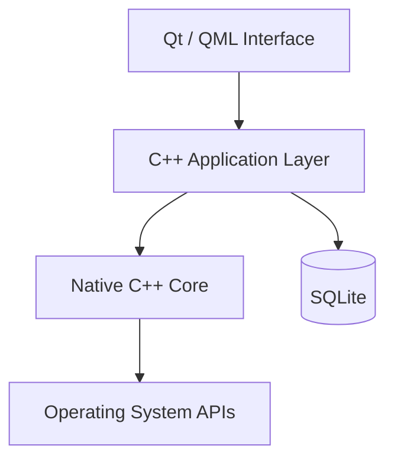
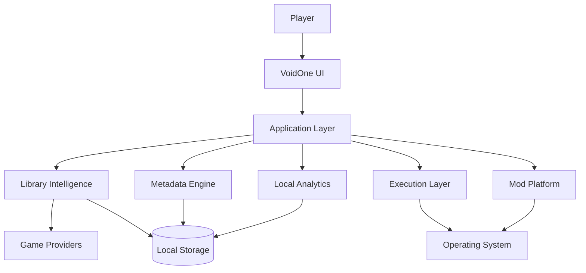

<div align="center">


# 🌌 VoidOne

### The Open-Source PC Gaming Platform Built Around Your Games — Not Around a Store

<p>
  <strong>🇬🇧 English</strong> •
  <a href="README.fa.md">🇮🇷 پارسی</a>
</p>

<p>
  <a href="https://github.com/VoidOne-App/VoidOne/actions">
    
  </a>
  <a href="https://github.com/VoidOne-App/VoidOne/releases/latest">
    
  </a>
  <a href="https://github.com/VoidOne-App/VoidOne/stargazers">
    
  </a>
  <a href="https://github.com/VoidOne-App/VoidOne/blob/main/LICENSE">
    
  </a>
</p>

<p>
  
  
  
  
  
</p>

<br />

**One Library. Your Games. Your Hardware. Your Rules.**

<br />

<a href="#-about">About</a> •
<a href="#-vision">Vision</a> •
<a href="#-gamer-to-gamer-commitment">Commitment</a> •
<a href="#-current-foundation">Current</a> •
<a href="#-future-direction">Future</a> •
<a href="#-architecture">Architecture</a> •
<a href="#-engineering-infrastructure">Engineering</a> •
<a href="#-roadmap">Roadmap</a> •
<a href="#-build-from-source">Build</a> •
<a href="#-contributing">Contributing</a>

</div>

---

## 👁️ About

**VoidOne** is an open-source native PC gaming platform designed to put the player's games at the center of the experience.

Modern PC gaming is fragmented across storefronts, launchers, installation directories, platform-specific systems, configuration files, metadata services, and independent game executables.

VoidOne is being built to provide a native layer between the player, their hardware, the operating system, and the gaming ecosystem.

The foundation is built around:

- **C++23**
- **Qt 6.8**
- **QML / Qt Quick**
- **SQLite**
- **CMake**
- **Ninja**

The project is intentionally designed as more than a conventional launcher.

The long-term direction is a modular platform for:

- Game discovery
- Library management
- Native execution
- Process orchestration
- Performance management
- Metadata
- Local analytics
- Mod management
- Extensibility
- Developer tooling

VoidOne is an **actively developed project**. Features described as future capabilities are clearly identified as such throughout this document.

---

# 🎯 Vision

PC gaming should not require the player to constantly move between disconnected systems.

```text
Storefronts
     │
Launchers
     │
Installations
     │
Executables
     │
Metadata
     │
Mods
     │
Configuration
     │
     ▼
┌───────────────────────────────┐
│           VOIDONE             │
│                               │
│  Native Gaming Management     │
│  Execution • Library • Data   │
└───────────────┬───────────────┘
                │
                ▼
          PLAYER + HARDWARE
```

VoidOne's long-term goal is to provide a unified native layer without becoming another storefront or closed ecosystem.

> **VoidOne is not being built to become another storefront.**
>
> **It is being built to become the layer between the player, the operating system, and the gaming ecosystem.**

---

# 🛡️ Gamer-to-Gamer Commitment

VoidOne is built **by a gamer, for gamers**.

This is not just marketing language.

It is the standard the project is being built around.

## ♾️ Free & Open Source — Forever

VoidOne is committed to remaining **free and open-source**.

The project is released under the **MIT License** and is intended to remain accessible, inspectable, and modifiable.

No mandatory subscription for the core experience.

No artificial paywall around the fundamentals.

No closed ecosystem designed to lock the player in.

## 🚫 No Ads. No Telemetry.

**No Ads. No Telemetry.**

VoidOne is not built around advertising or behavioral tracking.

The principle is simple:

> **You use VoidOne to manage your games. You should not become the product.**

## ⚡ Lightweight by Design

VoidOne is being engineered around an ambitious performance goal:

> **Target idle memory usage: under 50 MB.**

This is an **engineering target**, not a guaranteed specification of every current release or hardware configuration.

The objective is to avoid unnecessary:

- Background services
- Persistent processes
- Heavy runtimes
- Resource-hungry dependencies
- Hidden workloads

Every component should have a reason to exist.

## 🔒 100% Control Over Your Data

Your data belongs to **you**.

VoidOne follows a local-first direction wherever practical.

The goal is to keep your:

- Game library
- Settings
- Profiles
- Configuration
- Local statistics
- Personal gaming data

under your control.

## 🎮 I Stand With Gamers

VoidOne exists because gamers deserve software that respects:

- Their hardware
- Their privacy
- Their time
- Their data
- Their freedom
- Their games

We are not building another ecosystem to control the player.

We are building a tool to give players **more control over the ecosystem they already have**.

> ### **Free and open-source — forever.**
>
> ### **No Ads. No Telemetry.**
>
> ### **Your data. Your control.**
>
> ### **Built by a gamer. For gamers.**
>
> **I stand with gamers — always.**

---

# 🧭 Engineering Principles

VoidOne follows a set of principles intended to keep the project technically credible as it grows.

### Native First

Prefer native technologies when they provide meaningful advantages in performance, integration, maintainability, or system control.

### Local First

Prefer local processing and local persistence whenever practical.

### Privacy by Design

Avoid unnecessary collection, tracking, or transmission of player data.

### Lightweight by Design

Dependencies, background processes, and runtime components should justify their resource cost.

### User Ownership

Players should remain in control of their games, data, configuration, and experience.

### Evidence Over Marketing

Performance and technical claims should be backed by implementation, testing, or reproducible benchmarks.

### Human-Controlled Automation

Automation and AI may accelerate engineering, but final engineering responsibility remains human.

### Long-Term Maintainability

Architecture should remain understandable, testable, and extensible as the project grows.

---

# ✅ Current Foundation

This section describes the project's current foundation rather than its long-term ambitions.

## 🧠 Native Core

VoidOne is built around modern native technologies:

- **C++23**
- **Qt 6.8**
- **QML / Qt Quick**
- **SQLite**
- **CMake**
- **Ninja**

## 🎨 QML / Qt Quick UI

Qt Quick and QML provide the foundation for the graphical interface.

The architecture separates the visual layer from the native application layer, allowing the UI and underlying systems to evolve independently.

## 💾 Local Persistence

SQLite provides the foundation for local application data.

This supports the project's local-first direction and avoids making a remote backend a fundamental requirement for basic local application state.

## 🔨 Native Build System

The project uses CMake as its build configuration system and Ninja where configured as the build generator.

## 🤖 Engineering Automation

GitHub Actions and repository automation are used to support development, validation, and build workflows.

AI-assisted engineering infrastructure is also maintained separately from the player-facing product experience.

---

# 🔭 Future Direction

The following capabilities represent **planned, future, or long-term engineering directions**.

They should not be interpreted as generally available functionality in the current release.

## 👻 Ghost Launch

A future execution layer designed to give players more control over how games are started and managed.

Potential capabilities:

- Direct executable execution where technically and legally possible
- Custom launch arguments
- Environment configuration
- Per-game launch profiles
- Process lifecycle tracking
- Background-process policies
- Orphan-process detection
- Process prioritization

Concept:

```text
Player
  │
  ▼
VoidOne
  │
  ▼
Execution Layer
  │
  ▼
Game Process
```

Ghost Launch is intended to become a controlled execution layer between the player and the game.

VoidOne does not intend to bypass DRM, licensing requirements, or required platform authentication.

---

# ⚙️ Intelligent Process Orchestration

Future versions may introduce deeper process awareness.

Potential capabilities include:

- Process lifecycle management
- Child-process awareness
- CPU priority profiles
- Background workload policies
- Resource-aware launch profiles
- Orphan-process detection
- Runtime process management

The goal is controlled execution rather than simply launching an executable and losing visibility into what happens afterward.

---

# 🎮 Multi-Store Library

A unified library across multiple providers is part of the long-term direction.

Potential integrations include:

- Steam
- Epic Games
- GOG
- EA App
- Local installations
- Additional providers

Potential capabilities:

- Installation discovery
- Manifest parsing
- Library aggregation
- Duplicate detection
- Game identity normalization
- Metadata normalization
- Provider-aware launching

The goal is a unified library — not another storefront.

---

# 🖼️ Metadata Engine

Future versions may introduce a richer metadata layer.

Potential data:

- Cover artwork
- Hero banners
- Backgrounds
- Descriptions
- Genres
- Release information
- Developer
- Publisher
- Ratings
- Platform information

The planned architecture favors:

- Asynchronous processing
- Local caching
- Non-blocking UI
- Failure-tolerant network operations

Online metadata should enhance the experience without becoming a mandatory dependency for basic local functionality.

---

# 📊 Local Gaming Analytics

Future versions may provide privacy-oriented local analytics.

Potential capabilities:

- Launch history
- Session tracking
- Play duration
- Per-game statistics
- Local crash records
- Performance history
- Local performance trends

Guiding principle:

> **Useful analytics without turning the player into the product.**

---

# 🧩 Advanced Mod Platform

A future mod architecture may provide:

- Mod profiles
- Virtual file mapping
- Non-destructive deployment
- Dependency management
- Conflict detection
- Load-order management
- Compatibility checks

Example:

```text
Game
├── Vanilla
├── Competitive
├── Graphics Overhaul
├── Experimental
└── Custom Profile
```

The objective is to support multiple configurations while minimizing unnecessary changes to the original game installation.

---

# 🎨 Next-Generation UI

The long-term visual direction may include:

- Advanced QML interfaces
- Dynamic themes
- Artwork-driven libraries
- Responsive layouts
- Personalization
- Display scaling
- Accessibility
- Optional animations
- RGB customization

Visual effects should justify their performance cost.

> **A premium interface is only useful when it remains responsive.**

---

# 🩺 Performance Diagnostics

Future diagnostics may include:

- Startup analysis
- Runtime measurements
- Memory diagnostics
- Process analysis
- Library scan profiling
- Performance history
- Per-game performance profiles
- Benchmarking

The objective is simple:

> **Make performance measurable rather than subjective.**

---

# 💾 Backup & Recovery

Future versions may introduce local backup and recovery capabilities.

Potential areas include:

- Application configuration
- Library data
- Game profiles
- Mod profiles
- User preferences

Potential functionality:

- Backup creation
- Profile export/import
- Recovery snapshots
- Configuration restoration

---

# 🔌 Extensibility

The long-term platform may expose controlled extension points.

Potential future components include:

- Extension APIs
- Theme SDK
- Provider APIs
- Community extensions
- Custom integrations
- Developer tooling

Any extension architecture should prioritize:

- Security
- Stability
- Compatibility
- Maintainability
- User control

---

# ⚡ Performance Goals

Performance is a core engineering objective.

The following values are **targets**, not guaranteed specifications.

| Metric | Engineering Target |
| :--- | :--- |
| **Idle Memory** | `< 50 MB` |
| **Cold Startup** | `< 1.0s` target |
| **Database Operations** | Sub-millisecond target |
| **UI Rendering** | 60+ FPS target |
| **Library Scanning** | Minimal UI blocking |

These numbers should not be interpreted as promises.

Before any performance figure becomes an official product claim, it should be backed by reproducible testing.

Benchmark reports should document:

- Hardware
- Operating system
- Compiler
- Qt version
- Application version
- Build configuration
- Test methodology
- Measurement conditions

> **The goal is not to promise performance. The goal is to prove it.**

---

# 🏗️ Architecture

VoidOne is designed around separation between presentation, application logic, native systems, persistence, and operating-system integration.

## Current Architectural Direction



## Long-Term Platform Architecture



The second diagram represents **long-term architecture**, not a claim that all components currently exist.

---

# 🧰 Technology Stack

| Technology | Role |
| :--- | :--- |
| **C++23** | Native application and systems development |
| **Qt 6.8** | Application framework |
| **QML / Qt Quick** | User interface |
| **SQLite** | Local persistence |
| **CMake** | Build configuration |
| **Ninja** | Build execution |
| **CTest** | Test execution where configured |
| **GitHub Actions** | CI/CD automation |
| **Clang tooling** | Static analysis where configured |
| **AddressSanitizer** | Memory-error diagnostics where configured |
| **UndefinedBehaviorSanitizer** | Undefined-behavior diagnostics where configured |

---

# 🤖 Engineering Infrastructure

VoidOne uses automation to reduce repetitive engineering work and improve validation.

This infrastructure should not be confused with player-facing product functionality.

## 🔄 Automated Engineering

The repository's automation may be used for:

- Compilation
- Testing
- Static analysis
- Sanitizer builds
- QML validation
- Artifact generation
- Release validation

The repository workflows remain the source of truth for the exact CI configuration.

## 🧠 AI Repair

VoidOne includes an **AI Repair** engineering workflow.

AI Repair exists to assist with software-engineering problems such as diagnosing failures and producing candidate fixes.

It is **not** intended to be an autonomous authority.

The intended model is:

```text
CI Failure
    │
    ▼
AI-Assisted Diagnosis
    │
    ▼
Candidate Patch
    │
    ▼
Validation
    │
    ├──────────────┐
    ▼              ▼
  Build          Tests
    │              │
    └──────┬───────┘
           ▼
     Human Review
           │
           ▼
         Merge
```

Potential uses include:

- Failure diagnosis
- Code analysis
- Candidate patch generation
- Build validation
- Test validation
- Regression investigation
- Engineering feedback

> **AI accelerates engineering. It does not replace engineering ownership.**

AI-generated changes remain subject to testing, review, and repository policy.

---

# 🛡️ Security

Security is treated as an engineering concern rather than a marketing claim.

The project's security direction includes:

- Automated validation
- Static analysis
- Dependency awareness
- Artifact integrity
- Release validation
- Secure engineering practices

Future security work may include:

- Dependency auditing
- Artifact verification
- Reproducible builds
- Hardened update mechanisms
- Secure extension boundaries
- Runtime integrity validation

VoidOne does not claim certifications or absolute security guarantees unless explicitly documented.

---

# 📦 Releases

## Latest Release

The official dynamic latest-release endpoint is:

**https://github.com/VoidOne-App/VoidOne/releases/latest**

This always resolves to the repository's latest published GitHub Release.

## All Releases

**https://github.com/VoidOne-App/VoidOne/releases**

Available assets depend on the specific release.

They may include:

- Windows installers
- Portable archives
- Platform-specific archives
- SHA-256 checksums

Always use the assets published with the corresponding release.

---

# 🔐 Artifact Verification

When a release provides a SHA-256 checksum, verify the downloaded artifact locally.

### PowerShell

```powershell
Get-FileHash .\VoidOne-Windows-x64-Portable.zip -Algorithm SHA256
```

Compare the resulting hash against the checksum published for that exact release artifact.

Use the exact filename provided by the release.

---

# 🔨 Build From Source

VoidOne is primarily developed around Windows while the project also maintains cross-platform build infrastructure.

Build requirements may evolve as the project develops.

## Windows

Recommended tools:

- Windows 10 or Windows 11
- Visual Studio 2022
- MSVC
- Qt 6.8+
- CMake
- Ninja
- Git

## Linux

Recommended tools:

- Recent Linux distribution
- GCC or Clang
- Qt 6.8+
- CMake
- Ninja
- Git
- Required Qt/system development packages

## macOS

macOS is not currently a primary target of the project.

Support may be considered as the platform architecture matures.

---

## 📥 Clone

```bash
git clone https://github.com/VoidOne-App/VoidOne.git
cd VoidOne
```

## ⚙️ Configure

### Windows

```powershell
cmake `
  -S . `
  -B build `
  -G Ninja `
  -DCMAKE_BUILD_TYPE=Release `
  -DCMAKE_CXX_STANDARD=23
```

If Qt is not automatically discoverable:

```powershell
cmake `
  -S . `
  -B build `
  -G Ninja `
  -DCMAKE_BUILD_TYPE=Release `
  -DCMAKE_CXX_STANDARD=23 `
  -DCMAKE_PREFIX_PATH="C:\Qt\6.x.x\msvc2022_64"
```

Replace the path with the actual Qt installation directory.

### Linux

```bash
cmake \
  -S . \
  -B build \
  -G Ninja \
  -DCMAKE_BUILD_TYPE=Release \
  -DCMAKE_CXX_STANDARD=23
```

If required:

```bash
cmake \
  -S . \
  -B build \
  -G Ninja \
  -DCMAKE_BUILD_TYPE=Release \
  -DCMAKE_CXX_STANDARD=23 \
  -DCMAKE_PREFIX_PATH="$HOME/Qt/6.x.x/gcc_64"
```

## 🔨 Build

```bash
cmake --build build --parallel
```

## 🧪 Test

If the project configuration exposes CTest tests:

```bash
ctest \
  --test-dir build \
  --output-on-failure
```

---

# 📦 Packaging

Packaging is handled according to the platform and release configuration.

The long-term distribution model is intended to support convenient native packages while keeping portable distribution available where practical.

Potential Windows distribution formats include:

- Installer
- Portable archive

Release automation may also produce checksums for published artifacts.

The exact generated filenames should always be taken from the corresponding release rather than assumed in documentation.

---

# 🧪 Testing & Validation

Testing is part of the engineering lifecycle.

Depending on the active project configuration, validation may include:

- Unit tests
- Build validation
- AddressSanitizer
- UndefinedBehaviorSanitizer
- Static analysis
- QML validation
- Cross-platform build verification

Contributors should run the checks relevant to their changes before opening a pull request.

---

# 📏 Performance Policy

VoidOne does not treat unverified numbers as specifications.

A meaningful benchmark should identify:

```text
Application Version
        │
        ▼
Hardware
        │
        ▼
Operating System
        │
        ▼
Compiler / Toolchain
        │
        ▼
Qt Version
        │
        ▼
Build Configuration
        │
        ▼
Benchmark Methodology
        │
        ▼
Measured Result
```

Relevant measurements may include:

- Cold startup
- Warm startup
- Idle memory
- Peak memory
- Library scan duration
- Database performance
- CPU utilization
- UI frame-time
- Background workload impact

> **No number becomes an official performance specification until it can be reproduced.**

---

# 🗺️ Roadmap

The roadmap describes the project's direction.

It is not a promise of specific delivery dates.

## Phase I — Native Foundation

- [x] C++23 foundation
- [x] Qt / QML foundation
- [x] CMake build system
- [x] Native application architecture
- [x] CI infrastructure

## Phase II — Library Intelligence

- [ ] Game discovery
- [ ] Installation detection
- [ ] Local library persistence
- [ ] Provider integration
- [ ] Metadata normalization

## Phase III — Experience

- [ ] Advanced library UI
- [ ] Filtering and categorization
- [ ] Artwork and metadata
- [ ] Personalization
- [ ] UI refinement

## Phase IV — Execution

- [ ] Ghost Launch
- [ ] Process lifecycle management
- [ ] Launch profiles
- [ ] Runtime configuration
- [ ] Local playtime tracking

## Phase V — Mod Platform

- [ ] Mod profiles
- [ ] Virtual file mapping
- [ ] Dependency management
- [ ] Conflict detection
- [ ] Compatibility management

## Phase VI — Intelligence

- [ ] Local gaming analytics
- [ ] Performance diagnostics
- [ ] Advanced engineering automation
- [ ] AI-assisted failure diagnosis
- [ ] Automated validation

## Phase VII — Ecosystem

- [ ] Extension APIs
- [ ] Theme SDK
- [ ] Community extensions
- [ ] Additional providers
- [ ] Developer ecosystem

> **The roadmap represents direction, not guarantees.**

---

# 🤝 Contributing

Contributions are welcome.

You can contribute through:

- C++
- Qt / QML
- UI/UX
- Testing
- Documentation
- Bug reports
- Feature proposals
- Performance improvements
- Platform support
- Build and CI improvements

## Contribution Workflow

Create a focused feature branch:

```bash
git checkout main
git pull origin main
git checkout -b feature/your-feature
```

Make your changes and validate them locally.

Then:

```bash
git add .
git commit -m "feat: describe your change"
git push origin feature/your-feature
```

Open a Pull Request on GitHub.

For substantial changes, explain:

- What changed
- Why it changed
- How it was tested
- Any compatibility considerations
- Any performance implications

Keep changes focused, reviewable, and maintainable.

---

# 🐛 Reporting Issues

When reporting a build or runtime problem, include:

- Operating system
- Compiler
- Compiler version
- Qt version
- CMake version
- Build configuration
- Relevant error output
- Steps to reproduce

For runtime problems, include available logs or terminal output.

Good issue reports make problems easier to reproduce and fix.

---

# 📚 Project Documentation

The repository may contain additional documentation covering areas such as:

- Building
- Contributing
- Troubleshooting
- Development workflows
- Engineering infrastructure

The repository itself remains the source of truth for current implementation details.

---

# 📜 License

VoidOne is distributed under the **MIT License**.

See [`LICENSE`](LICENSE) for the complete license text.

Repository:

https://github.com/VoidOne-App/VoidOne

---

<div align="center">

# 🌌 VoidOne

### Your Games. Your Hardware. Your Rules.

**Built by a gamer. Engineered like a platform. Built in the open.**

<br />

### ♾️ Free & Open Source — Forever

### 🚫 No Ads. No Telemetry.

### 🔒 Your Data. Your Control.

<br />

<a href="https://github.com/VoidOne-App/VoidOne/stargazers">
  
</a>

<br />
<br />

**Native · Open Source · Local First · Player Focused**

</div>
````0