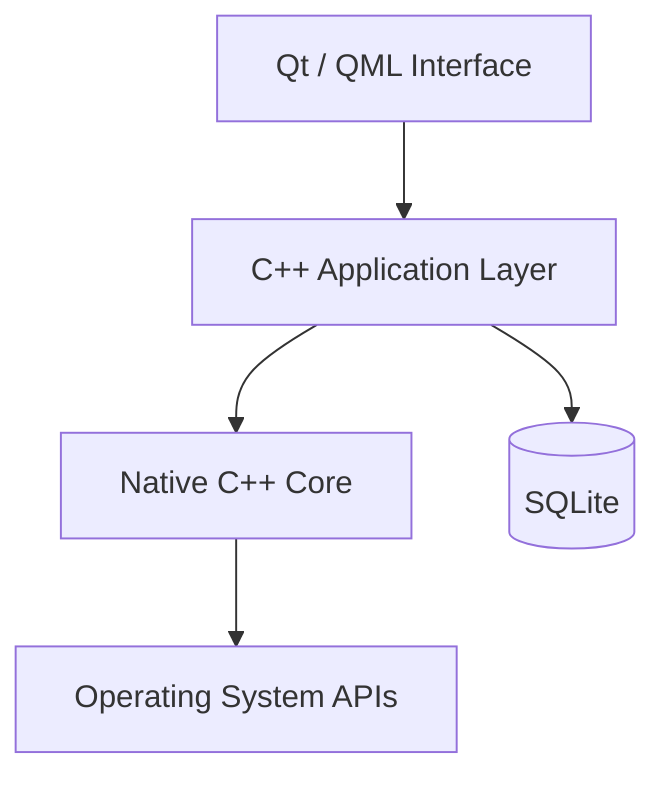
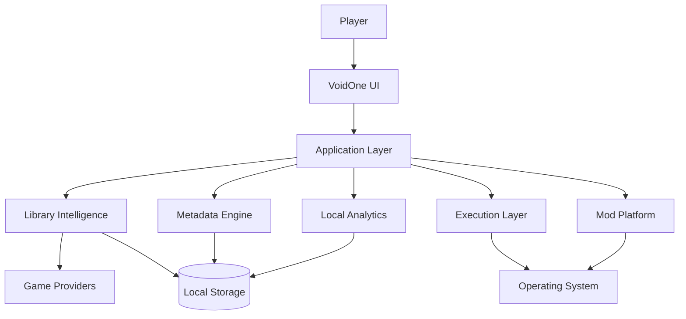

<div align="center">


# 🌌 VoidOne

### The Open-Source PC Gaming Platform Built Around Your Games — Not Around a Store

<p>
  <b>🇬🇧 English</b> •
  <a href="README.fa.md">🇮🇷 پارسی</a>
</p>

<p>
  <a href="https://github.com/VoidOne-App/VoidOne/actions/workflows/c.cpp.yml">
    
  </a>
  <a href="https://github.com/VoidOne-App/VoidOne/releases/latest">
    
  </a>
  <a href="https://github.com/VoidOne-App/VoidOne/stargazers">
    
  </a>
  <a href="https://github.com/VoidOne-App/VoidOne/blob/main/LICENSE">
    
  </a>
</p>

<p>
  
  
  
  
  
</p>

<br />

**One Library. Your Games. Your Hardware. Your Rules.**

<br />

<p>
  <a href="#-about">About</a> •
  <a href="#-vision">Vision</a> •
  <a href="#-gamer-to-gamer-commitment">Commitment</a> •
  <a href="#-current-capabilities">Current</a> •
  <a href="#-future-direction">Future</a> •
  <a href="#-performance-goals">Performance</a> •
  <a href="#-architecture">Architecture</a> •
  <a href="#-engineering-infrastructure">Engineering</a> •
  <a href="#-roadmap">Roadmap</a> •
  <a href="#-build-from-source">Build</a> •
  <a href="#-contributing">Contributing</a>
</p>

</div>

---

## 👁️ About

**VoidOne** is an open-source, native PC gaming platform designed to put the player's games — not the storefront — at the center of the desktop experience.

Built with **C++23, Qt 6.8, QML, SQLite, CMake, and Ninja**, VoidOne is being developed as a lightweight foundation for discovering, organizing, launching, and eventually managing games across the fragmented PC gaming ecosystem.

Modern PC gaming can be spread across:

- Multiple storefronts
- Multiple launchers
- Installation directories
- Platform manifests
- Independent executables
- Configuration systems
- Metadata providers
- Mod-management tools
- Background services

VoidOne aims to bring these pieces together through a native application designed around the player's local environment.

> **Your games should be the focal point of your system — not the stores distributing them.**

VoidOne is an evolving project. This README intentionally separates **current capabilities** from **planned and long-term capabilities**.

---

# 🎯 Vision

VoidOne is not being built to become another storefront.

The long-term vision is to create a **native management and orchestration layer between the player, the operating system, and the gaming ecosystem**.

```text
                         ┌──────────────────────┐
                         │        PLAYER        │
                         └──────────┬───────────┘
                                    │
                                    ▼
                         ┌──────────────────────┐
                         │       VOIDONE        │
                         │  Native Game Layer   │
                         └──────────┬───────────┘
                                    │
              ┌─────────────────────┼─────────────────────┐
              │                     │                     │
              ▼                     ▼                     ▼
         GAME LIBRARY          EXECUTION             SERVICES
              │                     │                     │
              └─────────────────────┼─────────────────────┘
                                    │
                                    ▼
                         ┌──────────────────────┐
                         │   OPERATING SYSTEM   │
                         └──────────────────────┘
```

The objective is not to replace every existing gaming service.

Instead, VoidOne aims to provide an independent native layer that can progressively integrate with the ecosystem while keeping the player's local library at the center.

> **VoidOne is not being built to become another storefront. It is being built to become the layer between the player, the operating system, and the gaming ecosystem.**

---

# 🛡️ Gamer-to-Gamer Commitment

VoidOne is built **by a gamer, for gamers**.

This is not just a product philosophy.

It is a commitment.

## ♾️ Free & Open-Source — Forever

VoidOne is committed to remaining **free and open-source**.

No mandatory subscription for the core platform.  
No paywall around the fundamental experience.  
No closed ecosystem designed to lock the player in.

## 🚫 No Ads. No Telemetry.

**No Ads. No Telemetry.**

VoidOne is not being built around advertising or player tracking.

The goal is simple:

> **You use VoidOne to manage your games — not to become the product.**

## ⚡ Lightweight by Design

VoidOne is being engineered with a clear performance goal:

> **Target idle memory usage: under 50 MB.**

This is an engineering target, not a guaranteed specification of the current release.

The goal is to avoid unnecessary background services, heavyweight runtimes, and hidden processes that consume system resources without providing value to the player.

## 🔒 100% Control Over Your Data

Your data belongs to **you**.

VoidOne is designed around local-first data ownership, with the goal of keeping your:

- Game library
- Settings
- Profiles
- Local statistics
- Configuration
- Gaming data

under your control.

## 🎮 I Stand With Gamers

VoidOne exists because gamers deserve software that respects:

- Their hardware
- Their privacy
- Their time
- Their data
- Their freedom
- Their games

We are not building another ecosystem to control the player.

We are building a tool to give players **more control over the ecosystem they already have**.

> ### **Free and open-source — forever.**
>
> ### **No Ads. No Telemetry.**
>
> ### **Your data. Your control.**
>
> ### **Built by a gamer. For gamers.**
>
> **I stand with gamers — always.**

---

# 🏗️ Product Principles

The Gamer-to-Gamer Commitment defines what VoidOne stands for.

These principles guide the engineering decisions behind the project.

### Native First

Use native technologies and operating-system capabilities where they provide meaningful advantages in performance, integration, and maintainability.

### Local First

Prefer local storage and local processing whenever practical.

### Privacy by Design

Avoid unnecessary collection, tracking, or transmission of player data.

### Lightweight by Design

Every background process, dependency, and runtime component should have a reason to exist.

### User Ownership

The player should remain in control of their library, data, configuration, and experience.

### Open by Design

The project should remain transparent and accessible to its community.

### Evidence Over Marketing

Performance and technical claims should be backed by implementation, testing, or reproducible benchmarks.

---

# ✅ Current Capabilities

This section describes the current project foundation.

Future functionality is intentionally documented separately.

## Native Application Foundation

VoidOne is built around:

- **C++23**
- **Qt 6.8**
- **QML / Qt Quick**
- **SQLite**
- **CMake**
- **Ninja**

## Native UI Foundation

Qt Quick / QML provides the foundation for the graphical interface.

The architecture separates the visual layer from the native C++ application layer.

## Local Persistence

SQLite provides the foundation for local application data and persistence.

## Engineering Infrastructure

The repository contains automated development infrastructure for building and validating the project through GitHub Actions and related tooling.

The repository itself remains the source of truth for exactly which workflows and checks are active.

---

# 🔭 Future Direction

The following capabilities represent **planned, future, or long-term engineering directions**.

> **These capabilities should not be interpreted as generally available functionality in the current release unless explicitly implemented and documented.**

Long-term platform direction includes:

- Ghost Launch
- Intelligent Process Orchestration
- Advanced Process Management
- CPU Priority Profiles
- Resource Optimization
- Multi-Store Aggregation
- Epic Games integration
- GOG integration
- EA App integration
- Rich Metadata Engine
- Artwork / Hero Banner System
- Local Gaming Analytics
- Advanced Mod Engine
- Mod Profiles
- Virtual File Mapping
- Dependency Management
- Conflict Detection
- Advanced QML Interface
- Dynamic Themes
- RGB Customization
- Performance Diagnostics
- Backup & Recovery
- Extension APIs
- Theme SDK
- Developer Ecosystem
- Community Extensions

These are product directions, not claims about current implementation.

---

# 👻 Ghost Launch

**Ghost Launch** is a planned execution architecture designed to provide greater control over game startup and runtime behavior.

Potential capabilities include:

- Direct executable execution where technically and legally possible
- Custom launch arguments
- Environment configuration
- Per-game launch profiles
- Process lifecycle management
- Background process policies
- Orphan process detection
- Process prioritization
- Runtime state tracking

The conceptual model:

```text
Player
  │
  ▼
VoidOne
  │
  ▼
Execution Layer
  │
  ▼
Game Process
```

The objective is to create a controlled execution layer between the player and the game.

VoidOne does not intend to bypass DRM, licensing systems, or required platform authentication.

---

# ⚙️ Intelligent Process Orchestration

A future process-management layer may allow VoidOne to understand the relationship between a game and its supporting processes.

Potential capabilities include:

- Process lifecycle tracking
- Child-process awareness
- Background workload policies
- CPU priority profiles
- Runtime process management
- Orphan-process detection
- Per-game execution policies

The long-term goal is controlled execution rather than simply starting an executable and forgetting about it.

---

# 🧩 Multi-Store Aggregation

A unified multi-store library is part of the long-term platform direction.

Potential providers include:

- Steam
- Epic Games
- GOG
- EA App
- Local installations
- Additional providers

Potential capabilities:

- Installation discovery
- Manifest parsing
- Library aggregation
- Duplicate detection
- Game identity normalization
- Metadata normalization
- Provider-aware launching

The objective is to provide one consistent library without creating another storefront.

---

# 🖼️ Metadata Engine

A future metadata system may provide:

- Cover artwork
- Hero banners
- Backgrounds
- Descriptions
- Genres
- Release information
- Developer information
- Publisher information
- Ratings
- Platform information

The planned architecture favors:

- Asynchronous processing
- Local caching
- Non-blocking UI
- Failure-tolerant network operations

---

# 📊 Local Gaming Analytics

Future versions may provide privacy-oriented local analytics.

Potential capabilities include:

- Session tracking
- Launch history
- Play duration
- Per-game statistics
- Local crash records
- Performance history

The guiding principle:

> **Useful analytics without turning the player into the product.**

Analytics should remain local wherever technically practical.

---

# 🧰 Advanced Mod Platform

A future mod-management architecture may include:

- Mod profiles
- Virtual file mapping
- Non-destructive deployment
- Dependency management
- Conflict detection
- Load-order management
- Compatibility checks

Example:

```text
Game
├── Vanilla
├── Competitive
├── Graphics Overhaul
├── Experimental
└── Custom Profile
```

The objective is to let players maintain multiple configurations without unnecessarily modifying the original game installation.

---

# 🎨 Next-Generation Interface

The long-term UI direction may include:

- Advanced QML interfaces
- Dynamic themes
- Artwork-driven libraries
- Responsive layouts
- Personalization
- Display scaling
- Accessibility improvements
- Optional animations
- RGB customization

Visual effects should justify their performance cost.

> **A premium interface is only useful when it remains responsive.**

---

# 🩺 Performance Diagnostics

Future diagnostic capabilities may include:

- Startup analysis
- Runtime measurements
- Memory diagnostics
- Process analysis
- Library scan profiling
- Performance history
- Per-game performance profiles
- Benchmarking

The goal is to make performance measurable rather than subjective.

---

# 💾 Backup & Recovery

Future versions may introduce local backup and recovery functionality.

Potential areas include:

- Application configuration
- Library data
- Game profiles
- Mod profiles
- User preferences

Potential functionality:

- Backup creation
- Profile export/import
- Recovery snapshots
- Configuration restoration

---

# 🔌 Extensibility

VoidOne's long-term architecture may provide controlled extension points.

Potential future components include:

- Extension APIs
- Theme SDK
- Provider integrations
- Community extensions
- Custom integrations
- Developer tooling

Security and stability should remain requirements for any extension system.

---

# 🤖 Engineering Infrastructure

AI is part of VoidOne's **engineering infrastructure**, not a requirement for the player and not a replacement for human engineering.

The project includes AI-assisted development workflows intended to help maintain and repair the codebase.

## AI Repair

The **AI Repair** infrastructure is designed to assist with CI and development failures.

Depending on the active repository configuration, the workflow can be used for tasks such as:

- Failure diagnosis
- Code analysis
- Candidate repair generation
- Build validation
- Test validation
- Engineering feedback

The intended model is:

```text
                 CI Failure
                     │
                     ▼
              AI-Assisted Diagnosis
                     │
                     ▼
               Candidate Patch
                     │
                     ▼
                 Validation
                ┌────┴────┐
                ▼         ▼
              Build      Tests
                │         │
                └────┬────┘
                     ▼
               Human Review
                     │
                     ▼
                   Merge
```

AI-generated changes are not automatically considered correct.

> **AI accelerates engineering. It does not replace engineering ownership.**

Human review, validation, and repository policy remain the final authority.

---

# 🏗️ Architecture

VoidOne is designed around a layered native architecture.

## Core Architecture



## Long-Term Platform Architecture



The second diagram represents the **long-term architecture** and does not imply that every subsystem is currently implemented.

---

# 🛡️ Security

Security is treated as an engineering requirement.

Repository-level security and quality tooling may include:

- CodeQL
- Static analysis
- Automated validation
- Release integrity checks
- Build validation

Long-term security direction may include:

- Dependency auditing
- Artifact integrity verification
- Reproducible builds
- Hardened update mechanisms
- Secure extension boundaries
- Runtime integrity validation

VoidOne does not claim security certifications or absolute security guarantees unless explicitly documented.

---

# 🧰 Technology Stack

| Technology | Role |
| :--- | :--- |
| **C++23** | Native application and systems development |
| **Qt 6.8** | Native application framework |
| **QML / Qt Quick** | Graphical interface |
| **SQLite** | Local persistence |
| **CMake** | Build configuration |
| **Ninja** | Build execution |
| **CTest** | Testing infrastructure where configured |
| **GitHub Actions** | CI/CD automation |
| **CodeQL** | Security analysis where configured |
| **Cppcheck** | Static analysis where configured |
| **WiX Toolset** | Windows installer tooling where configured |
| **NSIS** | Windows packaging where configured |
| **Ollama** | Local AI engineering infrastructure where configured |
| **Gemini** | AI-assisted engineering