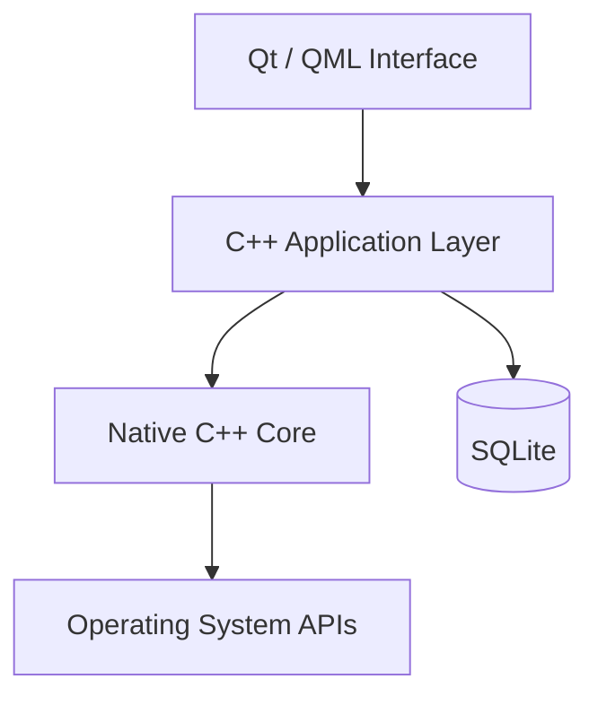
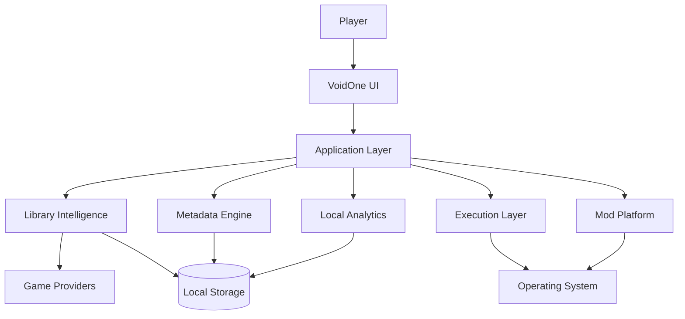

<div align="center">


# 🌌 VoidOne

### The Open-Source PC Gaming Platform Built Around Your Games — Not Around a Store

<p>
  <b>🇬🇧 English</b> •
  <a href="README.fa.md">🇮🇷 پارسی</a>
</p>

<p>
  <a href="https://github.com/VoidOne-App/VoidOne/actions/workflows/c.cpp.yml">
    
  </a>
  <a href="https://github.com/VoidOne-App/VoidOne/releases/latest">
    
  </a>
  <a href="https://github.com/VoidOne-App/VoidOne/stargazers">
    
  </a>
  <a href="https://github.com/VoidOne-App/VoidOne/blob/main/LICENSE">
    
  </a>
</p>

<p>
  
  
  
  
  
  
</p>

<br />

**One Library. Your Games. Your Hardware. Your Rules.**

<br />

<p>
  <a href="#-about">About</a> •
  <a href="#-vision">Vision</a> •
  <a href="#-gamer-to-gamer-commitment">Commitment</a> •
  <a href="#-current-foundation">Current</a> •
  <a href="#-future-platform-direction">Future</a> •
  <a href="#-performance-goals">Performance</a> •
  <a href="#-architecture">Architecture</a> •
  <a href="#-engineering-infrastructure">Engineering</a> •
  <a href="#-releases">Releases</a> •
  <a href="#-roadmap">Roadmap</a> •
  <a href="#-build-from-source">Build</a> •
  <a href="#-contributing">Contributing</a>
</p>

</div>

---

## 👁️ About

**VoidOne** is an open-source, native PC gaming platform being engineered around a simple idea:

> **Your games should be the center of your gaming experience — not the stores distributing them.**

PC gaming is fragmented across storefronts, launchers, installation directories, platform manifests, configuration systems, metadata providers, background processes, and independent game executables.

VoidOne is being built as a native layer between the player and that fragmented ecosystem.

The project is built around modern technologies including:

- **C++23**
- **Qt 6.8**
- **QML / Qt Quick**
- **SQLite**
- **CMake**
- **Ninja**

VoidOne is an actively developed project.

Its long-term direction extends beyond a traditional launcher toward a broader native gaming platform covering areas such as:

- Game discovery
- Library management
- Native execution
- Process orchestration
- Performance optimization
- Metadata
- Mod management
- Local analytics
- Extensibility
- Developer tooling

This README intentionally distinguishes between **current implementation** and **future platform direction**.

---

# 🎯 Vision

VoidOne is not being built to become another storefront.

It is being built to become the layer between:

**The Player → The Operating System → The Gaming Ecosystem**

```text
                         ┌───────────────────────┐
                         │        PLAYER         │
                         └───────────┬───────────┘
                                     │
                                     ▼
                         ┌───────────────────────┐
                         │       VOIDONE         │
                         │   Native Game Layer   │
                         └───────────┬───────────┘
                                     │
                 ┌───────────────────┼───────────────────┐
                 │                   │                   │
                 ▼                   ▼                   ▼
             LIBRARIES           EXECUTION          SERVICES
                 │                   │                   │
                 └───────────────────┼───────────────────┘
                                     │
                                     ▼
                         ┌───────────────────────┐
                         │   OPERATING SYSTEM   │
                         └───────────────────────┘
```

The objective is not to replace the gaming ecosystem with another closed ecosystem.

The objective is to provide players with an open, native, extensible layer that works with the ecosystem they already use.

> **VoidOne is not being built to become another storefront. It is being built to become the layer between the player, the operating system, and the gaming ecosystem.**

---

# 🛡️ Gamer-to-Gamer Commitment

VoidOne is built **by a gamer, for gamers**.

This is more than a product statement.

It is a commitment to the people who use it.

## ♾️ Free & Open-Source — Forever

VoidOne is committed to being **free and open-source**.

The core project is released under the **MIT License**.

No mandatory subscription for the core platform.

No paywall around the fundamental experience.

No closed ecosystem designed to lock players in.

## 🚫 No Ads. No Telemetry.

**No Ads. No Telemetry.**

VoidOne is not being built around advertising, behavioral tracking, or turning players into a monetized data source.

> **You use VoidOne to manage your games — you don't become the product.**

## ⚡ Lightweight by Design

VoidOne is being engineered around an ambitious performance goal:

> **Target idle memory usage: under 50 MB.**

This is an **engineering target**, not a guaranteed specification of the current release.

The goal is to minimize unnecessary:

- Background services
- Persistent processes
- Heavy runtimes
- Resource-hungry components
- Hidden workloads

Every component should have a reason to exist.

## 🔒 100% Control Over Your Data

Your data belongs to **you**.

VoidOne is designed around local-first data ownership.

The long-term objective is to keep your:

- Game library
- Settings
- Configuration
- Profiles
- Local statistics
- Gaming data

under your control whenever technically practical.

## 🎮 I Stand With Gamers

VoidOne exists because gamers deserve software that respects:

- Their hardware
- Their privacy
- Their time
- Their data
- Their freedom
- Their games

We are not building another ecosystem to control the player.

We are building a tool to give players **more control over the ecosystem they already have**.

> ### **Free and open-source — forever.**
>
> ### **No Ads. No Telemetry.**
>
> ### **Under 50 MB RAM — as an engineering target.**
>
> ### **100% control over your data.**
>
> ### **Built by a gamer. For gamers.**
>
> **I stand with gamers — always.**

---

# 🧭 Product Principles

### 🧱 Native First

Prefer native technologies and operating-system capabilities where they provide meaningful advantages in performance, integration, and maintainability.

### 🔒 Privacy by Design

Avoid unnecessary collection, tracking, or transmission of player data.

### 💾 Local First

Prefer local processing and local persistence whenever practical.

### ⚡ Lightweight by Design

Dependencies, runtimes, services, and background processes should justify their resource cost.

### 🎮 User Ownership

The player should remain in control of their games, data, configuration, and experience.

### 🌐 Open by Design

The project should remain transparent, inspectable, modifiable, and accessible to contributors.

### 📐 Evidence Over Marketing

Technical claims should be supported by implementation, testing, or reproducible benchmarks.

---

# ✅ Current Foundation

This section describes the project's **current engineering foundation**.

Future capabilities are intentionally not presented as current functionality.

## 💻 Native Application

VoidOne is built around:

- **C++23**
- **Qt 6.8**
- **QML / Qt Quick**
- **SQLite**
- **CMake**
- **Ninja**

## 🎨 Native UI Foundation

Qt Quick / QML provides the graphical interface foundation.

The project separates the visual layer from the native C++ application layer to support maintainability and future expansion.

## 💾 Local Persistence

SQLite provides local persistence for application data.

The architecture is designed around local ownership rather than requiring a mandatory remote backend for the core application.

## 🔄 CI-Driven Engineering

The repository currently contains an automated GitHub Actions pipeline covering build, validation, static analysis, security analysis, testing, packaging, and release-related automation.

The workflow is defined in:

`.github/workflows/c.cpp.yml`

## 🪟 Platform Direction

Windows is currently the primary build and packaging environment.

Linux is part of the project's broader cross-platform engineering direction and is intended to expand as the platform matures.

macOS is not currently part of the primary build configuration.

---

# 🔭 Future Platform Direction

The following capabilities represent **planned, future, or long-term engineering directions**.

> **These capabilities must not be interpreted as generally available functionality in the current release unless explicitly implemented in the repository.**

Long-term platform direction includes:

- Ghost Launch
- Intelligent Process Orchestration
- Advanced Process Management
- CPU Priority Profiles
- Resource Optimization
- Multi-Store Aggregation
- Epic Games integration
- GOG integration
- EA App integration
- Rich Metadata Engine
- Artwork / Hero Banner System
- Local Gaming Analytics
- Advanced Mod Engine
- Mod Profiles
- Virtual File Mapping
- Dependency Management
- Conflict Detection
- Advanced QML Interface
- Dynamic Themes
- RGB Customization
- Performance Diagnostics
- Backup & Recovery
- Extension APIs
- Theme SDK
- Developer Ecosystem
- Community Extensions

These represent the **direction of the platform**, not claims about its current state.

---

# 👻 Ghost Launch

**Ghost Launch** is a planned execution architecture intended to provide greater control over how games are started and managed.

Potential capabilities include:

- Direct executable execution where technically and legally possible
- Custom launch arguments
- Environment configuration
- Per-game launch profiles
- Process lifecycle management
- Background-process policies
- Orphan-process detection
- Process prioritization
- Runtime state tracking

Conceptually:

```text
Player
  │
  ▼
VoidOne
  │
  ▼
Execution Layer
  │
  ▼
Game Process
```

The objective:

> **A controlled execution layer between the player and the game.**

VoidOne does not intend to bypass DRM, licensing, or required platform authentication.

If a game legitimately requires another platform or service, that dependency remains part of the execution environment.

---

# ⚙️ Intelligent Process Orchestration

A future process-management layer may allow VoidOne to understand and manage the relationship between a game and its supporting processes.

Potential capabilities include:

- Process lifecycle tracking
- Child-process awareness
- Background workload policies
- CPU priority profiles
- Runtime process management
- Orphan-process detection
- Per-game execution policies
- Resource-aware launch profiles

The long-term objective is controlled execution rather than simply starting an executable and forgetting about it.

---

# 🧩 Multi-Store Aggregation

A unified multi-store library is part of the long-term platform direction.

Potential providers include:

- Steam
- Epic Games
- GOG
- EA App
- Local installations
- Additional providers

Potential capabilities include:

- Installation discovery
- Manifest parsing
- Library aggregation
- Duplicate detection
- Game identity normalization
- Metadata normalization
- Provider-aware launching

The objective is to unify access without turning VoidOne into another storefront.

---

# 🖼️ Metadata Engine

A future metadata engine may provide:

- Cover artwork
- Hero banners
- Backgrounds
- Descriptions
- Genres
- Release information
- Developer information
- Publisher information
- Ratings
- Platform information

The planned architecture favors:

- Asynchronous processing
- Local caching
- Non-blocking UI
- Failure-tolerant network operations

Metadata should enhance the experience without becoming a mandatory dependency for basic local operations.

---

# 📊 Local Gaming Analytics

Future versions may provide privacy-oriented local analytics.

Potential capabilities include:

- Session tracking
- Launch history
- Play duration
- Per-game statistics
- Local crash records
- Performance history
- Local performance trends

Guiding principle:

> **Useful analytics without turning the player into the product.**

Analytics should remain local wherever technically practical.

---

# 🧰 Advanced Mod Platform

A future mod-management architecture may include:

- Mod profiles
- Virtual file mapping
- Non-destructive deployment
- Dependency management
- Conflict detection
- Load-order management
- Compatibility checks

Example:

```text
Game
├── Vanilla
├── Competitive
├── Graphics Overhaul
├── Experimental
└── Custom Profile
```

The objective is to allow multiple configurations without unnecessarily modifying the original installation.

---

# 🎨 Next-Generation Interface

The long-term UI direction may include:

- Advanced QML interfaces
- Dynamic themes
- Artwork-driven libraries
- Responsive layouts
- Personalization
- Display scaling
- Accessibility improvements
- Optional animations
- RGB customization

Visual effects should justify their performance cost.

> **A premium interface is only useful when it remains responsive.**

---

# 🩺 Performance Diagnostics

Future diagnostic capabilities may include:

- Startup analysis
- Runtime measurements
- Memory diagnostics
- Process analysis
- Library scan profiling
- Performance history
- Per-game performance profiles
- Benchmarking

The objective is to make performance measurable rather than subjective.

---

# 💾 Backup & Recovery

Future versions may introduce local backup and recovery functionality.

Potential areas include:

- Application configuration
- Library data
- Game profiles
- Mod profiles
- User preferences

Potential capabilities include:

- Backup creation
- Profile export/import
- Recovery snapshots
- Configuration restoration

---

# 🔌 Extensibility & Developer Ecosystem

VoidOne's long-term architecture may provide controlled extension points.

Potential future components include:

- Extension APIs
- Theme SDK
- Provider APIs
- Community extensions
- Custom integrations
- Developer tooling

Security, stability, and maintainability should remain requirements for any extension system.

---

# ⚡ Performance Goals

Performance is a core engineering objective.

The following values are **long-term engineering targets**, not guaranteed specifications of the current release.

| Metric | Engineering Target | Direction |
| :--- | :--- | :--- |
| **Idle Memory** | `< 50 MB` | Native architecture and lightweight runtime |
| **Cold Startup** | `< 1.0s` | Lazy initialization and asynchronous startup |
| **Database Operations** | Sub-millisecond target | Efficient SQLite queries and indexing |
| **UI Rendering** | 60+ FPS target | Qt Quick scene graph and hardware acceleration |
| **Library Scanning** | Minimal UI blocking | Asynchronous and incremental processing |

These targets require reproducible benchmarks before being presented as official specifications.

Benchmark reports should document:

- Hardware
- Operating system
- Compiler
- Qt version
- Application version
- Build configuration
- Test methodology
- Measurement conditions

> **The goal is not to promise performance. The goal is to prove it.**

---

# 🏗️ Architecture

VoidOne is designed around a layered native architecture.

## Current Architectural Direction



## Long-Term Platform Architecture



The second diagram represents the **long-term platform architecture**, not a claim that every component currently exists.

---

# 🧰 Technology Stack

| Technology | Role |
| :--- | :--- |
| **C++23** | Native application and systems development |
| **Qt 6.8** | Application framework |
| **QML / Qt Quick** | Graphical interface |
| **SQLite** | Local persistence |
| **CMake** | Build configuration |
| **Ninja** | Build execution |
| **CTest** | Automated testing where configured |
| **GitHub Actions** | CI/CD automation |
| **CodeQL** | C++ security analysis |
| **Cppcheck** | Static analysis |
| **AddressSanitizer** | Runtime memory diagnostics |
| **MSVC** | Windows C++ toolchain |
| **NSIS** | Windows installer generation |
| **WiX Toolset** | Windows MSI packaging |
| **Ollama** | Local AI infrastructure used by engineering automation |
| **Gemini** | AI-assisted engineering infrastructure |
| **Qwen2.5-Coder** | Coding model used by AI Repair infrastructure |

---

# 🤖 Engineering Infrastructure

VoidOne uses automation to reduce repetitive engineering work and improve the development lifecycle.

This infrastructure is separate from the player-facing product experience.

## 🔄 Automated CI/CD

The repository's current GitHub Actions workflow automates multiple stages of the engineering lifecycle.

The active workflow includes areas such as:

- Release-tag validation
- C++ static analysis
- CodeQL analysis
- Cppcheck
- Debug builds
- Sanitizer validation
- Release builds
- CTest execution where configured
- Qt deployment
- Windows packaging
- Portable ZIP generation
- SHA-256 checksum generation
- Release artifact publishing
- Automated release notifications

The workflow also supports scheduled automated health checks and manual workflow execution.

The repository's workflow file remains the authoritative source for exact CI behavior.

## 🧠 AI Repair

VoidOne includes an **AI Repair** engineering workflow.

AI Repair is **not a player-facing product feature**.

It is an engineering automation layer intended to help developers investigate CI failures and prepare candidate fixes.

The infrastructure can work with components such as:

- **Gemini**
- **Qwen2.5-Coder**
- **Ollama**
- GitHub Actions
- Build logs
- C++ / Qt tooling
- Automated validation

The intended engineering loop is:

```text
                 CI Failure
                     │
                     ▼
             Failure Analysis
                     │
                     ▼
             AI-Assisted Repair
                     │
                     ▼
              Candidate Patch
                     │
                     ▼
               Build / Checks
                     │
                     ▼
              Automated Tests
                     │
                     ▼
             Draft Pull Request
                     │
                     ▼
                Human Review
                     │
                     ▼
                   Merge
```

AI Repair is designed to **assist engineering**, not replace engineering ownership.

> **AI accelerates engineering. It does not replace engineering ownership.**

AI-generated changes remain subject to validation, review, and repository policy.

---

# 🛡️ Security Engineering

Security is treated as an engineering concern throughout development.

The current CI infrastructure includes security-oriented validation such as:

- **GitHub CodeQL**
- **Cppcheck**
- Compiler hardening flags
- Sanitizer-enabled validation
- Automated build checks
- Artifact integrity checks
- SHA-256 checksum generation

The Windows release build also enables compiler/linker hardening options including:

```text
/NXCOMPAT
/DYNAMICBASE
/GUARD:CF
/HIGHENTROPYVA
```

Long-term security direction includes:

- Dependency auditing
- Artifact integrity verification
- Reproducible builds
- Hardened update mechanisms
- Secure extension boundaries
- Runtime integrity validation

VoidOne does not claim security certifications or absolute security guarantees unless explicitly documented.

---

# 📦 Releases

## 🚀 Latest Release

VoidOne uses GitHub's dynamic latest-release endpoint rather than hardcoding a version number.

<p>
  <a href="https://github.com/VoidOne-App/VoidOne/releases/latest">
    
  </a>
</p>

**Open the latest release:**

https://github.com/VoidOne-App/VoidOne/releases/latest

GitHub's `releases/latest` endpoint resolves to the repository's latest published release. 0

## 📚 All Releases

https://github.com/VoidOne-App/VoidOne/releases

Release assets are generated according to the repository's release workflow.

Depending on the release, assets may include:

- Windows installer
- Windows MSI package
- Portable Windows ZIP
- SHA-256 checksum files

GitHub releases are versioned software snapshots associated with repository tags and can contain downloadable release assets. 1

---

# 🔐 Verify Release Integrity

When a SHA-256 checksum is provided with a release artifact, verify the downloaded file locally.

### PowerShell

```powershell
Get-FileHash .\VoidOne-Windows-x64-Portable-<version>.zip -Algorithm SHA256
```

Compare the resulting hash with the checksum published alongside the same release artifact.

Use the exact filename supplied by the release.

---

# 🔨 Build From Source

VoidOne is primarily developed and packaged for Windows.

Linux remains part of the broader cross-platform engineering direction.

Build requirements may evolve as the project develops.

## Windows

Recommended environment:

- Windows 10 or Windows 11
- Visual Studio 2022 / MSVC
- Qt 6.8
- CMake
- Ninja
- Git

The repository's CI currently uses Qt **6.8.0**, MSVC x64, Ninja, NSIS, and WiX for its Windows release pipeline.

## Linux

Potential development environment:

- Recent Linux distribution
- GCC or Clang
- Qt 6
- CMake
- Ninja
- Git
- Required system development libraries

Linux support should be considered an evolving part of the project rather than equivalent to the current Windows release pipeline.

## macOS

macOS is not currently part of the primary build and packaging pipeline.

---

## 📥 Clone

```bash
git clone https://github.com/VoidOne-App/VoidOne.git
cd VoidOne
```

## ⚙️ Configure

### Windows

If Qt is already discoverable by CMake:

```powershell
cmake `
  -S . `
  -B build `
  -G Ninja `
  -DCMAKE_BUILD_TYPE=Release `
  -DCMAKE_CXX_STANDARD=23
```

If CMake cannot locate Qt automatically:

```powershell
cmake `
  -S . `
  -B build `
  -G Ninja `
  -DCMAKE_BUILD_TYPE=Release `
  -DCMAKE_CXX_STANDARD=23 `
  -DCMAKE_PREFIX_PATH="C:\Qt\6.8.0\msvc2022_64"
```

Adjust the Qt installation path to match your environment.

### Linux

```bash
cmake \
  -S . \
  -B build \
  -G Ninja \
  -DCMAKE_BUILD_TYPE=Release \
  -DCMAKE_CXX_STANDARD=23
```

If Qt is installed outside the standard search paths:

```bash
cmake \
  -S . \
  -B build \
  -G Ninja \
  -DCMAKE_BUILD_TYPE=Release \
  -DCMAKE_CXX_STANDARD=23 \
  -DCMAKE_PREFIX_PATH="$HOME/Qt/6.x.x/gcc_64"
```

## 🔨 Build

```bash
cmake --build build --parallel
```

## 🧪 Test

If the current configuration provides CTest targets:

```bash
ctest \
  --test-dir build \
  --output-on-failure
```

---

# 🔍 Static Analysis

For development environments where `clang-tidy` is available:

```bash
cmake \
  -S . \
  -B build-analysis \
  -G Ninja \
  -DCMAKE_BUILD_TYPE=Debug \
  -DCMAKE_CXX_STANDARD=23 \
  -DCMAKE_CXX_CLANG_TIDY=clang-tidy
```

Then:

```bash
cmake --build build-analysis --parallel
```

The repository's CI configuration remains the authoritative source for the exact static-analysis configuration used in automated validation.

---

# 📦 Windows Packaging

The release pipeline currently supports Windows packaging through **NSIS** and **WiX** where the corresponding installer definitions are present.

The CI pipeline also:

1. Builds the application.
2. Deploys the required Qt runtime.
3. Validates critical deployment files.
4. Produces a portable ZIP.
5. Generates SHA-256 checksums.
6. Produces installer artifacts when configured.
7. Publishes release artifacts for tagged releases.

For local Qt deployment, `windeployqt` can be used where appropriate:

```powershell
windeployqt `
  --release `
  --compiler-runtime `
  --no-translations `
  --qmldir ".\src" `
  ".\path\to\VoidOne.exe"
```

The exact executable path depends on the current CMake configuration.

---

# 🧪 Testing & Validation

Testing is part of the engineering lifecycle.

Depending on the current repository configuration, validation may include:

- CTest
- Debug builds
- AddressSanitizer
- Static analysis
- CodeQL
- Cppcheck
- QML validation
- Release build validation
- Packaging validation

The CI pipeline currently includes a sanitizer-oriented debug job for configured pull-request and scheduled runs.

Contributors should run the validation relevant to their changes before opening a pull request.

---

# 📏 Performance Policy

Performance claims should be reproducible.

The following are **engineering targets**, not guaranteed current specifications:

| Metric | Target |
| :--- | :--- |
| Idle memory | `< 50 MB` |
| Cold startup | `< 1.0s` |
| Database operations | Sub-millisecond target |
| UI rendering | 60+ FPS target |
| Library scanning | Minimal UI blocking |

Before any target is presented as an official measured specification, benchmark results should document:

- Hardware
- Operating system
- Compiler
- Qt version
- Application version
- Build configuration
- Test methodology
- Measurement conditions

Potential measurements include:

- Cold startup
- Warm startup
- Idle memory
- Peak memory
- Library scan duration
- Database performance
- CPU utilization
- UI frame-time
- Background workload impact

> **The goal is not to promise performance. The goal is to prove it.**

---

# 🗺️ Roadmap

VoidOne is being developed incrementally.

Roadmap items represent engineering direction and should not be interpreted as guaranteed delivery dates.

## Phase I — Native Foundation

- [x] C++23 project foundation
- [x] Qt / QML application foundation
- [x] CMake build system
- [x] Native application architecture
- [x] GitHub Actions CI/CD infrastructure
- [x] CodeQL integration
- [x] Cppcheck integration
- [x] Sanitizer-oriented validation
- [x] Windows release packaging pipeline

## Phase II — Library Intelligence

- [ ] Game discovery
- [ ] Installation detection
- [ ] Local library persistence
- [ ] Provider integration
- [ ] Metadata normalization

## Phase III — Experience

- [ ] Advanced library interface
- [ ] Filtering and categorization
- [ ] Artwork and metadata
- [ ] Personalization
- [ ] UI refinement

## Phase IV — Execution

- [ ] Ghost Launch
- [ ] Process lifecycle management
- [ ] Launch profiles
- [ ] Runtime configuration
- [ ] Local playtime tracking

## Phase V — Mod Platform

- [ ] Mod profiles
- [ ] Virtual file mapping
- [ ] Dependency management
- [ ] Conflict detection
- [ ] Compatibility management

## Phase VI — Intelligence

- [ ] Local gaming analytics
- [ ] Performance diagnostics
- [ ] Advanced engineering automation
- [ ] Automated failure diagnosis
- [ ] Automated validation

## Phase VII — Ecosystem

- [ ] Extension APIs
- [ ] Theme SDK
- [ ] Community extensions
- [ ] Additional providers
- [ ] Developer ecosystem

> **The roadmap describes direction, not promises.**

---

# 🤝 Contributing

Contributions are welcome.

You can contribute through:

- C++
- Qt / QML
- UI/UX
- Testing
- Documentation
- Bug reports
- Feature proposals
- Performance improvements
- Platform support
- Build and CI improvements

## Contribution Workflow

Create a feature branch:

```bash
git checkout main
git pull origin main
git checkout -b feature/your-feature
```

Make your changes and validate them locally.

Then:

```bash
git add .
git commit -m "Add your feature"
git push origin feature/your-feature
```

Open a Pull Request on GitHub.

For substantial changes, explain:

- What changed
- Why it changed
- How it was tested
- Any compatibility considerations

Keep changes focused, reviewable, and maintainable.

---

# 🧭 Engineering Standards

### Evidence Over Marketing

Technical claims should be supported by implementation, testing, benchmarks, or documented evidence.

### Small Reviewable Changes

Prefer focused changes that are easy to understand, validate, and review.

### Native First

Prefer native technologies when they provide meaningful advantages in performance, integration, maintainability, or system control.

### Security by Default

Consider security during architecture and implementation rather than treating it exclusively as a post-release concern.

### Human-Controlled Automation

Automation and AI should assist engineering while preserving human responsibility for decisions and final changes.

### Long-Term Maintainability

Architecture should remain understandable and extensible as VoidOne grows.

### Respect the Player

Every feature should ultimately answer one question:

> **Does this give the player more value and control without unnecessarily taking something away?**

---

# 🐛 Reporting Problems

When reporting a build or runtime problem, include:

- Operating system
- Compiler
- Compiler version
- Qt version
- CMake version
- Build configuration
- Relevant error messages
- Steps to reproduce the problem

For runtime failures, include available terminal or debug output.

Clear reports make problems easier to reproduce and resolve.

---

# 📚 Documentation

Additional documentation may be added to the repository as the project grows.

The repository itself remains the source of truth for:

- Current implementation
- Build configuration
- CI workflows
- Release configuration
- Supported tooling
- Development requirements

Do not rely on roadmap items as evidence that a feature is already implemented.

---

# 📜 License

VoidOne is distributed under the **MIT License**.

See [`LICENSE`](LICENSE) for the complete license text.

Repository:

https://github.com/VoidOne-App/VoidOne

---

<div align="center">

# 🌌 VoidOne

### Your Games. Your Hardware. Your Rules.

**Built by a gamer. Engineered like a platform. Built in the open.**

<br />

### ♾️ Free & Open-Source — Forever

### 🚫 No Ads. No Telemetry.

### 🔒 Your Data. Your Control.

### 🎮 Built by a Gamer. For Gamers.

<br />

<a href="https://github.com/VoidOne-App/VoidOne">
  
</a>

<br />
<br />

**Open Source · Native · Modular · Player-Focused**

</div>
````2
