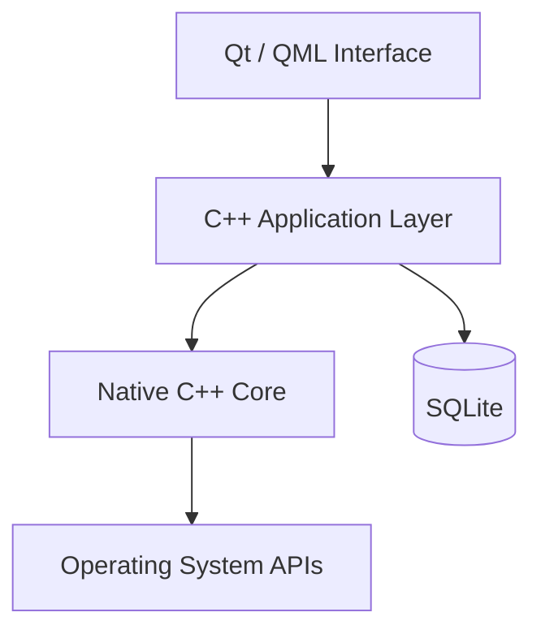
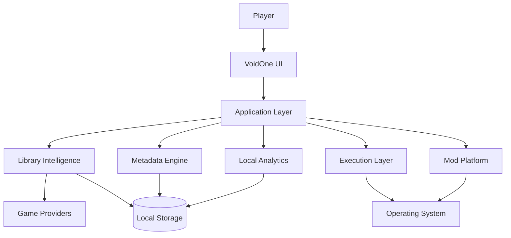

<div align="center">


# 🌌 VoidOne

### The Open-Source PC Gaming Platform Built Around Your Games — Not Around a Store

<p>
  <b>🇬🇧 English</b> •
  <a href="README.fa.md">🇮🇷 پارسی</a>
</p>

<p>
  <a href="https://github.com/VoidOne-App/VoidOne/actions/workflows/c.cpp.yml">
    
  </a>
  <a href="https://github.com/VoidOne-App/VoidOne/releases/latest">
    
  </a>
  <a href="https://github.com/VoidOne-App/VoidOne/stargazers">
    
  </a>
  <a href="https://github.com/VoidOne-App/VoidOne/blob/main/LICENSE">
    
  </a>
</p>

<p>
  
  
  
  
  
</p>

<br />

**One Library. Your Games. Your Hardware. Your Rules.**

<br />

<p>
  <a href="#-about">About</a> •
  <a href="#-vision">Vision</a> •
  <a href="#-gamer-to-gamer-commitment">Commitment</a> •
  <a href="#-current-foundation">Current</a> •
  <a href="#-future-direction">Future</a> •
  <a href="#-performance-goals">Performance</a> •
  <a href="#-architecture">Architecture</a> •
  <a href="#-engineering-infrastructure">Engineering</a> •
  <a href="#-roadmap">Roadmap</a> •
  <a href="#-build-from-source">Build</a> •
  <a href="#-contributing">Contributing</a>
</p>

</div>

---

## 👁️ About

**VoidOne** is an open-source, native PC gaming platform being built around one simple idea:

> **Your games should be the center of your gaming experience — not the stores distributing them.**

Modern PC gaming is fragmented across storefronts, launchers, installation directories, platform manifests, configuration systems, metadata services, and independent game executables.

VoidOne is being engineered as a native layer that brings the player's local gaming environment into one coherent experience.

Built around:

- **C++23**
- **Qt 6**
- **QML / Qt Quick**
- **SQLite**
- **CMake**
- **Ninja**

VoidOne is intended to grow from a native launcher foundation into a broader platform for game discovery, library management, execution, optimization, mod management, local intelligence, and future ecosystem extensibility.

The project is currently in active development.

This README deliberately separates **what exists today** from **what VoidOne is being built toward**.

---

# 🎯 Vision

VoidOne is not being built to become another storefront.

It is being built to become the layer between:

**the player → the operating system → the gaming ecosystem**

```text
                         ┌───────────────────────┐
                         │        PLAYER         │
                         └───────────┬───────────┘
                                     │
                                     ▼
                         ┌───────────────────────┐
                         │       VOIDONE         │
                         │  Native Gaming Layer  │
                         └───────────┬───────────┘
                                     │
             ┌───────────────────────┼───────────────────────┐
             │                       │                       │
             ▼                       ▼                       ▼
        GAME LIBRARY            EXECUTION              SERVICES
             │                       │                       │
             └───────────────────────┼───────────────────────┘
                                     │
                                     ▼
                         ┌───────────────────────┐
                         │    OPERATING SYSTEM  │
                         └───────────────────────┘
```

The long-term objective is not to force players into another ecosystem.

It is to give players a native layer that can work with the ecosystem they already use.

> **VoidOne is not being built to become another storefront. It is being built to become the layer between the player, the operating system, and the gaming ecosystem.**

---

# 🛡️ Gamer-to-Gamer Commitment

VoidOne is built **by a gamer, for gamers**.

This is more than a product philosophy.

It is a commitment.

## ♾️ Free & Open-Source — Forever

VoidOne is committed to remaining **free and open-source**.

No mandatory subscription for the core platform.

No paywall around the fundamental experience.

No closed ecosystem designed to lock players in.

## 🚫 No Ads. No Telemetry.

**No Ads. No Telemetry.**

VoidOne is not being built around advertising or player tracking.

The principle is simple:

> **You use VoidOne to manage your games — you don't become the product.**

## ⚡ Lightweight by Design

VoidOne is being engineered around an ambitious performance goal:

> **Target idle memory usage: under 50 MB.**

This is an **engineering target**, not a guaranteed specification of the current release.

The goal is to avoid unnecessary:

- Background services
- Heavy runtimes
- Persistent processes
- Resource-hungry components
- Hidden workloads

Every component should have a reason to exist.

## 🔒 100% Control Over Your Data

Your data belongs to **you**.

VoidOne is designed around local-first data ownership.

The long-term goal is to keep your:

- Game library
- Settings
- Profiles
- Configuration
- Local statistics
- Gaming data

under your control.

## 🎮 I Stand With Gamers

VoidOne exists because gamers deserve software that respects:

- Their hardware
- Their privacy
- Their time
- Their data
- Their freedom
- Their games

We are not building another ecosystem to control the player.

We are building a tool to give players **more control over the ecosystem they already have**.

### **Free and open-source — forever.**

### **No Ads. No Telemetry.**

### **Your data. Your control.**

### **Built by a gamer. For gamers.**

**I stand with gamers — always.**

---

# 🧭 Product Principles

The Gamer-to-Gamer Commitment guides the engineering decisions behind VoidOne.

### Native First

Prefer native technologies and operating-system capabilities where they provide meaningful advantages in performance, integration, and maintainability.

### Local First

Prefer local processing and local persistence whenever practical.

### Privacy by Design

Avoid unnecessary collection, tracking, or transmission of player data.

### Lightweight by Design

Every dependency, background process, and runtime component should justify its resource cost.

### User Ownership

The player should remain in control of their games, data, configuration, and experience.

### Open by Design

The project should remain transparent, inspectable, and accessible to its community.

### Evidence Over Marketing

Technical claims should be supported by implementation, testing, or reproducible benchmarks.

---

# 🎯 Current Foundation

This section describes the **current project foundation**.

It intentionally does not present roadmap items as completed functionality.

## Native Application Foundation

VoidOne is built around:

- **C++23**
- **Qt 6**
- **QML / Qt Quick**
- **SQLite**
- **CMake**
- **Ninja**

## Native UI

Qt Quick / QML provides the foundation for the graphical interface.

The project separates the visual layer from the native C++ application layer to keep the architecture maintainable and extensible.

## Local Persistence

SQLite provides the foundation for local application persistence.

The local-first architecture is intended to keep core application state independent from a mandatory remote backend.

## Cross-Platform Build Foundation

VoidOne is currently developed and tested primarily on **Windows**, while Linux builds are also exercised through the project's CI infrastructure.

macOS is not currently part of the primary build/test configuration.

---

# 🔭 Future Direction

The following capabilities represent **planned, future, or long-term engineering directions**.

> **These capabilities are not presented as generally available current functionality unless explicitly implemented and documented by the repository.**

Long-term platform direction includes:

- Ghost Launch
- Intelligent Process Orchestration
- Advanced Process Management
- CPU Priority Profiles
- Resource Optimization
- Multi-Store Aggregation
- Steam ecosystem integration
- Epic Games integration
- GOG integration
- EA App integration
- Rich Metadata Engine
- Artwork / Hero Banner System
- Local Gaming Analytics
- Advanced Mod Engine
- Mod Profiles
- Virtual File Mapping
- Dependency Management
- Conflict Detection
- Advanced QML Interface
- Dynamic Themes
- RGB Customization
- Performance Diagnostics
- Backup & Recovery
- Extension APIs
- Theme SDK
- Developer Ecosystem
- Community Extensions

These are product directions — **not claims about the current release**.

---

# 👻 Ghost Launch

**Ghost Launch** is a planned execution architecture designed to give the player greater control over game startup and runtime behavior.

Potential capabilities include:

- Direct executable execution where technically and legally possible
- Custom launch arguments
- Environment configuration
- Per-game launch profiles
- Process lifecycle management
- Background-process policies
- Orphan-process detection
- Process prioritization
- Runtime state tracking

Conceptually:

```text
Player
  │
  ▼
VoidOne
  │
  ▼
Execution Layer
  │
  ▼
Game Process
```

The objective is to create a controlled execution layer between the player and the game.

VoidOne does not intend to bypass DRM, licensing systems, or required platform authentication.

If a game legitimately requires another service, that dependency remains part of the execution environment.

---

# ⚙️ Intelligent Process Orchestration

A future process-management layer may allow VoidOne to understand and manage the relationship between a game and its supporting processes.

Potential capabilities include:

- Process lifecycle tracking
- Child-process awareness
- Background workload policies
- CPU priority profiles
- Runtime process management
- Orphan-process detection
- Per-game execution policies
- Resource-aware launch profiles

The long-term objective is controlled execution rather than simply starting an executable and forgetting about it.

---

# 🧩 Multi-Store Aggregation

A unified multi-store library is part of the long-term platform direction.

Potential providers include:

- Steam
- Epic Games
- GOG
- EA App
- Local installations
- Additional providers

Potential capabilities include:

- Installation discovery
- Manifest parsing
- Library aggregation
- Duplicate detection
- Game identity normalization
- Metadata normalization
- Provider-aware launching

The objective is to provide one consistent library without turning VoidOne into another storefront.

---

# 🖼️ Metadata Engine

A future metadata engine may provide:

- Cover artwork
- Hero banners
- Backgrounds
- Descriptions
- Genres
- Release information
- Developer information
- Publisher information
- Ratings
- Platform information

The planned architecture favors:

- Asynchronous processing
- Local caching
- Non-blocking UI
- Failure-tolerant network operations

Metadata should enhance the library without becoming a mandatory dependency for basic local functionality.

---

# 📊 Local Gaming Analytics

Future versions may provide privacy-oriented local analytics.

Potential capabilities include:

- Session tracking
- Launch history
- Play duration
- Per-game statistics
- Local crash records
- Performance history
- Local performance trends

The guiding principle:

> **Useful analytics without turning the player into the product.**

Analytics should remain local wherever technically practical.

---

# 🧰 Advanced Mod Platform

A future mod-management architecture may include:

- Mod profiles
- Virtual file mapping
- Non-destructive deployment
- Dependency management
- Conflict detection
- Load-order management
- Compatibility checks

Example:

```text
Game
├── Vanilla
├── Competitive
├── Graphics Overhaul
├── Experimental
└── Custom Profile
```

The objective is to allow multiple configurations without unnecessarily modifying the original game installation.

---

# 🎨 Next-Generation Interface

The long-term UI direction may include:

- Advanced QML interfaces
- Dynamic themes
- Artwork-driven libraries
- Responsive layouts
- Personalization
- Display scaling
- Accessibility improvements
- Optional animations
- RGB customization

Visual effects should justify their performance cost.

> **A premium interface is only useful when it remains responsive.**

---

# 🩺 Performance Diagnostics

Future diagnostic capabilities may include:

- Startup analysis
- Runtime measurements
- Memory diagnostics
- Process analysis
- Library scan profiling
- Performance history
- Per-game performance profiles
- Benchmarking

The goal is to make performance measurable rather than subjective.

---

# 💾 Backup & Recovery

Future versions may introduce local backup and recovery functionality.

Potential areas include:

- Application configuration
- Library data
- Game profiles
- Mod profiles
- User preferences

Potential capabilities include:

- Backup creation
- Profile export/import
- Recovery snapshots
- Configuration restoration

---

# 🔌 Extensibility & Developer Ecosystem

VoidOne's long-term architecture may provide controlled extension points.

Potential future components include:

- Extension APIs
- Theme SDK
- Provider APIs
- Community extensions
- Custom integrations
- Developer tooling

Security, stability, and maintainability should remain requirements for any extension system.

---

# ⚡ Performance Goals

Performance is a **core engineering objective** of VoidOne.

The following values are **long-term engineering targets**, not guaranteed specifications of the current release.

| Metric | Target | Engineering Direction |
| :--- | :--- | :--- |
| **Idle Memory** | `< 50 MB` | Native C++ architecture and lightweight runtime design |
| **Cold Startup** | `< 1.0s` | Lazy initialization and asynchronous startup |
| **Database Operations** | Sub-millisecond target | Efficient SQLite queries and indexing |
| **UI Rendering** | 60+ FPS target | Qt Quick scene graph and hardware acceleration |
| **Library Scanning** | Minimal UI blocking | Asynchronous and incremental processing |

## 🎯 What We Are Optimizing For

VoidOne aims to be:

- Fast to start
- Lightweight while idle
- Responsive during library operations
- Efficient with large libraries
- Predictable under normal workloads
- Native to the operating system

These figures are **engineering goals**, not marketing specifications.

Before any number becomes an official performance claim, it should be supported by reproducible benchmarks.

Benchmark documentation should include:

- Hardware
- Operating system
- Compiler
- Qt version
- Application version
- Build configuration
- Test methodology
- Measurement conditions

> **The goal is not to promise performance. The goal is to prove it.**

---

# 🏗️ Architecture

VoidOne is designed around a layered native architecture.

## Core Architecture



## Long-Term Platform Architecture



The second diagram represents **long-term architecture**, not a claim that every component currently exists.

---

# 🧰 Technology Stack

| Technology | Role |
| :--- | :--- |
| **C++23** | Native application and systems development |
| **Qt 6** | Native application framework |
| **QML / Qt Quick** | Graphical interface |
| **SQLite** | Local persistence |
| **CMake** | Build configuration |
| **Ninja** | Build execution |
| **CTest** | Testing infrastructure where configured |
| **GitHub Actions** | CI/CD automation |
| **Clang / clang-tidy** | Static analysis where configured |
| **AddressSanitizer** | Runtime memory diagnostics where configured |
| **UndefinedBehaviorSanitizer** | Undefined-behavior diagnostics where configured |

---

# 🤖 Engineering Infrastructure

VoidOne uses automation to improve the engineering lifecycle.

This infrastructure is separate from the player's product experience.

## GitHub Actions

The repository uses GitHub Actions for automated development and validation workflows.

The current project infrastructure includes automated builds and validation across Windows and Linux configurations, with additional checks depending on the active repository workflows.

The workflow definitions remain the authoritative source for exact CI behavior.

## AI Repair

VoidOne also includes an **AI Repair** workflow intended to assist with software-engineering failures.

AI Repair is **engineering infrastructure**, not a player-facing product feature.

Its purpose is to accelerate diagnosis and candidate repair while keeping engineering ownership with humans.

The intended lifecycle is:

```text
                 CI Failure
                     │
                     ▼
             AI-Assisted Diagnosis
                     │
                     ▼
              Candidate Patch
                     │
                     ▼
                 Validation
                ┌────┴────┐
                ▼         ▼
              Build      Tests
                │         │
                └────┬────┘
                     ▼
                Human Review
                     │
                     ▼
                   Merge
```

Potential engineering uses include:

- Failure diagnosis
- Code analysis
- Candidate patch generation
- Build validation
- Test validation
- Regression investigation
- Engineering feedback

> **AI accelerates engineering. It does not replace engineering ownership.**

AI-generated changes remain subject to validation, review, and repository policy.

---

# 🔄 CI/CD

The project's GitHub Actions infrastructure is designed to automate repetitive engineering work.

Depending on the active workflow configuration, the pipeline may include:

- Windows builds
- Linux builds
- Unit tests
- Static analysis
- Sanitizer builds
- QML validation
- Release packaging
- Artifact generation
- SHA-256 checksum generation

The repository's workflow definitions remain the authoritative source for current CI behavior.

---

# 🛡️ Security

Security is treated as an engineering concern throughout development.

Current security-related validation depends on the active repository workflows and tooling.

Long-term security direction includes:

- Dependency auditing
- Artifact integrity verification
- Release validation
- Reproducible builds
- Hardened update mechanisms
- Secure extension boundaries
- Runtime integrity validation

VoidOne does not claim security certifications or absolute security guarantees unless explicitly documented.

---

# 📥 Download

## Latest Release

The following URL points to the repository's latest GitHub Release:

**[Download the latest VoidOne release](https://github.com/VoidOne-App/VoidOne/releases/latest)**

## All Releases

**[View all VoidOne releases](https://github.com/VoidOne-App/VoidOne/releases)**

Release assets depend on the specific published release and may include:

- Windows installers
- Portable archives
- Linux archives
- SHA-256 checksums

Always use the assets published with the corresponding release.

---

# 🔐 Verify Release Integrity

When SHA-256 checksums are provided, verify the downloaded artifact locally.

### PowerShell

```powershell
Get-FileHash .\VoidOne-Windows-x64-Portable.zip -Algorithm SHA256
```

Compare the generated hash with the checksum published alongside the corresponding release.

Use the exact filename supplied by the release.

---

# 🔨 Build From Source

VoidOne is currently developed and tested primarily on **Windows**, while Linux builds are also exercised through CI.

For the most authoritative build instructions, see [`BUILD.md`](BUILD.md).

## Windows

Recommended environment:

- Windows 10 or Windows 11
- Visual Studio 2022 or Visual Studio Build Tools 2022
- MSVC x64
- Qt 6
- CMake
- Ninja
- Git

## Linux

Recommended environment:

- Recent Linux distribution
- GCC or Clang
- Qt 6
- CMake
- Ninja
- Git
- Required system development libraries

## macOS

macOS is not currently part of the primary build/test configuration.

Future support may be considered as the build system and platform integration mature.

## 📥 Clone

```bash
git clone https://github.com/VoidOne-App/VoidOne.git
cd VoidOne
```

## ⚙️ Configure

### Windows

If Qt is already available in your environment:

```powershell
cmake -S . -B build -G Ninja -DCMAKE_BUILD_TYPE=Release -DCMAKE_CXX_STANDARD=23
```

If CMake cannot locate Qt automatically:

```powershell
cmake -S . -B build -G Ninja -DCMAKE_BUILD_TYPE=Release -DCMAKE_CXX_STANDARD=23 -DCMAKE_PREFIX_PATH="C:\Qt\6.x.x\msvc2022_64"
```

Replace the Qt path with the actual installation path on your system.

### Linux

```bash
cmake \
  -S . \
  -B build \
  -G Ninja \
  -DCMAKE_BUILD_TYPE=Release \
  -DCMAKE_CXX_STANDARD=23
```

If Qt cannot be found automatically:

```bash
cmake \
  -S . \
  -B build \
  -G Ninja \
  -DCMAKE_BUILD_TYPE=Release \
  -DCMAKE_CXX_STANDARD=23 \
  -DCMAKE_PREFIX_PATH="$HOME/Qt/6.x.x/gcc_64"
```

## 🔨 Build

```bash
cmake --build build --parallel
```

## 🧪 Tests

If tests are enabled in the current configuration:

```bash
ctest --test-dir build --output-on-failure --parallel 2
```

---

# 🔍 Static Analysis

Where supported by the current build configuration, the project can be configured with Clang and `clang-tidy`.

```bash
cmake \
  -S . \
  -B build-analysis \
  -G Ninja \
  -DCMAKE_BUILD_TYPE=Debug \
  -DCMAKE_CXX_STANDARD=23 \
  -DCMAKE_CXX_COMPILER=clang++ \
  -DCMAKE_CXX_CLANG_TIDY=clang-tidy
```

Then:

```bash
cmake --build build-analysis --parallel
```

---

# 📦 Release Packaging

## Windows

Qt's `windeployqt` can be used to deploy the Qt runtime alongside a Windows build.

Example:

```powershell
windeployqt `
  --release `
  --qmldir ".\src\ui\qml" `
  ".\build\path\to\VoidOneLauncher.exe"
```

The exact executable path depends on the current CMake configuration.

The project's GitHub Actions infrastructure handles automated deployment and packaging for configured release builds.

## Linux

The CI pipeline may package Linux release builds into `.tar.gz` archives and generate SHA-256 checksums where configured.

---

# 🧪 Testing & Validation

Testing is part of the engineering lifecycle.

Depending on the current project configuration, validation can include:

- Unit tests
- Build validation
- AddressSanitizer
- UndefinedBehaviorSanitizer
- Static analysis
- QML validation
- Cross-platform build verification

Contributors should run the validation relevant to their changes before opening a pull request.

---

# 📏 Benchmarking Policy

VoidOne aims to make performance measurable.

Future benchmark reports should document:

```text
Application Version
        │
        ▼
Hardware
        │
        ▼
Operating System
        │
        ▼
Compiler / Toolchain
        │
        ▼
Qt Version
        │
        ▼
Build Configuration
        │
        ▼
Benchmark Methodology
        │
        ▼
Measured Result
```

Potential measurements include:

- Cold startup
- Warm startup
- Idle memory
- Peak memory
- Library scan duration
- Database performance
- UI frame-time
- CPU utilization
- Background workload impact

> **No performance number becomes an official specification until it can be reproduced.**

---

# 🗺️ Roadmap

VoidOne is being developed incrementally.

Roadmap items represent engineering direction and should not be interpreted as guaranteed delivery dates.

## Phase I — Native Foundation

- [x] C++23 project foundation
- [x] Qt / QML application foundation
- [x] CMake build system
- [x] Native application architecture
- [x] GitHub Actions infrastructure
- [x] Cross-platform CI foundation

## Phase II — Library Intelligence

- [ ] Game discovery
- [ ] Installation detection
- [ ] Local library persistence
- [ ] Provider integration
- [ ] Metadata normalization

## Phase III — Experience

- [ ] Advanced library interface
- [ ] Filtering and categorization
- [ ] Artwork and metadata
- [ ] Personalization
- [ ] UI refinement

## Phase IV — Execution

- [ ] Ghost Launch
- [ ] Process lifecycle management
- [ ] Launch profiles
- [ ] Runtime configuration
- [ ] Local playtime tracking

## Phase V — Mod Platform

- [ ] Mod profiles
- [ ] Virtual file mapping
- [ ] Dependency management
- [ ] Conflict detection
- [ ] Compatibility management

## Phase VI — Intelligence

- [ ] Local gaming analytics
- [ ] Performance diagnostics
- [ ] Advanced engineering automation
- [ ] Automated failure diagnosis
- [ ] Automated validation

## Phase VII — Ecosystem

- [ ] Extension APIs
- [ ] Theme SDK
- [ ] Community extensions
- [ ] Additional providers
- [ ] Developer ecosystem

> **The roadmap describes direction, not promises.**

---

# 🤝 Contributing

Contributions are welcome.

You can contribute through:

- C++
- Qt / QML
- UI/UX
- Testing
- Documentation
- Bug reports
- Feature proposals
- Performance improvements
- Platform support
- Build and CI improvements

## Contribution Workflow

Create a feature branch:

```bash
git checkout main
git pull origin main
git checkout -b feature/your-feature
```

Make your changes and test them locally.

Then:

```bash
git add .
git commit -m "Add your feature"
git push origin feature/your-feature
```

Open a Pull Request on GitHub.

For substantial changes, explain:

- What changed
- Why it changed
- How it was tested
- Any relevant compatibility considerations

Keep changes focused, reviewable, and maintainable.

---

# 🧭 Engineering Standards

### Evidence Over Marketing

Technical claims should be supported by implementation, testing, benchmarks, or documented evidence.

### Small Reviewable Changes

Prefer focused changes that are easy to understand, validate, and review.

### Native First

Prefer native technologies when they provide meaningful advantages in performance, integration, maintainability, or system control.

### Security by Default

Consider security during architecture and implementation rather than treating it exclusively as a post-release concern.

### Human-Controlled Automation

Automation and AI should assist engineering while preserving human responsibility for decisions and final changes.

### Long-Term Maintainability

Architecture should remain understandable and extensible as VoidOne grows.

### Respect the Player

Every feature should ultimately answer one question:

> **Does this give the player more value and control without unnecessarily taking something away?**

---

# 🐛 Reporting Problems

When reporting a build or runtime problem, include:

- Operating system
- Compiler
- Compiler version
- Qt version
- CMake version
- Build configuration
- Relevant error messages
- Steps to reproduce the problem

For runtime failures, include available terminal or debug output.

Clear reports make it easier to reproduce and fix problems.

---

# 📚 Documentation

Additional project documentation may include:

- [`BUILD.md`](BUILD.md) — Build and development guide
- [`CONTRIBUTING.md`](CONTRIBUTING.md) — Contribution guidelines
- [`TROUBLESHOOTING.md`](TROUBLESHOOTING.md) — Troubleshooting information

The repository remains the source of truth for current implementation details.

---

# 📜 License

VoidOne is distributed under the **MIT License**.

See [`LICENSE`](LICENSE) for the complete license text.

Copyright © 2026 VoidOne-App Core Team.

---

<div align="center">

# 🌌 VoidOne

### Your Games. Your Hardware. Your Rules.

**Built by a gamer. Engineered like a platform. Built in the open.**

<br />

**♾️ Free & Open Source — Forever**

**🚫 No Ads. No Telemetry.**

**🔒 Your Data. Your Control.**

<br />

<a href="https://github.com/VoidOne-App/VoidOne">
  
</a>

<br /><br />

**Open Source · Native · Modular · Player-Focused**

</div>